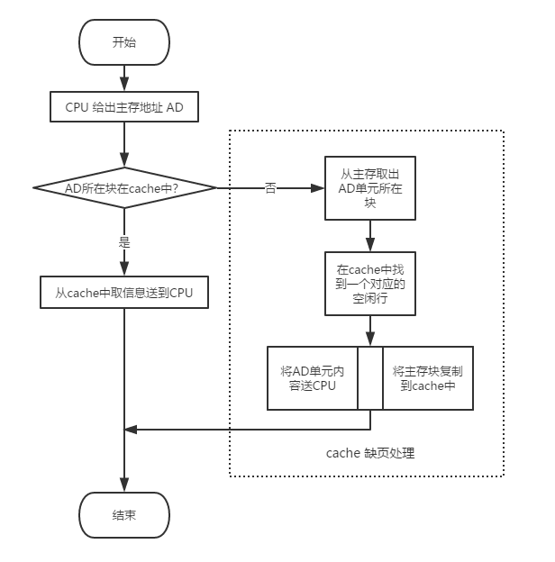

# Cache 的基本概念与工作原理

## 1. 背景知识

随着 CPU 技术的飞速发展，常用的处理器飞奔在越来越高的频率之上，虽然处理器的速度越来越快，但是与之相匹配的存储器的速度却没有获得相应的提升，这大大限制了 CPU 的处理性能。而我们本系列文档所介绍的主角 Cache 技术就是用来解决这个难题的。

在 ARM 发布 Cortex-M7 架构之后，微控制器领域也出现了频率高达数百兆的芯片，如 ST 的 STM32F7 系列和 NXP 的 i.MX RT 系列芯片，这些芯片内的处理器都自带 cache，在合理配置下可以表现出十分强悍的数据处理性能。那么什么是 cache？如何利用这一新特性编写高性能的程序？又有什么要注意的地方吗？你可能会有上述这些疑问，别担心，本系列文章将会为你一一解答。

本系列文章分为三篇，第一篇为 《cache 的基本概念与工作原理》，讲解 cache 相关的基础知识。第二篇为《STM32F7 Cache 介绍与实战》，讲解如何在 STM32F7 系列芯片上使用 cache，并编写程序进行性能测试。第三篇为《Cache 的一致性问题与使用技巧》，将会介绍 cache 的数据一致性问题和使用 cache 过程中的一些技巧。下面我们从 cache 的基础知识开始，了解这一强大的特性吧。

## 2. 计算机的层次结构存储系统

想要理解 cache 的工作原理，就必须要了解计算机系统中数据的存储方式。

在计算机中程序执行时所有的指令和数据都是从存储器中取出来执行的。存储器是计算机系统中的重要组成部分，相当于计算机的仓库，用来存放各类程序及其处理的数据。因此存储器的容量和性能应当随着处理器的速度和性能的提高而通过提高，以保持系统性能的平衡。

然而在过去的 20 多年中，随着时间的推移，处理器和存储器在性能发展上的差异越来越大，存储器在容量尤其是访问延时方面的性能增长越来越跟不上处理器性能发展的需要。为了缩小存储器和处理器两者之间在性能方面的差距，通常在计算机内部采用层次化的存储器体系结构。

从上图可以看到，速度越快则容量越小、越靠近 CPU。CPU 可以直接访问内部存储器。而外部存储器的信息则要先取到主存，然后才能被 CPU 访问。CPU 执行指令时，需要的操作数大部分来自寄存器，当需要对存储器进行读写操作时，先访问 cache ，如果不在 cache 中，则访问主存，如果不在主存中，则访问硬盘。此时，操作数从硬盘中读出送到主存，然后从主存送到 cache。

数据使用时，一般只在相邻两层之间复制传送，而且总是从慢速存储器复制到快速存储器。传送的单位是一个定长块，因此需要确定定长块的大小，并且在相邻两层间建立块之间的映射关系。

在我们接触的嵌入式系统中，具体的存取时间和存储容量的大小可能和上图不符，但是不同层级之间的量级对比还是一致的。

## 3. 为什么需要 Cache?

由于 CPU 和主存所使用的半导体器件工艺不同，两者速度上的差异导致快速的 CPU 等待慢速的存储器，为此需要想办法提高 CPU 访问主存的速度。除了提高 DRAM 芯片本身的速度和采用并行结构技术以外，加快 CPU 访存速度的主要方式之一是在 CPU 和主存之间增加高速缓冲器，也就是我们主角 Cache。

Cache 位于 CPU 和内存之间，可以节省 CPU 从外部存储器读取指令和数据的时间。

## 4. 基本概念

- 程序访问的局部性

  对大量典型程序运行情况分析的结果表明，在较短的时间间隔内，程序产生的地址往往集中在存储空间的一个很小范围，这种现象称为**程序访问的局部性**。这种局部性可细分为时间局部性和空间局部性。**时间局部性**是指被访问的某个存储单元在一个较短的时间间隔很可能又被访问。**空间的局部性**是指访问的某个存储单元的临近单元在一个较短的时间间隔内很可能也被访问。

- Instruction Cache 

  指令 cache 只被用于缓存指令，从外部存储器读取指令需要很长时间，如果外部存储器是 flash，那么 CPU 可能需要 50-100ns 才能获得指令。

- Data Cache 

  数据 cache 只被用于缓存数据，和指令 cache 类似，CPU 要花费很长时间才能从外部的 SRAM 或者 SDRAM 取回数据。

## 5. 工作原理

cache 是一种小容量高速缓冲存储器，由快速的 SRAM 组成，直接制作在 CPU 芯片内，速度较快，几乎与 CPU 处于同一个量级。在 CPU 和主存之间设置 cache，总是把主存中被频繁访问的活跃程序块和数据块复制到 cache 中。由于程序访问的局部性，大多数情况下，CPU 可以直接从 cache 中直接取得指令和数据，而不必访问慢速的主存。

为了方便 cache 和主存间交换信息，cache 和主存空间都被划分为相等的区域。例如将主存中一个 512 个字节的区域称作一个块（block），cache 中存放一个主存块的区域称作行（line）。

- cache 的行有效位

  系统启动时，每个 cache 行都为空，其中的信息无效，只有 cache 行中装入了主存块之后才有效。为了说明 cache 行中的信息是否有效，某一个行都有一个**有效位**。通过将一行的有效位清零来淘汰这一行中所存储的主存快的操作称为冲刷，也就是我们常说的刷 cache。

- CPU 在 cache 中的访问过程

  在 CPU 执行程序过程中，需要从主存取指令或写数据时，先检查 cache 中有没有要访问的信息，若有，就直接在 cache 中读写，而不用访问主存储器。若没有，再从主存中把当前访问信息所在的一个一个主存块复制到 cache 中。因此，cache 中的内容是主存中部分内容的副本。下图展示了带 cache 的 CPU 执行一次访存操作的过程。

   

- cache 与主存的平均访问时间

  如上图所示的访存过程中，需要判断所访问的信息是否在 cache 中。若 CPU 访问单元的主存块在 cache 中，则称 **cache 命中**（hit），命中的概率称为**命中率 p** (hit rate)。若不在 cache 中，则为**不命中**（miss），其概率为**缺失率**（miss rate）。命中时，CPU 在 cache 中直接存取信息，所用的时间开销就是 **cache 的访问时间 Tc**，称为命中时间。缺失时，需要从主存读取一个主存块送 cache，并同时将所需信息送 CPU，因此所用时间为**主存访问时间 Tm**，和 **cache 访问时间 Tc** 之和。通常把从主存读入一个主存块到 cache 的时间 **Tm 称为缺页损失**。

  CPU 在 cache 和主存层次的平均访问时间为：

  `Ta = p * Tc + (1 - p) * (Tm + Tc) = Tc + (1 - p) * Tm`

  由于程序访问的局部性特点，cache 的命中率可以达到很高，接近于 1。因此，虽然缺页损失所耗费的时间远远大于命中时间，但最终的平均访问时间仍可接近 cache 的访问时间。

- cache 的映射方式

  cache 行中的信息取自主存中的某个块。将主存块复制到 cache 行时，主存块和 cache 行之间必须遵循一定的映射规则。这样 CPU 在要访问某个主存单元时，可以依据映射规则到 cache 对应的行中查找要访问的信息，而不用在整个 cache 中查找。

  根据不同的映射规则，主存块和 cache 行之间有以下三种映射方式。

  - **直接映射（direct）**：每个主存块映射到 cache 的固定行中。
  - **全相连映射（full associate）**：每个主存块映射到 cache 的任意行中。
  - **组相连映射（set associate）**：每个主存块映射到 cache 的固定组的任意行中。

  目前我们常见的 CPU 一般都采用的组相连的映射方式，组相连的映射方式将前两种映射方式**取长补短**，获得了优异的性能和较低的硬件实现难度。在这里不再展开仔细描述，感兴趣的小伙伴可以通过搜索阅读相关内容来了解其中的细节。

值得注意的是，cache 对程序员在编写高级或低级语言程序时是透明的，因此程序员无需了解 cache 是否存在或者如何设置，感觉不到 cache 的存在。但是对 cahche 的深入了解有助于编写出高效的程序！

在下一篇中，我们将在 STM32F767 开发板上运行 RT-Thread 的 stm32f767-atk-apollo BSP，开启 cache 功能，并编写不同情况下的性能测试程序。