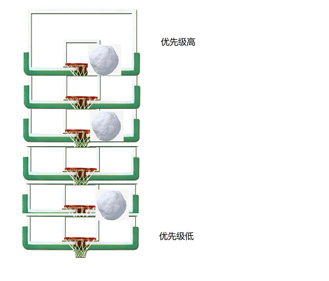
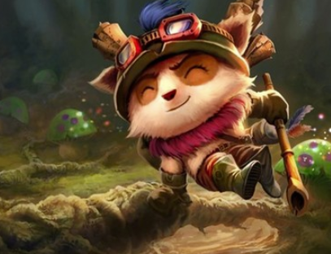

# 通过雪人努努和提莫来理解 RTOS 调度系统

## 故事背景

想象一块巨大的篮板，上面从上到下依次有 32 个篮筐，每个篮筐的边沿上都可能会挂着一个大雪球。

## 英雄介绍

### 提莫队长

| 技能类别 | 详细介绍 |
| -------- | -------- |
| 天生技能 |  提莫会根据指示，将本应该在篮筐上的雪球拿走保管，这样努努就不能滚动这个雪球了，同样，提莫队长也会在接到命令后将雪球放回篮筐        |

### 雪人努努

| 技能类别 | 名称 | 详细介绍                                                     |
| -------- | ---- | ------------------------------------------------------------ |
| 天生技能 |      | 努努总是选择篮筐中最上面最大的那个雪球，然后将它滚动起来，努努在 **释放任何技能** 后都会尝试重新选择一个雪球 |
| 主动技能 | Q    | 努努主动将手中的雪球交给一只提莫保管                         |
| 主动技能 | W    | 努努通知一只提莫将保管的雪球放回篮筐                         |
| 被动技能 | E    | 努努推雪球的过程被打断，外部有人通知某一只提莫将保管的雪球放回篮筐 |
| 被动技能 | R    | 该技能周期性自动释放，检查当前滚动的雪球是否超时               |

