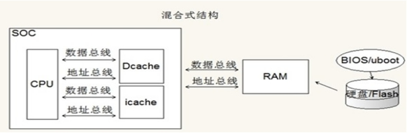

#  1 写在最前面的话

## 第一次编写
- 2017.01.21

C语言的重要性没的说了，想要深入嵌入式领域，没有扎实的C语言基础是不行的。之前也写了一些零零散散的东西，没有系统的体系架构，学完忘了，再次去寻找的时候又要花费不少时间，大部分时间就浪费在重复劳动上了，避免重复劳动很重要！！！回想过去，总是为解决一些低端问题在底层兜圈圈，不能提高能力水平。为了解决这些问题，我觉得，一定要建立自己的C语言知识结构。就这样开始行动吧，建立了整体的框架了之后，再根据平时做项目积累的实践经验来完善这些知识，让这些知识更具实践性。话不多说，开始做吧！

1. 要在具体项目中学习C语言，不能单纯地学习C语言。

2. 需要时间和实践。
3. 学习编程语言要学会换位思考：
4. 要注意实践中的摸索和总结。

要点一：要在实践中总结。一定要重视实践。从实践中学习C语言！！！
要点二：摸索，自己要注意去思考假设验证。分析可能出现的原因。
要点三：总结：学习了新的知识之后，将学习的知识进行显性化总结。要注意自己在实践中的总结和得失。解决问题的方法。会该怎么做，不会有哪些解决问题的思路。一定要注意在实际项目中的学习，而不是仅仅学习C语言本身，这样会永远也学不好C语言。        

今天写了关于内存的理解这一章，记起了好多知识，大体上还是比较熟悉的，加深理解了冯诺依曼和哈佛结构的知识、对栈有了新的理解。这些都是之前一知半解的知识，经过这次总结理解的更加深入了。看来学习知识真的不能泛泛而过。继续努力吧~

- 2018.08.19

最近想要继续总结知识结构，于是将之前学习 C语言时的学习笔记找到并拿了出来。为了方便修改和添加，将其从word格式修改为 md 格式，今后将继续完善它，加油！ 

#  2 关于内存

## 2.1 程序运行为什么需要内存

### 2.1.1 计算机程序运行的目的

这里要说明的问题是为什么程序的运行需要内存，内存到底是一个什么玩意儿。写程序也这么多年了，从第一次接触C语言到现在已经有五年时间了，之前一直对内存的概念模模糊糊的。那么为什么要写程序呢？

首先要理解一个概念就是:计算机程序 = 代码 + 数据。

代码和数据经过运行后输出结果，从宏观上来理解，代码就是动作，是加工数据的动作，数据就是数字，就是被代码所加工的东西。从这个角度上来说，程序运行的目的无外乎有两个：第一个是结果，第二个是过程。

### 2.1.2 计算机程序运行的过程

计算机程序的运行过程，其实就是程序中很多个函数相继运行的过程。程序是由很多个函数组成的，程序的本质就是函数，函数的本质是加工数据的动作。

### 2.1.3 冯诺依曼结构和哈佛结构

冯诺依曼结构：数据和代码放在一起。

哈佛结构：数据和代码分开存在。

什么是代码：函数。

什么是数据：全局变量，局部变量。

在S5PV210中运行的linux系统上运行应用程序时：这时候所有的应用程序的代码和数据都在DRAM，所以这种结构就是冯诺依曼结构。

在单片机中，我们把程序代码烧写到Flash（NorFlash）中，然后程序在Flash中原地运行，程序中所涉及到的数据（全局变量、局部变量）不能放在Flash中，必须放在RAM（SRAM）中。这种就叫哈佛结构。

现在ARM的CPU使用的是一种改进型的哈佛结构，并不是典型的哈佛结构。实际上在内存里，指令和数据是在一起的。而在CPU内的缓存中，还是会区分指令缓存和数据缓存，最终执行的时候，指令和数据是从两个不同的地方出来的。可以理解为在CPU外部，采用的是冯诺依曼模型，而在CPU内部用的是哈佛结构。

|      |                                |
| ---- | ------------------------------ |
|      |  |

 

这种结构就是目前ARM的结构，将两种结构扬其长，避其短。其中，芯片内部的cache，表示高速缓存，Dcache用来缓存部分代码，icache用来缓存部分数据。只有需要改变时，cache才会到RAM中加载新的数据。所以大部分时间CPU都是通过哈佛结构和cache（高速缓存）通讯，这个速度是非常快的。

这样在芯片外部，利用冯诺依曼结构，节省了外部的PCB走线资源。

在芯片内部，利用哈佛结构提高了CPU访问数据的速度，可谓是两全其美。

### 2.1.4 动态内存（DRAM）和静态内存（SRAM）

这个问题简单的说一下。

SRAM的特点是：

1.不需要刷新，读取速度快静态功耗极低，常用作Cache。

2.价格高，相同容量比DRAM体积要大。

DRAM的特点是：

1.需要通过刷新操作来保持数据，读取速度比SRAM慢，常用来做主内存。

2.价格便宜，容量大。

3.SDRAM，同步的DRAM，即数据的读写需要时钟来同步。 

简单来说，SRAM读写速度快，但是比较贵，体积也比较大，电路比较复杂，所以说常常用来做缓存Cache.

Dram读写速度虽然慢一点，但是便宜，容量大，所以目前主要的内存都是用DRAM或者SDRAM。

### 2.1.5 为什么需要内存

知道了上面的那些知识，那么到底内存是用来做什么的呢。内存是用来存储可变数据的，数据在程序中的表现为全局变量、局部变量等。（在GCC中，常量也存在内存中）（大部分单片机中，常量是存储在FLASH中的，也就是在代码段）这些知识对我们写程序来说非常重要，对程序运行更是本质相关。

所以内存对程序来说几乎是本质需求，简单的程序就需要更少的内存，庞大的程序就需要更多的内存。内存管理在我们写程序中是十分重要的，比如说数据结构是研究数据如何组织并放在内存中的，而算法是为了用更优秀的方法来加工数据，只要跟数据有关，就离不开内存。

### 2.1.5 如何管理内存（有OS或无OS）

对于计算机来说，内存容量越大，就存在越多的可能性。我们写程序的时候需要管理内存，如果管理不善，可能会造成程序运行消耗过多的内存，如果内存全部被消耗完而没有内存可用时程序就会崩溃。所以内存对程序来说是一种资源，所以管理内存对程序来说就是一个重要的技术和话题。

如果在有操作系统的情况下：操作系统掌握所有的硬件内存，操作系统将内存分成一个一个的页面，然后以页面为单位来管理。页面内以字节为单位来管理。在操作系统下对内存进行管理，只需要使用操作系统提供的API，比如在C语言中用Malloc和Free这些API来管理内存。

在没有操作系统的情况下：程序需要直接操作内存，编程者需要自己计算内存的使用和安排。

不同的语言提供了不同的操作内存的结构。

1.汇编根本没有提供任何内存管理，直接使用内存地址.

2.在C语言中，编译器帮我们管理内存，我们使用编译器提供的变量名来访问内存。操作系统下如果需要大块的内存，则使用API(malloc free)这些接口来访问系统内存。裸机中使用大块的内存，需要通过定义数组等来解决。

3.C++中，通过NEW来创建对象（其实就是为对象分配内存），然后使用完了用delete来删除对象（其实就是释放内存）。其实C++中的内存管理还是程序员自己做，如果创建了对象用完后而没有删除，也会导致这个对象占用的内存不能被释放，这就是内存泄露。

4.在java/c#等语言，这些语言不直接操作内存，而是通过虚拟机来操作内存。这样虚拟机作为程序员的代理，来帮我们处理内存的释放工作。如果我们的程序申请了内存，在使用完毕之后忘记了释放，则虚拟机会帮我们释放掉这些内存。这样使得这两种语言对比C/C++有一定的优势，但是这个虚拟机回收内存是需要付出一定代价的，所以说语言没有好换，只有适应不适应。当我们程序对性能非常在乎的时候（比如操作系统内核）就会用C/C++语言，当我们对开发程序的速度非常在乎的时候，就会用JAVA/C#等语言。

## 2.2 位、字节、半字、字的概念和内存位宽

### 2.2.1 什么是内存？（从硬件和逻辑两个角度）

从硬件角度：内存是电脑上的一个配件。根据不同的硬件实现原理还可以把内存分成SRAM和DRAM（DRAM又分为好多代，最早的SDRAM到后来的DDR1，DDR2，DDR3等等）。

从逻辑的角度讲：内存是这样的，可以随机访问，可以读写。内存在编程中天然是用来存放变量的。因为有了内存，C语言才能定义变量，C语言中的变量实际就对应内存中的一个单元。

### 2.2.2 内存的逻辑抽象图（内存的编程模型）

从逻辑的角度来讲，内存实际上是由无限多个内存单元格组成的，每个单元格有一个固定的地址叫做内存地址，这个内存地址和这个单元格唯一对应且永久绑定。

逻辑上说，内存可以有无限大。但是现实中内存的大小是有限制的，比如32位的系统（32位的系统指的是32位的数据总线，但一般地址线也是32位，这个地址线32位据定了内存地址只能偶32位二进制，所以逻辑上的大小为2的32次方）内存限制就为4G。实际上32位系统中可用的内存是小于等于4G的（比如只装了1G的内存条也是可以的）。

### 2.2.3 位和字节

内存单元的大小单位有四个：位（1bit） 字节（8bit） 半字（一般是16bit） 字（一般32bit）

在所有的计算机、所有的机器中（不管是16位系统还是32位或者是以后的64位系统），位永远是1bit,字节永远都是8bit。

### 2.2.4 字和半字

历史上曾经出现过16位系统，32位系统，64位系统是那种，而且操作系统还有windows、linux、IOS等很多，所以很多概念在历史上的定义都不清晰。所以对字，半字，双字这些概念不要详细的区分，要知道这些单位具体有多少位是依赖于平台的。实际工作中在每种平台上先去搞清楚这个平台的定义，先搞清楚字是多少位，然后半字是字的一半，双字永远是字的两倍大小。

编程中一半用不到字的这些概念，但是在一些文档中可能会有，所以还是需要加以区分。在linux+ARM这个软硬件平台上，字是32位的。

### 2.2.5 内存位宽

从硬件角度来讲，硬件内存的实现本身是有宽度的，也就是说有的内存条就是8位的，而有些就是16位的。那么需要知道的是，内存芯片之间是可以并联的，通过并联后，即使8位的内存芯片也可以做出16位或32位的硬件内存。

从逻辑的角度来讲：内存位宽在逻辑上可以是任意的。但是由于受到硬件特性的影响，不能随意的定义内存位宽。一般如果实际硬件都是32位的，软件上就要尽量按照32位硬件的特性和限制来编程。

## 2.3 内存编址和寻址、内存对齐

### 2.3.1 内存的编址方法

在程序运行时，计算机中CPU实际只认识内存地址，而不关心这个地址所代表的空间在哪里，怎么分布这些实体问题。因为硬件设计保证了按照这个地址就一定能找到这个内存空间，所以说关于内存单元有两个概念：地址和空间。（地址和空间一一对应且永久绑定）

### 2.3.2 关键：内存编址是以字节为单位的

任何一个有效的内存地址都代表了一个字节的内存空间，这个大小是固定的，就是一个字节，即8bit。

### 2.3.3 内存和数据类型的关系

在C语言中的基本数据类型有:char short int long float double

int整形即整数类型，这个整就体现在他和CPU本身的数据位宽是一样的，比如32位的CPU，整形就是32位，int就是32位。

数据类型是用来定义变量的，而这些变量需要存储，运算在内存中。所以数据类型必须和内存相匹配才能获得最好的性能，否则可能不工作或者效率低下。在32位系统中定义变量最好用int，因为这样效率高。原因就在于32位的系统本身配合内存等也是32位，这样的硬件配置天生适合定义32位的int类型变量，效率最高。也能定义8位的char类型变量或者16位的short类型变量，但实际上访问效率不高。

在很多32位的环境下，我们实际定义bool类型变量都是用int来实现bool的。也就是说我们定义一个bool变量时，编译器实际帮我们分配了32位的内存来存储这个bool变量，编译器这么做实际上浪费了31位的内存，但是好处是效率高。随着半导体技术的发展，内存越来越便宜，现在的机器都是高配，不在乎省一点内存，而效率和用户体验变成了关键，所以现在写程序大部分都是以效率为重。

### 2.3.4 内存对齐

在C中定义一个int类型变量，在内存中就必须分配四个字节来存储这个变量。那么有两种不同内存分配思路和策略：

第一种：0 1 2 3

第二种：1 2 3 4 或 3 4 5 6  或 2 3 4 5

内存的对齐访问不是逻辑的问题，是硬件的问题，从硬件角度来说，32位的内存它的0 1 2 3四个单元本身逻辑上就有相关性，这4个字节组合起来当做一个int硬件上就是合适的，效率就高。对齐访问很配合硬件，所以效率很高，非对齐访问因为和硬件本身不搭配，所以效率不高。因为兼容性的问题，一般硬件也提供非对齐访问，但是效率要低很多。

2.4 C语言如何操作内存

### 2.4.1 C语言对内存地址的封装（变量名、数据类型、函数名的意义）

在C中数据类型的本质含义是：标志一个内存空间的长度和解析方法。

数据类型决定长度的含义：我们的一个内存地址(0x30000000),本来这个地址只能代表一个字节的长度，但是实际上我们可以通过给他一个类型（int）,让他有了长度（4），这样这个代表内存地址的数字（0x30000000）就能表示从这个数字（0x30000000）开头的连续的4个字节的内存格子了（0x30000000+0x30000001+0x30000002+0x30000003）。

数据类型决定解析方法的含义：比如我有一个内存地址（0x30000000）,通过给这个内存地址不同的类型来指定这个内存单元格子中二进制数的解析方法。比如（int）0x30000000,含义就是这个地址开始连起来4个字节共同存储的是一个int型的数据。那么（float）0x30000000，含义就是从这个地址开始的连续4个字节连起来共同存储的是一个float型数据。

值的类型并非值本身所固有的一种特性，而是取决于他的使用方式，。因此为了得到正确的答案，对值进行正确的使用时非常重要的。

在C语言中，函数就是一段代码的封装，函数名实质就是这一段代码的首地址。所以说函数名的本质也就是一个内存地址。

变量的值就是分配给该变量的内存位置所存储的数值，即使是指针变量也不例外。

有一点非常重要，名字与内存位置之间的关联并不是硬件所提供的，他是由编译器为我们实现的。所有这些变量给了我们一种更方便的方法记住地址，要注意硬件仍然通过地址访问内存位置。

指针的学习不是孤立的，而是融入了整个C语言的学习和使用过程。

### 2.4.2 用指针来间接访问内存

在关于类型（不管是普通变量类型int、float等，还是指针类型int * float *等），只要记住：类型只是对后面数字或者符号（代表的是内存地址）所表征的内存的一种长度规定和解析方法规定而已。

C语言中的指针，全名叫指针变量，指针变量其实和普通变量没有区别。比如int a和int *p本身没有任何区别，a和p都代表一个内存地址，比如是（0x20000000），但是这个内存的长度和解析方法不同。

a是(int)型所以a的长度是4字节，解析方法是按照int的规定来的。

p是(int *)类型所以p的长度是四个字节，解析方法是按照int *的规定来的。0x20000000开头的连续四字节中存储了一个地址，这个地址所代表的的内存单元中存放的是一个int类型的数。

1.内存中的每个位置由一个独一无二的地址标识。

2.内存中的每个位置都包含一个值。

### 2.4.3 用数组来管理内存

数组管理内存和变量其实没有本质区别，只是符号的解析方法不同。（普通变量，数组，指针变量其实都没有本质差别，都是对内存地址的解析，只是解析方法不一样）。

int a; //编译器分配4字节长度给a，并且把首地址和符号a绑定起来。

int b[10]; //编译器分配40个字节长度给b,并且把首元素首地址和符号b绑定起来。

数组中的第一个元素（a[0]）称为首元素，每个元素类型都是int,所以长度都是4，其中第一个字节的地址就称为首地址。首元素a[0]的首地址就称为首元素的首地址。

2017.3.4 补充：今天学习到了linux应用编程的进程环境阶段，在这一段里在声明环境变量的时候用了 extern char **environ,这里为什么是char **类型呢，因为环境变量是一个字符串数组。所以是char **类型。在我们定义main函数的时候 int main(int argc,char **argv)的第二个参数同样是用char **类型定义，因为在这里同样是因为传入了字符串数组。在程序里我们可以用对比函数和aegv[0]等数组内的字符串内容进行对比。

这个问题困扰我一段时间了，今天至少知道是怎么回事了，以后再说灵活应用吧。

这里char **是一个二重指针，可以指向一个指针数组。指针数组也就是说本质是一个数组，只是其中的每一个元素都是一个指针。

这个问题以后在写代码的过程中再思考吧，先读一下C和指针里相关的内容。

## 2.5 内存管理之结构体

### 2.5.1 数据结构的意义

数据结构就是研究数据如何组织（在内存中排布），如何加工的学问。

### 2.5.2 最简单的数据结构-数组

因为程序中由好多个类型相同、意义相关的变量需要管理，这时候如果用单独的变量来做的话，程序就会看起来很乱，用数组管理会更好管理。

### 2.5.3 数组的优势和劣势

数组的优势：数组比较简单，访问用下标，可以随机访问。

数组的缺陷：1.数组中所有的元素类型必须相同。

                2.数组大小必须定义时给出，而且一旦确定不能再改。

### 2.5.4 使用方法和细节

结构体的发明就是为了解决数组的第一个缺陷：数组中所有元素类型必须相同。当一组数据的类型不相同的时候，就必须用结构体，而不能使用数组了。

2.5.4.1结构体的基本使用方法

Struct tag { member list} variable list;

标签、成员列表、变量列表不能完全省略，至少要出现两个。

1.基本声明和定义方法：

struct simple {

     Int a;
    
     Char b;
    
     Float c;

};

Struct simple x;

Struct simple y[20], *z;

    注意第二个结构体创建，这里y是一个数字，它包含了20个结构。z是一个指针，它指向这个类型的结构。这里的y是一个结构体数组，每一个变量是一个结构体。这里的用法很像我们产品中写事件所用的数据结构，每个事件的结构是相同的。但是写了一百个事件，依次向后写。然后对这一百个事件进行添加或者修改，这里的数据结构很像一个结构体数组。

2.结构体声明的良好技巧：

结构体声明有多重方法，但是我最常用的方法是用typedef创建一种新的类型：

typedef struct{

	int a;
	
	int b;
	
	int c;

}Event;

Event example1;

使用重新定义的类型Event来定义结构体变量example1后，就可以操作结构体example1了。当需要在多个源文件中使用同一种类型的结构，应该把标签声明（参考基本声明和定义方法一）或者typedef形式的声明放在一个头文件中。这种技巧和声明一个结构标签的效果几乎相同，区别在于现在这样的event是一个类型名而不是一个结构标签。

2.5.4.2结构体的声明

    有一些细节需要注意:

struct simple {

     Int a;
    
     Char b;
    
     Float c;

};

这个声明并没有提供变量列表，所以它并未创建任何变量。这个声明类似于制造一个甜饼切割器，或者说是模具。模具决定制造出来的甜饼的形状，但模具本身却不是甜饼。标签本身标识了一种模式，用于声明未来的变量，但无论是标签还是模式本身都不是变量。

 

2.5.4.2结构体的高级使用方法     

高级使用方法一：

注意在定义的时候不能在函数外初始化。还可以用一些的方法来进行初始化。在为结构体申请空间之后，必须在申请的同时初始化，否则就必须在函数内对结构体的值进行修改。下面是一种在定义的同时进行初始化的方法。

wiz_NetInfo gWIZNETINFO = { .mac = {0x00, 0x08, 0xdc,0x00, 0xab, 0xcd},

                            .ip = {10, 1, 30, 123},
    
                            .sn = {255,255,255,0},
    
                            .gw = {10, 1, 30, 254},
    
                            .dns = {101,226,4,6},
    
                            .dhcp = NETINFO_STATIC };

高级使用方法二：

这里描述一种以结构体数据结构管理内存，并在存储器中存入和取出时的操作方法。我认为本质上还是理解指针类型的含义。指针类型代表着某个数据类型在内存中的延续长度，比如说int *型的指针，说明指向的数据在首地址之后延续了四个字节。而一个结构体类型的指针，就在首地址之后延续了sizeof（结构体名）个长度。将一个结构体存储地址的首地址赋给一个这种结构体类型的指针，就可以通过这指针以->的方式来访问这个结构体。

比如说将整个结构体存放在某一段存储器中，放入的时候用sizeof计算出结构体所占用的空间，然后将结构体写入存储器。

取出的时候先将存储器中的数据取出到某个地址，然后将首地址赋给一个特定结构体类型的指针，然后通过指针方式直接访问结构体内的数据。

下面是我自己写的实例代码，此处省略头文件。

//先定义结构体类型

typedef struct{

	int a;
	
	int b;
	
	int c;

}Event;

//开始写主函数

void main(void)

{

   Event test;

   test.a = 15;

   test.b = 14;

   test.c = 13;

   Event *pdata = (Event *)malloc(sizeof(Event)); //为结构体申请内存空间

//**********************************************

      此处省略检查是否分配成功代码

//**********************************************

memcpy(pdata,&test,sizeof(test));   //将内容复制到申请的内存空间中

printf("the a is %d.\n",pdata->a);    //直接通过结构体指针方式来访问数据

pdata->a = 8;                    //使用指针的方式修改结构体值

printf("the a is %d.\n",pdata->a);    //再次访问数据查看是否被更改

这些代码在GCC环境下经过验证。可以看出指针类型的理解对内存的操作非常有用，也让我对指针类型的理解有了进一步的加深。

### 2.5.5 结构体内嵌指针实现面向对象

C语言是面向过程的，但是C语言写出来的linux系统是面向对象的。非面向对象的语言不一定不能实现面向对象的代码。只是说用面向对象的语言来实现要更加简单一些，更加直观一些。用C++、java等面向对象的语言来实现面向对象简单一些，因为语言本身帮我们做了很多事情。但是用C来实现面向对象很麻烦，看起来也不容易理解，这既是为什么大多数人学过C语言却看不懂linux内核代码的原因。

Struct node

{

int age;             //普通变量

Void (*pFunc)(void);  //函数指针，指向void pfunc(void)这类函数

};

使用这样的结构体就可以实现面向对象，这样包含了函数指针的结构体就类似于面向对象中的class,结构体中的函数指针类似于class中的成员方法。

2.6 内存管理之栈

### 2.6.1 什么是栈

1.栈是一种数据结构，C语言中使用栈来保存局部变量。栈是被发明出来管理内存的。

### 2.6.2 栈管理内存的特点（小内存、自动化）

 先进后出 FILO  栈

 先进先出 FIFO  队列

栈的特点是入口即出口，只有一个口，另一个口是堵死的，所以先进去必须后出来。

队列的特点是入口和出口都有，必须从入口进去，从出口出来，所以先进去的必须先出来，否则就堵住了后面的。

### 2.6.3 栈的应用：局部变量

我们在C语言中定义一个局部变量时（int a），编译器会在栈中分配一段空间（4字节）来给这个局部变量用（分配时栈顶指针会移动给出空间，给局部变量a用的意思就是，将这4字节的栈内存地址和我们定义的局部变量名a给关联起来），对应栈的操作是入栈。注意：这里栈指针的移动和内存分配是自动的，不用人来写代码干预。

然后等我们函数退出的时候，局部变量要灭亡。对应栈的操作是弹栈（出栈）。出栈时也是栈顶指针移动将栈空间中与a关联的那4个字节空间释放。这个动作也是自动的，也不用人写代码干预。

### 2.6.3 栈的约束

栈是有大小的，所以栈内存的大小不好设置。如果太小怕溢出，如果太大怕浪费。栈溢出的危害很大，一定要避免。所以我们在C语言中定义局部变量时不能定义太多或者太大，使用递归来解决问题时一定要注意递归收敛。

### 2.6.3 关于栈的感悟

听栈这个概念好多年了，一直迷迷糊糊的，今天重新写到这里突然有些开窍了，现在认为这里用栈管理内存的意思是，这一片空间被给了栈用。如果需要变量，那么就在栈里面给这个变量分配空间，空间分配完毕后，也就是入栈完毕，这时候指针就移动到新的地址，等待是否有新的变量申请内存空间。这个时候其实变量名和地址已经绑定了，我们就可以通过变量名访问在栈里的这一个内存空间了。出栈的意思是，某个函数要退出了，函数内的局部变量也就没有意义了，那就指针往回移动，也就是出栈，出栈的意思就是栈顶指针移动将栈空间中与a关联的那4个字节空间释放。同时内部变量名也就不再对应栈空间中的地址（取消关联性），这时候这个地址可能会被分配给其它变量使用。这时候如果再次访问这个地址，已经没有意义了，因为这个地址空间不再是用来给之前的变量使用了。

置于为什么局部变量在定以后没有显示初始化的话值是随机的，这个很好理解了，在前面的步骤中，出栈只是解除了内存地址和他之前所使用的变量名之间的绑定，但是并没有将这一段内存的值清零。当再次申请局部变量的时候，就把这一内存地址和新的局部变量进行了绑定，这时候新的变量名对应上了之前用过的内存地址，这个内存又没有被清空，所以里面的值还是上一次使用的时候给这个地址的赋值。因此看起来，新申请的局部变量的值是随机的。

## 2.7 内存管理之堆

### 2.7.1 什么是堆

堆是一种内存管理方式，内存管理对操作系统来说是一件非常复杂的事情，因为首先内存容量很大，其次内存需求在时间和大小上没有规律（操作系统上运行着几十、几百、几千个进程都会申请或者释放内存，申请或者释放内存块大小随意）。堆这种内存管理方式特点就是自由（随时申请，释放，大小随意）。堆内存是操作系统划分给堆管理器来管理的，然后向使用者（用户进程）提供API(malloc 和 free)来使用堆内存。

当需要的内存容量比较大的时候，需要反复使用及释放时，很多数据结构（比如链表）的实现都要时候用堆内存。

### 2.7.2 堆内存的特点

特点1：容量不限（常规使用需求的容量都能满足）

特点2：申请及释放都要手工完成，如果申请了没有释放，再用就会继续申请新的内存，造成内存泄露，这是很严重的BUG。

### 2.7.3 堆内存的特点

C语言操作堆内存的接口（malloc free）

堆内存在释放的时候最简单，直接调用free释放即可。 Void free(void *ptr);

堆内存申请时，有三个可选择的类似功能的函数：malloc calloc realloc

void *malloc(size_t size);

void *calloc(size_t nmemb, size_t size);	// nmemb个单元，每个单元size字节

void *realloc(void *ptr, size_t size);		// 改变原来申请的空间的大小的

譬如要申请10个int元素的内存：

malloc(40);			malloc(10*sizeof(int));

calloc(10, 4);		calloc(10, sizeof(int));

数组定义时必须同时给出数组元素个数（数组大小），而且一旦定义再无法更改。在Java等高级语言中，有一些语法技巧可以更改数组大小，但其实这只是一种障眼法。它的工作原理是：先重新创建一个新的数组大小为要更改后的数组，然后将原数组的所有元素复制进新的数组，然后释放掉原数组，最后返回新的数组给用户；

堆内存申请时必须给定大小，然后一旦申请完成大小不变，如果要变只能通过realloc接口。realloc的实现原理类似于上面说的Java中的可变大小的数组的方式。

### 2.7.4 堆的优势和劣势

堆的优势：灵活。

堆的劣势：需要程序员去处理各种细节，所以容易出错，严重依赖于程序员的水平。

## 2.8 复杂数据结构

### 2.8.1 链表、哈希表、二叉树、图等

链表是最重要的，链表在linux内核中使用非常多，驱动、应用编写很多时候都需要使用链表。所以对于链表必须要掌握到会自己定义结构体来实现链表，会写链表的节点插入（前插、后插）、节点删除、节点查找、节点遍历等。

哈希表不是很常用，一般不需要自己写来实现，而直接使用别人实现的哈希表比较多。对于我们来说最重要的是明白哈希表的原理、从而知道哈希表的特点、从而知道什么时候该用哈希表，当看到别人用了哈希表的时候要知道别人为什么要用哈希表、合适不合适？有没有更好的选择?

二叉树、图等，在嵌入式开发中用的很少，不用花费太多时间。

### 2.8.2 为什么需要更复杂的数据结构

因为现实中需要解决的问题是多种多样的，问题的复杂度不同，所需要解决问题的算法和数据结构也不同。所以当处理一定复杂度的问题的时候就去针对性的研究解决问题的数据结构和算法。当没有遇到此类问题的时候，就不用去管这些数据结构了。

### 2.8.3 数据结构和算法的关系

数据结构的发明是为了配合一定的算法，算法是为了处理具体的问题，算法的实现依赖于响应的数据结构。

### 2.8.4 数据结构和算法应该如何学习

1.数据结构和算法是相辅相成的，要一起研究。

2.数据结构和算法对嵌入式来说不全是重点，不要盲目去研究这个问题。

3.一般在实际应用中，实现数据结构和算法的人和使用数据结构和算法的人是分开的。实际中有一部分人的工作就是研究数据结构和算法，并试图使用代码来实现这些算法（表示为库）。其他做真正工作的人要做的就是理解、明白这些算法和数据结构的意义、优劣、特征，然后在合适的时候选择合适的数据结构和算法来解决自己碰到的实际问题。

4.举个例子：linux内核在字符设备驱动管理时，使用了哈希表，所以字符设备驱动的很多特点都和哈希表的特点有关。

# 3 位操作

## 3.1 常用位操作

1、位与 &

(1)注意：位与符号是一个&，两个&&是逻辑与。

(2)真值表：1&0=0	1&1=1	0&0=0	0&1=0	

(3)从真值表可以看出：位与操作的特点是，只有1和1位于结果为1，其余全是0.

(4)位与和逻辑与的区别：位与时两个操作数是按照二进制位彼次对应位相与的，逻辑与是两个操作数作为整体来相与的。（举例：0xAA&0xF0=0xA0, 0xAA && 0xF0=1）

2、位或 |

(1)注意：位或符号是一个 |，两个 || 是逻辑或。

(2)真值表：1|0=1	1|1=1	0|0=0	0|1=1

(3)从真值表可以看出：位或操作的特点是：只有2个0相位或才能得到0，只要有1个1结果就一定是1.

(4)位或和逻辑或的区别：位或时两个操作数是按照二进制位彼次对应位相与的，逻辑或是两个操作数作为整体来相或的。

3、位取反 ~

(1)注意：C语言中位取反是~，C语言中的逻辑取反是!

(2)按位取反是将操作数的二进制位逐个按位取反（1变成0，0变成1）；而逻辑取反是真（在C语言中只要不是0的任何数都是真）变成假（在C语言中只有0表示假）、假变成真。

实验：任何非0的数被按逻辑取反再取反就会得到1；

	  任何非0的数倍按位取反再取反就会得到他自己；

4、位异或 ^

(1)位异或真值表：1^1=0 	0^0=0	1^0=1	0^1=1	

(2)位异或的特点：2个数如果相等结果为0，不等结果为1。

记忆方法：异或就是相异就或操作起来。

位与、位或、位异或的特点总结：

位与：（任何数，其实就是1或者0）与1位与无变化，与0位与变成0

位或：（任何数，其实就是1或者0）与1位或变成1，与0位或无变化

位异或：（任何数，其实就是1或者0）与1位异或会取反，与0位异或无变化

 

5、左移位<< 与右移位>>

C语言的移位要取决于数据类型。

对于无符号数，左移时右侧补0（相当于逻辑移位）。

对于无符号数，右移时左侧补0（相当于逻辑移位）。

对于有符号数，左移时右侧补0（叫算术移位，相当于逻辑移位）。

对于有符号数，右移时左侧补符号位（如果正数就补0，负数就补1，叫算术移位）。

嵌入式中研究的移位，以及使用的移位都是无符号数。

## 3.2 位操作在操作寄存器时的应用

### 3.2.1 寄存器操作的要求（改变特定位不影响特定位）

(1)ARM是内存与IO统一编址的，ARM中有很多内部外设，SoC中CPU通过向这些内部外设的寄存器写入一些特定的值来操控这个内部外设，进而操控硬件动作。所以可以说：读写寄存器就是操控硬件。

(2)寄存器的特点是按位进行规划和使用。但是寄存器的读写却是整体32位一起进行的（也就是说你只想修改bit5～bit7是不行的，必须整体32bit全部写入）

(3)寄存器操作要求就是：在设定特定位时不能影响其他位。

(4)如何做到？答案是：读-改-写三部曲。读改写的操作理念，就是：当我想改变一个寄存器中某些特定位时，我不会直接去给他写，我会先读出寄存器整体原来的值，然后在这个基础上修改我想要修改的特定位，再将修改后的值整体写入寄存器。这样达到的效果是：在不影响其他位原来值的情况下，我关心的位的值已经被修改了。

### 3.2.2 特定位清零用 & 

(1)回顾上节讲的位与操作的特点：（任何数，其实就是1或者0）与1位与无变化，与0位与变成0

(2)如果希望将一个寄存器的某些特定位变成0而不影响其他位，可以构造一个合适的1和0组成的数和这个寄存器原来的值进行位与操作，就可以将特定位清零。

(3)举例：假设原来32位寄存器中的值为：0xAAAAAAAA，我们希望将bit8～bit15清零而其他位不变，可以将这个数与0xFFFF00FF进行位与即可。

### 3.2.3 特定位置1用 |

    (1)回顾上节讲的位或操作的特点：任何数，其实就是1或者0）与1位或变成1，与0位或无变化

(2)操作手法和刚才讲的位与是类似的。我们要构造这样一个数：要置1的特定位为1，其他位为0，然后将这个数与原来的数进行位或即可。

### 3.2.4 特定位取反用 ^

(1)回顾上节讲的位异或操作的特点：（任何数，其实就是1或者0）与1位异或会取反，与0位异或无变化

(2)操作手法和刚才讲的位与是类似的。我们要构造这样一个数：要取反的特定位为1，其他位为0，然后将这个数与原来的数进行位异或即可。

## 3.3 用位运算构建特定的二进制数

### 3.3.1 寄存器操作需要给特定位给特定值

(1)对寄存器特定位进行置1或者清0或者取反，关键性的难点在于要事先构建一个特别的数，这个数和原来的值进行位与、位或、位异或等操作，即可达到我们对寄存器操作的要求。

(2)自己写代码用位操作符号（主要是移位和位取反）来构建这个特定的二进制数。

### 3.3.2 使用移位获取特定位为1的二进制数

(1)最简单的就是用移位来获取一个特定位为1的二进制数。譬如我们需要一个bit3～bit7为1（隐含意思就是其他位全部为0）的二进制数，可以这样：(0x1f<<3)。

(2)更难一点的要求：获取bit3～bit7为1，同时bit23～bit25为1，其余位为0的数：

((0x1f<<3) | (7<<23))。

### 3.3.3 结合位取反获取特定位为0的二进制数

(1)这种特定位（比较少）为0而其余位（大部分）为1的数，不适合用很多个连续1左移的方式来构造，适合左移加位取反的方式来构造。

(2)思路是：先试图构造出这个数的位相反数，再取反得到这个数。（譬如本例中要构造的数bit4～bit10为0其余位为1，那我们就先构造一个bit4～bit10为1，其余位为0的数，然后对这个数按位取反即可）

### 3.3.3 位运算实战练习

回顾：要置1用|，用清零用&，要取反用^，~和<< >>用来构建特定二进制数。

4.2.4.1、给定一个整型数a，设置a的bit3，保证其他位不变。

		a = a | (1<<3)		或者 a |= (1<<3)

4.2.4.2、给定一个整形数a，设置a的bit3~bit7，保持其他位不变。

		a = a | (0b11111<<3)	或者 a |= (0x1f<<3);

4.2.4.3、给定一个整型数a，清除a的bit15，保证其他位不变。

		a = a & (~(1<<15));		或者 a &= (~(1<<15));

4.2.4.4、给定一个整形数a，清除a的bit15~bit23，保持其他位不变。

		a = a & (~(0x1ff<<15));		或者 a &= (~(0x1ff<<15));

4.2.4.5、给定一个整形数a，取出a的bit3~bit8。

思路：

	第一步：先将这个数bit3～bit8不变，其余位全部清零。
	
	第二步，再将其右移3位得到结果。
	
	第三步，想明白了上面的2步算法，再将其转为C语言实现即可。
	
	a &= (0x3f<<3);
	
	a >>= 3;

4.2.4.6、用C语言给一个寄存器的bit7～bit17赋值937（其余位不受影响）。

关键点：第一，不能影响其他位；第二，你并不知道原来bit7～bit17中装的值。

思路：第一步，先将bit7～bit17全部清零，当然不能影响其他位。

	  第二步，再将937写入bit7～bit17即可，当然不能影响其他位。
	
	  a &= ~(0x7ff<<7);
	
	  a |= (937<<7);

4.2.4.7、用C语言将一个寄存器的bit7～bit17中的值加17（其余位不受影响）。

关键点：不知道原来的值是多少

思路：第一步，先读出原来bit7～bit17的值

	  第二步，给这个值加17
	
	  第三步，将bit7～bit17清零
	
	  第四步，将第二步算出来的值写入bit7～bit17

4.2.4.8、用C语言给一个寄存器的bit7～bit17赋值937，同时给bit21～bit25赋值17.

思路：4.2.4.6的升级版，两倍的4.2.4.6中的代码即可解决。

分析：这样做也可以，但是效果不够高，我们有更优的解法就是合两步为一步。

 

4.2.6.技术升级：用宏定义来完成位运算

4.2.6.1、直接用宏来置位、复位（最右边为第1位）。 

	#define SET_NTH_BIT(x, n)  (x | ((1U)<<(n-1)))
	
	#define CLEAR_NTH_BIT(x, n) (x & ~((1U)<<(n-1)))


	

4.2.6.2、截取变量的部分连续位。例如：变量0x88, 也就是10001000b，若截取第2～4位，则值为：100b = 4 

\#define GETBITS(x, n, m) ((x & ~(~(0U)<<(m-n+1))<<(n-1)) >> (n-1)) 

分析：这个题目相当于我们4.2.4.5中做的事情，只不过要用宏来实现。

这个题目相当于是要把x的bit(n-1)到bit(m-1)取出来

复杂宏怎么分析：

((x & ~(~(0U)<<(m-n+1))<<(n-1))    >>    (n-1))

第一步，先分清楚这个复杂宏分为几部分：2部分

(x & ~(~(0U)<<(m-n+1))<<(n-1))   >>  (n-1)

分析为什么要>>(n-1)，相当于是我们4.2.4.5中的第二步

第二步，继续解析剩下的：又分为2部分

x 	& ~(~(0U)<<(m-n+1))   <<    (n-1) 		

分析为什么要&，相当于我们4.2.4.5中的第一步	

第三步，继续分析剩下的：

~		(~(0U)<<(m-n+1))		<<		(n-1) 

这个分析时要搞清楚第2坨到底应该先左边取反再右边<<还是先右边<<再左边取反。

解法：第一，查C语言优先级表；第二，自己实际写个代码测试。

说明这个式子应该是	~(~(0U)<<(m-n+1))	<<	(n-1) ，这就又分为2部分了

# 4 指针

## 4.1 指针的本质

首变量的值存储于计算机的内存中，每个变量都占据着一个特定的位置。每个内存位置都由地址唯一确定并引用，就像是一条街道上的房子由他们的门牌号码标识一样。指针只是地址的另一个名字罢了。指针变量就是一个其值为另外一个内存地址的变量。

首先必须要非常明确的是：指针的实质就是个变量，它跟普通变量没有任何区别。指针完整的名字应该叫做指针变量，简称为指针。

指针的出现是为了实现间接访问，在汇编中都有间接访问，其实就是CPU寻址方式中的间接寻址。间接访问（CPU的间接访问）是CPU设计时决定的，这个决定了汇编语言必须能够实现间接寻址，又决定了汇编之上的C语言也必须实现间接寻址。

间接寻址：意思就是不是通过一个立即数直接找到具体的数据，而是这个数据的地址被放在了一个寄存器中，我们先访问寄存器得到数据的地址，然后在通过得到的地址去访问所需要的数据。这里的寄存器在C语言中表现为指针变量，寄存器中的地址在C语言中表现为目标数据的地址，然后通过解引用指针变量中的地址来访问目标数据。原来C语言实现指针的机制后面是有硬件作为基础的，这才是本质。这也是我第一次注意到这个问题，虽然之前也学习过了但是并没有在CPU设计层次上来理解C语言。

高级语言中C#,JAVA等没有指针，也可以实现，原因是语言本身帮我们封装了。

### 4.1.1 字符串常量

在程序中使用字符串常量会生成一个“指向字符的常量指针”。当一个字符串常量出现于一个表达式中时，表达式所使用的值就是这些字符所存储的地址，而不是这些字符本身。因此，可以把字符串常量赋值给一个“指向字符的指针”，后者指向这些字符所存储的地址。但是不能把一个字符串常量赋值给一个字符数组，因为字符串常量的直接值是一个指针，而不是这些字符本身。

一个由C/C++编译的程序占用的内存分为以下几个部分：
    1、栈区（stack）— 由编译器自动分配释放 ，存放函数的参数值，局部变量的值等。其
操作方式类似于[数据结构](http://lib.csdn.net/base/datastructure)中的栈。
    2、堆区（heap） — 一般由程序员分配释放， 若程序员不释放，程序结束时可能由OS回
收 。注意它与数据结构中的堆是两回事。
    3、全局区（静态区）（static）—，全局变量和静态变量的存储是放在一块的，初始化的
全局变量和静态变量在一块区域， 未初始化的全局变量和未初始化的静态变量在相邻的另
一块区域。 - 程序结束后由系统释放。
    4、文字常量区 —常量字符串就是放在这里的。 程序结束后由系统释放。
    5、程序代码区—存放函数体的二进制代码。

之前使用这种字符串常量的时候总是有些疑惑，不知道应该怎么来初始化，现在明白了，字符串常量本身的值是他所存储的地址，而不是字符串常量本身。所以在初始化的时候就可将一个字符串常量赋值给一个指向字符的指针。然后通过这个指针来访问字符串常量。

## 4.2 指针的使用方法

指针使用的三部曲是：定义指针变量、关联指针变量、解引用。

当我们int  *p定义一个指针变量的时候，因为p是局部变量，所以内容也是随机的，如果这时候我们解引用这个指针，那么就可能访问到随机地址，就很有可能出错。所以说如果我们直接定义指针变量而没有绑定有效的地址就去解引用就会出错。

指针绑定的意义在于让指针指向一个可以访问、应该访问的地方，指针解引用是为了简介访问目标变量。

## 4.3 指针带来的符号理解

指针的使用过程中需要深入理解指针常用的符号，只有正确理解C语言中的符号，才能像编译器一样思考程序、理解代码。

Int f;

Int *f;

第二个声明的工作方式：他把表达式*f声明为一个整数。

Int *f,g;

这里并没有声明两个指针，尽管他们之间存在空白，但星号是作用于f的，只有f才是一个指针，g只是一个普通的整形变量。

如果你能对一个复杂表达式求值，你同样可以推断出一个复杂声明的含义，因为他们的原理是一样的。

 

### 4.3.1 星号 *

星号在C语言中既可以表示乘号也可以表示指针符号，这两个用法毫无关联，只是恰好用了同一个符号而已。

星号在用于指针相关功能的时候有两种用法：第一种是指针定义时，*结合前面的类型表示用于定义指针的类型；第二种功能是指针的解引用，解引用时*p表示p指向的变量本身。

### 4.3.2 取地址符 &

取地址符使用时直接加在一个变量的前面，然后取地址符和变量加起来构成一个新的符号，这个符号表示这个变量的地址。

### 4.3.3 指针定义并初始化与指针定义然后赋值的区别

指针定义时可以初始化，指针的初始化其实就是给指针变量初值（跟普通变量的初始化没有任何区别）。

指针变量定义同时初始化的格式是 int a = 32; int *p = &a;

不初始化时指针变量先定义再赋值 int a = 32;int *p; p = &a;

*p = &a是错误的，（这里相当于是给P指针指向的地址赋值，和我们的原意给指针变量本身赋值不相同，而且这里指针并没有被初始化指向一个合理的地址，极有可能出错。）如果出现这种错误说明是没有意识到指针变量的本质问题。指针变量本身也是一个变量，这个空间里面装了目标数据的地址，所以指针变量p里面应该放数据a所在的地址也就是 p = &a；而使用*p的意思是对数据所在地址的存储空间本身进行操作而不是对指针变量p进行操作了。

### 4.3.4 左值与右值

为了理解有些操作符存在的限制，就必须理解左值和右值之间的区别，这两个术语是多年前由编译器设计者所创造并沿用至今。

放在赋值运算符左边的就叫左值，右边的就叫右值，所以赋值操作其实就是：左值 = 右值；

当一个变量做左值的时候，编译器认为这个变量符号的真实含义是这个变量所对应的那个内存空间；当一个变量做右值的时候，编译器认为这个变量符号的真是含义就是这个变量的值，也就是这个变量所对应的内存空间中存储的那个数。

## 4.4 野指针的问题

### 4.4.1 野指针概念

野指针就是指针指向的位置是不可知的（随机的，不正确的，没有明确限制的）

野指针很可能触发运行时段错误（sgmentation fault）。

因为指针变量在定义时如果未初始化，值也是随机的。指针变量的值其实就是别的变量的地址，所以意味着这个指针指向了一个地址是不确定的变量，这时候去解引用就是去访问这个地址不确定的变量，所以结果是不可知的。

### 4.4.2 如何避免野指针

野指针的错误来源就是指针定义了以后没有初始化，也没有赋值，没有明确指向一个可用的内存空间，然后就去解引用了。

避免野指针的方法：在指针的解引用之前，一定确保指针指向一个绝对可用的空间。

常规的做法是：

1.定义指针时，同时初始化为NULL.

2.在指针解引用之前，先去判断这个指针是不是NULL。

3.在指针使用完之后，将其赋值为NULL。

4.在指针使用之前，将其赋值绑定一个可用地址你空间。

这四点防止野指针的方案绝对可行，在实践中在中小型的程序中，自己的水平可以把握的时候，可以不必严格按照这个标准，但是在大型程序中，或者自己水平感觉不好把握时，需要严格按照这样的标准。

### 4.4.3 NULL到底是什么

NULL在C/C++中定义为：

\#ifdef _cplusplus			// 定义这个符号就表示当前是C++环境

\#define NULL 0	              // 在C++中NULL就是0

\#else

\#define NULL (void *)0		// 在C中NULL是强制类型转换为void *的0

\#endif

在C语言中，int *p; 可以用 p = (int *)0;但是不可以p = 0；因为类型不相同。

所以NULL的实质就是0，然后我们给指针赋初值为NULL，其实就是让指针指向0地址处。为什么要指向0地质处呢？原因有两个：

1.第一个原因是0地址处作为一个特殊地址，我们认为指针指向0地址就表示指针没有被初始化，就表示为野指针。

2.第二个原因是0地址一般在操作系统中都是不可被访问的，如果C程序员不检查指针是否等于NULL，就直接去解引用这个指针，那么就会触发段错误，这已经是最好的结果了。

一般判断指针是否是野指针就写成 if (NULL == p),而不写成if(p == NULL),这样写如果将==写成了=编译器就会报错，程序员就会发现这个问题。

## 4.4 const关键字与指针

### 4.4.1 const修饰指针的4种形式

const关键字在C语言中还用来修饰变量，表示这个变量是常量，不能修改。

Const修饰指针有四种形式，区别清楚这四种就可以全部理解const和指针。

第一种：const int *p;

        Int const *p;
    
        Int * const p;
    
        Const int * const p;

关于指针变量的理解，主要涉及两个变量，一个是指针变量p本身，第二个是p指向的那个变量（*p）.一个const关键字只能修饰一个变量，所以弄清楚这四个表达式的关键就是搞清楚const放在某个位置时是修饰谁的。简单的讲看const里谁近就是修饰谁的。

### 4.4.2 const修饰变量的修改问题

根据实践发现const修饰的变量是可以改的（GCC环境下）。

在某些单片机环境下，const修饰的变量是不可以更改的，取决于具体的环境，C语言没有完全严格的要求。

在GCC中，const是通过编译器在编译的时候检查来确保实现的，也就是说const类型的变量不能改是编译错误，不是运行错误，所以只需要想办法骗过编译器就可以修改const定义的常量，而运行时不会报错。

更深层次的原因是，因为GCC把const类型的常量放在了data段，其实和普通的全局变量放在data段是一样实现的，知识通过编译器认定这个变量是const的，运行时并没有标志const标志，所以只要骗过编译器就可以修改了。

总结：数据本质上可不可以修改和数据被存放的位置有关，如果数据在代码段即使在运行过程中也是不能修改的。在这里编译器将被const修饰的数据放在了和全局变量一样的数据段，这样就从本质上说明他是可以被修改的，只是在编译器编译的时候认定他是常量，从编译器的层面上避免对这段数据的明显更改。但是如果换个方式绕过编译器，还是能更改这个数据的。static关键字，const 关键字可以定义位于全局数据区的静态变量。

### 4.4.3 const应该怎么用

Const是在编译器中实现的，编译时检查，并非不能骗过，所以在C语言中使用const就好像是一种道德约束，而不是法律约束，在使用const的时候更多是在传递一种信息，就是告诉编译器、也告诉读程序的人，这个变量是不应该也不必被修改的。

## 4.5 数组的深入理解

### 4.5.1 从内存的角度来理解数组

从内存的角度来说，数组变量就是一次分配多个变量，而且这多个变量在内存中的存储单元是依次相连的。

数组中多个变量虽然必须单独访问，但是因为他们的地址彼此相连，因此很适合用指针来操作，因此数组和指针天生就是在一起的。

### 4.5.2 从编译器的角度来理解数组

从编译器的角度来讲，数组变量也是变量，和普通变量和指针变量没有本质不同。变量的本质就是一个地址，这个地址在编译器中决定具体数值，具体数值和变量名绑定，变量类型决定这个地址的延续长度。

搞清楚三个概念。变量：本质是地址 变量名：地址的符号 变量类型：延续长度

### 4.5.3 数组中的关键符号（a a[0] &a &a[0]） （int a[0]）

理解这些符号的关键是要和左值右值结合起来，也就是搞清楚每个符号分别做左值和右值时的不同含义。

a就是数组名，a作左值时表示整个数组的所有空间，但是因为C语言规定数组操作的时候要独立单个操作，不能整体操作数组，所以a不能做左值；a做右值表示数组首元素的地址，a作右值等同于&a[0];

a[0]表示数组的首元素，也就是数组的第0个元素。做左值时表示数组第0个元素对应的内存空间(连续4字节)，做右值时表示数组第0个元素的值（也就是数组第0个元素对应的内存空间中存储的那个数）。

&a就是数组名a取地址，字面意思来看就应该是数组的地址，&a不能做左值，因为&a实质上是一个常量，不是变量不能被赋值。&a做右值时表示整个数组的首地址。

&a[0]字面意思就是数组第0个元素的首地址，a[0]做左值表示数组首元素对应的内存空间，a[0]做右值表示数组首元素的值。做右值的时候&a[0]等于a。

总结：

1.&a和a做右值时的区别：&a是整个数组的首地址，而a是数组首元素的首地址。这两个在数字上是相等的，但是意义不同，这会导致他们在参与运算时的表现不同。

2.a和&a[0]做右值的时候意义和数值完全相同，可以互相代替。

3.&a是常量，不能做左值。

4.a做左值代表整个数组所有空间，所以a不能做左值。

## 4.6 指针和数组的天生姻缘

### 4.6.1 以指针的方式来访问数组

数组元素使用时不能整体访问，只能单个访问。访问的方式有两种：数组形式和指针形式。

数组格式访问数组元素是：数组名[下标]；下标从0开始。

指针格式访问数组元素是： *（指针+偏移量）

如果指针是数组首元素地址（a或&a[0]），那么偏移量就是下标。指针也可以不是首元素地址而是其他哪个元素的地址，这时候偏移量就要考虑叠加了。

数组下标方式和指针方式均可以访问数组元素，两者的实质是一样的。在编译器内部都是用指针方式来访问数组元素的，数组下标方式只是编译器提供给编程者的一种壳（语法糖）。所以用指针方式来访问数组才是本质的做法。

4.6.1.1指针和下标访问数组的本质

2017.3.20：关于一维数组，在C语言中几乎所有使用数组名的表达式中，数组名的值是一个指针常量，也就是数组第一个元素的地址。他的类型取决于数组元素的类型：如果他们是int类型。那么数组名的类型就是“指向int的常量指针”。这个值是一个指针常量，指针常量所指向的是内存中数组的起始位置，如果修改这个指针常量，唯一可行的操作就是把整个数组移动到内存的其他位置。但是在程序完成链接之后，内存中数组的位置是固定的，所以当程序运行时，再想移动数组就为时已晚了。因此数组名的值是一个指针常量。这个指针常量是不能被修改的。

还有需要注意的地方就是：除了优先级之外，下标引用和间接访问完全相同。下面两个表达式是等同的。

array[subscript]

*(array  +  (subscript))

根据前面的学习，得到结论，数组名的值只是一个指针常量，可以证明他们的相等性。这说明在使用下标引用的地方可以使用对等的指针表达式来代替。在使用上面这种形式的指针表达式的地方，可以使用下标表达式来代替。

下面我测试了一个简单的例子来说明C的下标引用和间接访问表达式是一样的。

int a[10] = {0,1,2,3,4,5,6,7,8,9};

Int *b;

b = &a[0];  与表达式  b = a;的含义是相同的，因为&a[0],和a的值都指向数组第一个元素的指针。

首先，编写程序的方法不仅影响程序的运行时效率，而且影响它的可读性。不要为了效率上的细微差别而牺牲可读性，这点非常重要。是否值得把非常容易理解的循环替换成看起来莫名其妙的循环呢，偶尔答案是肯定的。但是在绝大多数情况下，答案是不容置疑的“否”，在这种方法中，为了一点点的运行效率，他所付出的代价是：程序难于编写在前，难于维护在后。如果程序无法运行或者无法维护，他的执行速度再快也无济于事。

从本质上讲，复杂的用法比简单的用法所涉及的风险要大得多。其次，维护代码的程序员可能不够经验丰富。程序维护是软件产品的主要成本所在，所以那些使程序维护工作更为困难的编程技巧应该谨慎使用。

4.6.1.2 数组和指针并不是相等的

必须要理解的一个问题就是，数组和指针是不相同的。虽然数组名和指针变量都有指针值，都可以进行间接访问和下标引用操作，但是他们还是有很大的区别的。

当声明一个数组的时候，编译器将根据声明所指定的元素数量为数组保留内存空间，然后再创建数组名，它的值是一个常量，指向这段空间的指向这段空间的起始位置。声明一个指针变量时，编译器只为指针本身保留内存空间，并不为任何整型值分配内存空间。而且指针变量并未被初始化为指向任何享有的内存空间，如果他是一个自动变量，甚至不会被初始化。

因此,如果定义  int a[5]; int *b; 那么*a是合法的，*b就是不合法的，因为它将访问一个未知的内存空间。另外b++可以通过编译，但是a++就不行，因为a的值是一个常量而不是一个变量。

通过对数组再一次的学习，对数组的本质理解又加深了。

### 4.6.2 从内存角度理解指针访问数组的实质

数组的特点就是：数组中各个元素的地址是依次相连的，而且数组还有一个很大的特点就是数组内的数据类型都是相同的。类型相同决定了每个数组元素占几个字节是相同的。

数组中的元素其实就是地址相连接、占地大小相同的一串内存空间。这两个特点就决定了只要知道数组中一个元素的地址，就很容易推算出其他元素的地址。

### 4.6.2 指针和数组类型的匹配问题

Int *p; int a[5];  p=a;  类型匹配。

Int *p;int a[5];  p=&a;  //类型不匹配 p是int *，&a是数组指针类型，而不是int指针类型，所以不匹配。

&a、a、&a[0]从数值上来看是完全相等的，但是意义来看就不同了。从意义上来看，a和&a[0]是数组首元素首地址，而&a是整个数组的首地址。从类型来看，a和&a[0]是元素的指针，也就是int *类型，而&a是数组指针是 int (*)[5]类型的。

自我总结：我现在有点搞明白当时疑惑的地方了，当时觉得既然都代表首地址那么有什么区别呢。这里就有区别了，区别是有的是指向元素的指针，有的是指向数组本身的指针，这两个概念是不同的。这里的重点是指针类型的区别。下面的总结很好地说明了这一点，某一个类型指针+1，并不是地址真正+1，而是指针向后移动一个指针类型所占长度的地址。

总结：指针的类型决定了指针如何参与运算

指针参与运算时，因为指针变量本身存储的数值是表示地址的，所以运算也是地址的运算。

指针参与运算的特点是，指针变量+1，并不是真的地址+1，而是加1*sizeof（指针类型）；如果是int *类型的指针，则+1就表示地址+4，如果是char *指针，则+1就表示地址+1；如果是double *指针，则+1就表示地址+8.

指针变量+1时实际不是+1而是加1*sizeof（指针类型），主要原因是希望指针+1后刚好指向下一个元素而不希望错位。

## 4.7 指针与强制类型转换

### 4.7.1 变量数据类型的含义

所有类型的数据存储在内存中都是按照二进制格式存储的，所以内存中只有0和1，并不知道是int的还是float的还是其他什么类型。

Int char short等属于整形，他们转化成二进制存放到内存中的方法是相同的，只是内存格子大小不同（所以这几种整形就彼此叫二进制兼容格式）。而float和double的存储方式彼此不同，和整形也不同。

存储数据就是将数据以某种类型的格式存放到内存空间中去。

读取数据就是将数据从内存中读取出来，然后按照某种类型的格式来解析。

### 4.7.2 指针数据类型的含义

指针的本质是：变量，指针就是指针变量。

一个指针涉及两个变量：一个是指针变量本身，一个是指针变量指向的那个变量。

指针类型都是占四个字节，解析的方式就是按照地址的方式来解析，所有的指针类型的解析方式都是相同的，都是地址。

对于指针指向的那个变量来说，指针的类型就很重要了。指针指向的那个变量的类型取决于指针类型，比如说指针是int *类型的，那么指针指向的变量就是int类型的。

### 4.7.2 有符号数和无符号数的区别

1.char 和 unsigned char的区别：首先在内存中，char与unsigned char没有什么不同，都是一个字节，唯一的区别是，char的最高位为符号位，因此char能表示-128~127, unsigned char没有符号位，因此能表示0~255，这个好理解，8个bit，最多256种情况，因此无论如何都能表示256个数字。运算的时候尽量采用unsigned 无符号类型避免在运算中出现错误。

2.在数据类型转换时有区别：

如果是char，系统认为最高位是符号位，那么将对最高位进行拓展

如果是unsigned char，系统认为没有符号位，不会对最高位拓展。

高位拓展的意思是：char在C里占一个字节，比如0x80的一个char，二进制为1000 0000，如果转为int则，认为最高位的1是符号位，int是4个字节，剩下的3个怎么办呢，肯定得填充了，系统会在前面填充。如果最高位是符号位，那么系统会在前面填充3个字节的符号位（这和计算机里头数值用补码表示有关，比如0x80的一个char，1000 0000，表示-128，转为int类型时，我们还是希望是-128，此时系统会在前三个字节里全部填充符号位1，变成1111 1111,1111 1111,1111 1111,1000 000。这个数在计算机里还是表示-128。

如果一个0x80的unsigned char,二进制也是1000 0000，由于是无符号型（只能表示正数），系统认为该数最高位不是符号是数，所以系统认为所表示的值是128，若转为int型，系统会在前三个字节填充0，变成0000 0000,0000 0000,0000 0000,1000 000。这个数在计算机int里还是表示128。

注意：赋给unsigned int也会扩展。

我发现电表里的程序都是使用无符号的类型来做标志位来参与运算，以后我也要尽量使用无符号类型的数据类型，避免出现类型转换时的错误。

\#define uint unsigned int

\#define uchar unsigned char

\#define ulong unsigned long

typedef  unsigned char  BYTE;

typedef  unsigned short  WORD;

## 4.8 指针、数组与sizeof运算符

Sizeof是C语言的一个运算符，sizeof的作用是用来返回（）里面的变量或者数据类型占用的内存字节数。

Sizeof（数组名）的时候，数组名不做左值也不做右值，纯粹就是数组名的含义，那么sizeof（数组名）实际上返回的是整个数组所占用内存空间。

函数传参形参是可以用数组的，只不过要注意，函数形参是数组时，实际传递的不是整个数组，而是数组的首元素首地址，也就是说函数传参用数组来传，实际上相当于传递的是指针。

用下面两种方式可以更方便定义指针类型：

\#define dpchar char*

Typedef char *tpchar;

## 4.9 指针与函数传参

### 4.9.1 普通变量与函数形参

函数传参时普通变量作为参数，形参和实参名字可以相同也可以不同，实际上都是用实参来代替形参的。

在子函数的内部，形参值等于实参。原因是函数调用时把实参的值赋给了形参。

这种就叫做传值调用。

### 4.9.2 数组作为函数形参

数组名作为形参传参的时候，实际传递的不是整个数组，而是数组的首元素的首地址。在子函数内部，传进来的数组名就等于是指向数组首元素的指针，所以sizeof得到4.

在子函数内传参得到的数组首元素首地址，和外面得到的数组首元素首地址的值是相同的，被人们称为传址调用，此时可以通过传进去的地址来访问实参。

数组作为函数形参时，[]里的数字是可有可无的，因为数组名作为形参传递实际只是个指针，根本没有数组长度这个信息。

指针作为函数形参和数组作为函数形参是一样的。

### 4.9.3 结构体变量作为函数形参

结构体变量作为函数形参的时候实际上和普通变量传参时表现是一模一样的，所以说结构体变量其实也只是普通变量而已。

因为结构体一般都很大，所以我们在传递结构体变量的时候一般都传入变量的地址。

### 4.9.4 传值调用和传址调用

传值调用实际上自己本身并没有进入到子函数内部，知识拷贝了一份自己的副本和自己具有一样的数值进入子函数，所以在子函数内修改的也是拷贝的那一份，不会影响到参数自己本身。

传址调用的方式下我们把参数的地址传进子函数了，于是我们就可以在子函数内通过指针解引用的方式来访问参数本身，从而对参数进行改变。

结论：其实根本没有传值和传址这两种方式，C语言本身函数调用时一直是传值的，只不过传的值可以是变量名，也可以是变量的指针。

## 4.9 输入型参数和输出型参数

### 4.9.1 函数的形参和返回值

函数名是一个符号，表示整个函数代码段的首地址，实质是一个指针常量，所以在程序中时候用到函数名时都是当地址用的，用来调用这个函数。

函数体是函数的关键，由一对{}括起来，包含很多句代码，函数体就是函数实际做的工作。

形参和返回值：形参是函数的输入，返回值是函数的输出。

为了保证函数的模块化编程，尽量少的使用全局变量。全局变量传参最大的好处就是节省了函数传参的开销，所以整体效率要高一些，但是实际应用中用的最多的还是传参，如果参数很多，通常的做法就是把很多参数打包成一个结构体，然后传结构体变量指针进去。

### 4.9.2 函数传参中使用const指针

Const一般用在函数参数列表中，用法是 const int *p;意义是指针变量p本身可变，而p指向的变量是不可变的。

Const用来修饰指针做函数传参，作用就在于声明在函数内部不会改变这个指针指向的内容，所以给这个函数传一个不可改变的指针char *p = “linux”;这种不会触发错误。而一个没有声明为const的指针的函数，传进来不可更改的指针就要注意避免出错。需要仔细考虑是否可行。

### 4.9.3 函数如何向外部返回多个值

在现实的编程中，一个函数经常需要返回多个值，通常做法是用参数来做返回。在linux风格的程序中，返回值是不用来返回结果的，而是还用来返回0或者负数用来表示程序执行结果是对还是错，是成功还是失败。

普遍做法，编程中函数的输入和输出都是靠函数参数来实现的，返回值只是用来表示函数执行的结果是否正确。

如果一个参数是用来做输入的，那么就叫做输入型参数。

如果一个参数的目的值用来做输出的，就叫做输出型参数。

输出型参数就是用来让函数内部把数据输出到函数外部的。

### 4.9.4 总结

函数传参如果是传的是普通变量，那肯定是输入型参数。

如果传递的是指针就有两种可能：如果这个参数是做输入的，在函数内部就只需要读取这个参数而不需要修改它，就会在指针前面加const修饰。

如果函数形参是指针变量并且还没加const，那么表示这个参数是用来做输出型参数的。

2017.3.22 补充：本来今天想继续把高级C语言进行整理，但是发现这些比较高级的知识使用的频率也不是非常高，我想可以在应用或者系统移植学习完毕后再来总结一次，因为在那些应用中使用这些知识，目前的工作中尽量不使用这种太过高级的的技巧。能用简单的方式完成就不用过于复杂的方式。

## 4.10 项目实战经验

### 4.10.1 全局的函数指针变量的定义

今天看了RTT的idle函数的钩子函数，发现绑定空闲用户程序使用的是一个全局的函数变量。static void (*rt_thread_idle_hook)(); 之前很少见到有定义全局函数指针变量的，在这里由于rt_thread_idle_hook是一个全局变量，所以在程序中直接对其操作就可以了。代码如下：

void rt_thread_idle_sethook(void (*hook)(void))

{

    rt_thread_idle_hook = hook;

}

由于rt_thread_idle_hook是全局变量，所以默认为0,在使用的时候可以在程序中使用如下代码：如果函数指针的值不为null，则执行下面的函数。

 if (rt_thread_idle_hook != RT_NULL)

            rt_thread_idle_hook();

从这里对全局变量的理解更加深入了，全局指针变量也是一个全局变量，可以像其他变量类型一样去操作。

# 5 指针高级应用

## 5.1 指针数组与数组指针

### 5.1.1 字面意思来理解指针数组和数组指针

1.指针数组的实质是一个数组，这个数组中存储的内容全部是指针变量。

2.数组指针的本质是一个指针，这个指针指向的是一个数组。

### 5.1.2 分析指针数组和数组指针的表达式 

如int *p[5];    int (*p)[5];    int *(p[5]);

一般规律，int *p是一个指针。 int p[5]是一个数组。

总结：我们在定义一个符号时，关键在于：首先要搞清楚你定义的符号是谁（第一步：找核心），其次再来看谁跟核心最近、谁跟核心结合（第二部：找结合）；以后继续向外扩展（第三步：继续向外结合直到整个符号完）。

如何核心和*结合，那么核心是指针。如何核心和[]结合，那么核心是数组。如何核心和（）结合，那么核心是函数。

那么很好判断第一个表达式是指针数组，第二个表达式是数组指针，第三个也是指针数组。

注意：符号的优先级的用处是决定当两个符号一起作用的时候决定哪个符号先运算，哪个符号后运算。遇到优先级问题第一种方法是查询优先级表，第二种方法是自己记住，只需要记住  []  .  ->这三个优先级比较高就好了。

关于分析C语言复杂表达式的总结：

1.优先级和结合性是分析符号意义的关键，在分析C语言的问题时，不要胡乱去猜测规律，不要总觉得C语言无从捉摸，从已知的规律出发按照既定的规则去做即可。

2.学会逐层剥离的分析方法，找到核心后从内到外逐层进行结合，结合之后可以把已经结合的部分当做一个整体，再去和整体外面的继续进行结合。

3.基础理论和原则是关键，没有无缘无故的规则。

## 5.2 函数指针与typedef

### 5.2.1 函数指针的实质（还是指针变量）

1.如何函数指针的实质还是指针，还是指针变量。本身占四字节（在32位系统中，所有的指针都是4字节）

2.函数指针，数组指针，普通指针之间并没有本质区别，区别在于指针指向的东西是什么类型。

3.函数的实质是一段代码，这一段代码在内存中是连续分布的，（一个函数的大括号括起来的所有语句将来编译出来生成的可执行程序是连续的），所以对函数来说很关键的就是函数中的低于局代码的地址，这个地址就是所谓的函数地址，在C语言中用函数名这个符号来表示。

4.结合函数的实质，函数指针其实就是一个普通变量，这个普通变量的类型是函数指针变量类型，他的值就是某个函数的地址（也就是他的函数名这个符号在编译器中对应的值）。

 

### 5.2.1 函数指针的书写和分析方法

1.C语言本身是强类型语言（每个变量都有自己的变量类型），编译器可以帮我们做严格的类型检查。

2.所有的指针变量类型其实本质都是一样的，但是为什么在C语言中要取区分他们，写法不一样呢（比如int类型的指针就写作 int *p;数组指针就写作int （*p）[5];函数指针就写的更复杂）

3.假设我们有个函数是： void func(void); 对应的函数指针：void  (*p)(void);

类型是 void  (*)(void);

4.函数名和数组名的最大区别就是，函数名做右值时加不加&效果和意义都是一样的；但是数组名做右值时加不加&意义就不一样了。数组名a做右值代表数组第一个元素的地址，&a代表整个数组的首地址，在参与运算的时候会有区别。

5.写一个复杂的函数指针的实例： char *strcpy(char *dest ,const char *src);

对应的函数指针就是： char *(*pfunc)(char *dest,const char *src);

函数原型是：         char *(*)( char *, const char * );

### 5.2.1 typedef关键字的用法

1.typedef是C语言中一个关键字，作用是用来定义（或者叫重命名类型）。

2.C语言的类型一共有两种，一种是编译器定义的原生类型（基础数据类型，如int、double之类）。第二种是用户自定义类型，不是语言自带的是程序员自己定义的（比如数组类型、结构体类型、函数类型等）。

3.数组指针、指针数组、函数指针等都属于用户自定义类型。

4.有的时候自定义类型太长了，用起来不方便，就用typedef来给他重命名一个短点的名字。

5.注意：typedef是给类型重命名，也就是说typedef加工出来的都是类型，而不是变量。

### 5.2.1 总结

函数指针的分析方法也是源于优先级与剥离的基本理论。

#  6 常见数据类型

## 6.1 程序中内存从哪里来

### 6.1.1 内存的实质

1.程序执行需要内存支持，对程序来说，内存就是程序的立足之地，程序是被放在内存中运行的，程序运行时需要内部才能来存储一些临时变量。

2.内存的管理最终是由操作系统完成的，内存本身是一个硬件器件，由硬件系统提供。

3.内存是由操作系统统一管理的，为了内存管理方便又合理，操作系统提供了多种机制来让我们应用程序使用内存，这些机制彼此不同，各自有各自的特点，我们程序根据自己的实际情况来选择某种方式获取内存（在操作系统处登记这块内存的临时使用权限）、使用内存、释放内存（向操作系统归还这块内存的使用权限）。

### 6.1.2 三种内存来源：栈（stack）、堆（heap）、数据区（.data）

在一个C语言的程序中，能够获取内存的就是三种情况，栈、堆、数据区。

1.栈的详解：

运行时自动分配，自动回收：栈是自动管理的，程序员不需要手工干预，方便简单。

反复使用：栈内存在程序中其实就是那一块空间，程序反复使用这一空间。

脏内存：栈内存由于反复使用，每次使用后程序不会去清理，因此分配到时保留原来的值。

临时性：函数不能返回栈变量的指针，因为这个空间是临时的。

栈会溢出：因为操作系统事先给定了栈的大小，如果在函数中无穷尽的分配栈内存总能用完。

2.堆内存详解：

操作系统堆管理器管理：堆管理器是操作系统的一个模块，对管理内存分配灵活，按需分配。

大块内存：堆管理器管理着很大的操作系统内存块，各进程可以按需申请使用，使用完释放。

程序手动申请&释放：手工意思是需要写代码去申请malloc和free。

脏内存：堆内存也是反复使用的，而且使用者用完释放前不会清除，因此也是脏的。

临时性：堆内存只是在malloc和free之间属于我们这个进程，可以访问。在malloc之前和free之后都不能再访问，否则有不可预料的后果。

### 6.1.3 代码段 数据段 BSS段

1.编译器在编译程序的时候，将程序中的所有元素分成了一些组成部分，各部分构成一个段，所以说段是可执行程序的组成部分。

2.代码段：代码段就是程序中的可执行部分，只管理解代码段就是函数堆叠组成的。

3.数据段（也称数据区、静态数据区、静态区）：数据段就是程序中的数据，直观理解就是C语言程序中的全局变量。（全局变量才算是程序中的数据，局部变量不算程序中的数据，只能算是函数中的数据）。

4.Bss段（又称ZI（zero initial）段）：bss段的特点就是被初始化为0，bss段本质上也是属于数据段，bss段就是被初始化为0的数据段。

注意区分：数据段（.data）和bss段的区别和联系，二者本来没有本质区别，都是用来存放c程序中的全局变量的，区别在于把显式初始化为非零的全局变量存在.data段中，而把显式初始化为0或者并未显式初始化的全局变量存在bss段。（C语言规定没有显式初始化的全局变量值默认为0）。

### 6.1.3 特殊数据会被放到代码段

     1.C语言中使用char *p=”linux”;定义字符串时，字符串“Linux”实际上被分配在代码段，也就是说这个“Linux”字符串实际上是一个常量字符串而不是变量字符串。（我理解所谓变量字符串应该是只存放在数组里，数组里的数据可以随意更改吧。）
    
     2.const型常量：const的实现方法至少有两种：
    
     第一种是编译器将const修饰的变量放在代码段来实现不能修改（普遍见与各种单片机的编译器）。
    
     第二种是由编译器来检查来确保const型的常量不会被修改，实际上const型的常量还是和普通变量一样存放在数据段的（GCC中就是这样实现的）。

### 6.1.4 显式初始化为非零的全局变量和静态局部变量放在数据段

     1.放在.data段的变量有两种：第一种是显式初始化为非零的全局变量。第二种是静态局部变量，也就是static修饰的局部变量。（普通变量分配在栈上，静态局部变量分配在.data段）。
    
    没有初始化或者显式初始化为0全局变量放在bss段。Bss段和.data段没有本质区别，几乎可以不明确区分这两种。

### 6.1.5 总结

     C语言中所有变量和常量所使用的内存无非上面三种情况。
    
     1.相同点：三种获取内存的方法，都可以给程序提供可用内存，都可以用来定义变量给程序用。
    
     2.不同点：
    
     第一：堆内存对应的C中普通局部变量，别的变量是不能用栈的，栈是自动的，由编译器和运行时环境共同来提供服务，程序员无法手工控制。
     第二：堆内存完全是独立于我们的程序的，程序需要内存时可以手工申请malloc，使用完成后必须尽快free释放。
    
     第三：数据段对于程序来说对应C程序中的全局变量和静态局部变量。
    
     不同存储方式有不同的特点，简单总结如下：
    
     1.函数内部使用，出了函数不会用到，就定义局部变量。
    
     2.堆内存和数据段几乎拥有相同的属性，大部分时候是可以完全替换的，但是生命周期不一样。堆内存的生命周期是从malloc开始到free结束。而全局变量是从整个程序一开始执行就开始，直到整个程序结束才会消灭，伴随程序运行的一生。如果一个变量只是在程序的一个阶段有用，那么就申请堆内存，如果整个程序运行过程中都使用那么就适用全局变量。

## 6.2 字符串

### 6.2.1 字符串的特点

C语言中没有原生字符串类型，C语言中的字符串是通过字符指针来间接实现的。

C语言使用指针来管理字符串：C语言中定义字符串方法：char *p = "linux";此时p就叫做字符串，但是实际上p只是一个字符指针（本质上就是一个指针变量，只是p指向了一个字符串的起始地址而已）。

### 6.2.2 C语言中字符串的本质

C语言中字符串的本质是：指针指向头，固定尾部的地址相连的一段内存。

1.字符串就是一串字符，字符反映在现实中就是文字、符号、数字等人用来表达的字符，反应在编程中字符就是字符类型的变量。C语言中使用ASCII编码对字符进行编程，编码后可以用char型变量来表示一个字符。字符串就是多个字符打包在一起共同组成的。

2.字符串在内存中其实就是多个字节连续分布构成的，类似于数组，字符串和字符数组非常像。

3.C语言中字符串有三个核心要点：第一是用一个指针指向字符串头。第二是固定尾部（字符串总是以‘\0’结尾）；第三是组成字符串的各个字符彼此地址相连。

4.'\0'是一个ASCII字符，其实就是编码为0的那个字符（真正的0，和数字0是不同的，数字0有它自己的ASCII编码）。要注意区分'\0'和'0'和0.（0等于'\0'，'0'等于48）。'\0'为NUL。

5.'\0'作为一个特殊的数字被字符串定义为（幸运的选为）结尾标志。产生的副作用就是：字符串中无法包含'\0'这个字符。（C语言中不可能存在一个包含'\0'字符的字符串），这种思路就叫“魔数”（魔数就是选出来的一个特殊的数字，这个数字表示一个特殊的含义，你的正式内容中不能包含这个魔数作为内容）。

### 6.2.3 NUL和NULL的区别

NULL可以被定义为(void *)0，而NUL可以被定义为'/0'。NULL和NUL都可以被简单地定义为0，这时它们是等价的，可以互换使用，但这是一种不可取的方式。为了使程序读起来更清晰，维护起来更容易，你在程序中应该明确地将NULL定义为指针类型，而将NUL定义为字符类型。

### 6.2.4 字符串与数组的本质差异

字符数组与字符串的本质差异（内存分配角度）：

(1)字符数组char a[] = "linux";来说，定义了一个数组a，数组a占6字节，右值"linux"本身只存在于编译器中，编译器将它用来初始化字符数组a后丢弃掉（也就是说内存中是没有"linux"这个字符串的）；这句就相当于是：char a[] = {'l', 'i', 'n', 'u', 'x', '\0'};

(2)字符串char *p = "linux";定义了一个字符指针p，p占4字节，分配在栈上；同时还定义了一个字符串"linux"，分配在代码段；然后把代码段中的字符串（一共占6字节）的首地址（也就是'l'的地址）赋值给p。

总结对比：字符数组和字符串有本质差别。字符数组本身是数组，数组自身自带内存空间，可以用来存东西（所以数组类似于容器）；而字符串本身是指针，本身永远只占4字节，而且这4个字节还不能用来存有效数据，所以只能把有效数据存到别的地方，然后把地址存在p中。

也就是说字符数组自己存那些字符；字符串一定需要额外的内存来存那些字符，字符串本身只存真正的那些字符所在的内存空间的首地址。

### 6.2.5 字符串处理函数

总结几个常用的字符串处理函数：

1.计算字符创长度：strlen  (注意返回值为无符号数，不可在有符号数的表达式中使用)

2.复制字符串：strcpy 长度受限：strncpy

3.连接字符串：strcat  长度受限：strncat

4.字符串比较函数：strcmp长度受限：strncmp

字符串查找基础：

1.查找一个字符：查找出现第一次：strchr  出现最后一次：strrchr

2.查找任意几个字符：char *strpbrk(char const *str,char const *group); 

3.查找一个子串：strstr(char const *s1,char const *s2 );查找在S1中整个S2第一次出现的起始位置。

### 6.2.6 内存操作

根据定义，字符串由一个NUL字节结尾，所以字符串内部不能包含任何NUL字符。但是，非字符串内部包含零值的情况并不罕见，这样就无法使用字符串函数来处理这种类型的数据，因为当他们遇到第一个NUL字节时将停止工作。

这时我们可以使用另外一组相关的函数，他们的操作与字符串函数类似，但是这些函数可以处理任意的字节序列。下面是他们的原型：

Void *memcpy( void *dst, void const *src,size_t length );

Void *memmove( void *dst, void const *src,size_t length );

Void *memcmp( void const *a, int ch,size_t length );

Void *memset( void *a, int ch,size_t length );

### 6.2.7 问题

1.C语言缺少显式的字符串数据类型，这是一个优点还是缺点？

答：优点是效率高，缺点是有可能会导致字符数组溢出。现在的软件规模更大了，很多高级语言都会做这些字符串类型的检查，可以避免这些问题。

2.如果从数组x复制50个字节到数组x，最简单的方法是什么？

答：使用memcpy(y,x,50);不要使用字符串的复制函数，因为字符串的复制函数在遇到NUL的时候会停止。

3.下面的表达式有何不同？

Memchr ( buffer, 0, SIZE ) - buffer

Strlen( buffer )

答：上面的表达式将在缓存区里寻找0，然后返回0所在的地址然后减去缓存区首地址，这样结果就会是一个有符号数。

下面的表达式返回缓存区第一个字符串的长度，是一个无符号数。

如果缓冲区里面的数据不是一个以NULL结尾的字符串，那么memchr会返回NULL，这个值减去缓存区的地址将得到无意义的值。而strlen函数将继续向后查找直到找到一个NUL,然后返回长度。

如果想要查找NUL那么应当使用内存查找函数，因为在字符串中是没有NUL的。

### 6.2.8 项目实践积累

6.2.8.2  如何将字符数据转化为整数

2017.3.20 ：

1.关于一维数组，在C语言中几乎在处理ASCII的时候可以利用ASCII的值让字符ASCII值相减的方式来获得实际想要的数字值。也就是将字符数据转化为实际数据。比如通过 ＇5＇-＇0＇ 获得数字5。

2.C语言有atoi、atol、atof等库函数，可分别把ASCII编码的字符串转化为int、long、float类型的数字。
头文件：[stdlib.h](https://www.baidu.com/s?wd=stdlib.h&tn=44039180_cpr&fenlei=mv6quAkxTZn0IZRqIHckPjm4nH00T1Yduj7BPjn3nHRzPvRzuyuB0ZwV5Hcvrjm3rH6sPfKWUMw85HfYnjn4nH6sgvPsT6KdThsqpZwYTjCEQLGCpyw9Uz4Bmy-bIi4WUvYETgN-TLwGUv3EnH6krj0snH6srHcvrHc3nHDYr0)
函数原型：int atoi(const char* nptr);
（另外两个类似）
举个例子：
char *str="123";
int num=atoi(str);
执行后，num的值被初始化为123。

6.2.8.1  处理字符串数据和十六进制数据的区别

2017.6.13：

修改数据接口转换器的程序，关于将收到的电表回复的数据转发到服务器端口的程序，刚开始的时候，我测试的数据都是完整的字符串，这样printf函数在发现\0之后认为一个字符串结束，可以将完整的字符串发送到服务器。但是由于电表回复的数据本身就是十六进制，是会包含00的，如果还用之前的方法就会丢到00之后的数据，所以就需要改写发送函数，变成用串口一个一个发送，这样才能保证不丢数据。

这里说明在处理数据的时候要细心，如果是字符串数据才可以用字符串发送函数，如果不是字符串是十六进制数据，就不能用字符串发送的方法。

## 6.3 结构体

### 6.3.1 结构体概述

1.结构体是一种自定义类型，C语言中有两种类型数据，原生类型和自定义类型。

2.结构体定义时需要先定义结构体类型，然后再用类型来定义变量，也可以在定义结构体类型的同时定义结构体变量。

### 6.3.2 从数组到结构体的进步之处

1.结构体可以认为只从数组发展过来的。数组就是最简单的数据结构，结构体比数组更复杂一些，链表、哈希表之类的比结构体又复杂一些，二叉树、图等更复杂一些。

2.数组有两个明显的缺陷，第一个是定义时必须明确给出大小，且这个大小在以后不能再更改；第二个是数组要求所有的元素类型必须一致，更复杂的数据结构中就致力于解决数组的这两个缺陷。

3.结构体就是为了解决数组的第二个缺陷的，可以将结构体理解为其中元素类型可以不相同的数组。结构体完全可以取代数组，只是在数组可用的范围内数组比结构体更简单。

### 6.3.3 结构体中的元素如何访问

1.数组中的元素的访问方式：表面上有两种方式（数组下标方式和指针方式），实质上都是指针方式访问。

2.结构体变量中的元素访问方式只有一种，用.或者->的方式来访问，起始这两种方式的实质是一样的，只是C语言规定用结构体变量来访问元素用. 用结构体变量的指针来访问元素用-> 。实际上在很多高级语言里面已经不区分了，都用. 。

3.结构体的访问方式有点类似于数组下标的方式。结构体变量的. 或者 -> 访问元素的实质都是用指针来访问的。

### 6.3.4 结构体的对齐访问

1.结构体中元素的访问本质上是用指针方式，结合这个元素在整个结构体中的偏移量和这个元素的类型来进行访问的。

2.但是实际上结构体的元素的偏移量比较复杂。因为结构体要考虑元素的对齐访问，所以每个元素实际占的字节数和自己本身的类型所占的字节数不一定完全一样。（比如char c实际占用字节数可能是1，可能是2，可能是3，也可能是4）。

3.一般我们用.来访问结构体元素时，我们是不用考虑结构体的元素对齐的，因为编译器会帮我们处理这个细节，但是C语言本身是很底层的语言，而且做嵌入式开发经常要从内存的角度，以指针的方式来处理结构体及其中的元素，因此还是需要掌握结构体对齐规则。

感悟：正是因为结构体本质上也是指针访问，所以理解元素在结构体内如何排布就变得非常有必要了，所以才引出了后面要掌握的知识，得出元素在结构体内偏移量的宏定义。这一点在第一次学习的时候并没有认识到这个程度。

### 6.3.5 结构体为何要对齐访问

1.结构体中元素的对齐访问主要原因是为了配合硬件，也就是说硬件本身有物理上的限制，如果对其排布和访问会提高效率，否则会大大降低效率。

2.内存本身是一个物理器件（DDR内存芯片，SOC上的控制器），本身有一定的局限性，如果内存每次访问时按照4字节对齐访问，那么效率是最高的，如果不对齐访问效率要低很多。

3.还有很多因素何原因导致我们需要对齐访问，比如cache的一些缓存特性，还有其他硬件（比如MMU、LCD显示器）的一些内存依赖特性，所以会要求内存对齐访问。

4.对比对齐访问和不对齐访问，对齐访问牺牲了内存空间，换取了速度性能；而非对齐访问牺牲了访问速度性能，换取了内存空间的完全利用。

### 6.3.6 结构体对齐的规则运算

编译器本身可以设置内存对齐的规则，下面的规则需要记住：

32位编译器，一般编译器默认对齐方式是4字节对齐。

总结：

1.结构体对齐要考虑：结构体本身必须是要安置在4字节对齐处，结构体对齐后的大小必须为4的倍数（编译器设置为4字节对齐时，如果编译器设置为8字节对齐，则这里的4是8.）

2.结构体中每个元素本身都必须对齐存放，而每个元素本身都有自己的对齐规则。

3.编译器考虑结构体存放时，以满足以上两点要求的最少内存需要的排布来算。

### 6.3.7 GCC的对齐指令

GCC支持但不推荐的对齐指令：#pragma pack()   #pragma pack(n) (n=1/2/4/8)

(1)#pragma是用来指挥编译器，或者说设置编译器的对齐方式的。编译器的默认对齐方式是4，但是有时候我不希望对齐方式是4，而希望是别的（譬如希望1字节对齐，也可能希望是8，甚至可能希望128字节对齐）。

(2)常用的设置编译器编译器对齐命令有2种：第一种是#pragma pack()，这种就是设置编译器1字节对齐（有些人喜欢讲：设置编译器不对齐访问，还有些讲：取消编译器对齐访问）；第二种是#pragma pack(4)，这个括号中的数字就表示我们希望多少字节对齐。

(3)我们需要#prgama pack(n)开头，以#pragma pack()结尾，定义一个区间，这个区间内的对齐参数就是n。

(4)#prgma pack的方式在很多C环境下都是支持的，但是gcc虽然也可以不过不建议使用。

 

GCC推荐的对齐指令__attribute__((packed))  __attribute__((aligned(n)))

 

(1)__attribute__((packed))使用时直接放在要进行内存对齐的类型定义的后面，然后它起作用的范围只有加了这个东西的这一个类型。packed的作用就是取消对齐访问。

(2)__attribute__((aligned(n)))使用时直接放在要进行内存对齐的类型定义的后面，然后它起作用的范围只有加了这个东西的这一个类型。它的作用是让整个结构体变量整体进行n字节对齐（注意是结构体变量整体n字节对齐，而不是结构体内各元素也要n字节对齐）

### 6.3.8 offsetof宏与container_of宏（重要）

1.由结构体指针进而访问各元素的原理，通过结构体整体变量来访问其中各个元素，本质上是通过指针方式来访问的，形式上是通过.的方式来访问的（这时候其实是编译器帮我们自动计算了偏移量）。

2.Offsetof宏：

作用：用宏来计算结构体中某个元素和结构体首地址的偏移量（其实质是通过编译器来帮我们计算）。

原理：我们虚拟一个type类型结构体变量，然后用type.member的方式来访问哪个member元素，继而得到member相对于整个变量首地址的偏移量。

\#define offsetof(struct_t,member)  (size_t)&(((struct_t *)0)->member)

其中struct_t为结构体类型，member为成员变量名，size_t一般为unsigned int类型。最终这个宏能得到成员m在结构体类型s中的偏移量。

3.container_of宏：

作用：知道一个结构体中的某个元素的指针，反推这个结构体变量的指针，有了container_of宏，我们可以从一个元素的指针得到整个结构体变量的指针，继而的到结构体中其他元素的指针。

Typeof关键字的作用是：typeif（a）时由变量a得到a的类型，typeof就是由变量名得到变量数据类型的。

这个宏的工作原理，先用typeof得到member元素的类型定义成一个指针，然后用这个指针减去该元素相对于整个结构体变量的偏移量，（偏移量用offset宏得到），减去之后得到的就是就是整个结构体变量的首地址了，再把这个地址强制类型转化为type *即可。

1. #define container_of(ptr, type, member) ({      \  

2.     **const** typeof( ((type *)0)->member ) *__mptr = (ptr);    \  

3.     (type *)( (**char** *)__mptr - offsetof(type,member) );})  

这个container_of的原理我觉得很简单，知道了这个元素的指针，又知道这个元素在结构体内的偏移量，用指针减去偏移量自然就得到了结构体的首地址了。

第二句话的作用是将已知元素的指针赋值给这这种元素类型的指针变量，所以必须要知道这个元素的类型是什么，否则指针变量的类型和指针不是一个类型是不能赋值的。

经过编程实践，我自己写的宏无法使用，原因可能是复制的时候有中文字符等等。

下面的宏是可以正常使用的：

// TYPE是结构体类型，MEMBER是结构体中一个元素的元素名

// 这个宏返回的是member元素相对于整个结构体变量的首地址的偏移量，类型是int

\#define offsetof(TYPE, MEMBER) ((int) &((TYPE *)0)->MEMBER)

// ptr是指向结构体元素member的指针，type是结构体类型，member是结构体中一个元素的元素名

// 这个宏返回的就是指向整个结构体变量的指针，类型是(type *)

\#define container_of(ptr, type, member) ({			\

	const typeof(((type *)0)->member) * __mptr = (ptr);	\
	
	(type *)((char *)__mptr - offsetof(type, member)); })
	
	  这个问题可能会作为面试题目出现，需要注意。

2017.6.13

今天我又思考了这个问题觉得挺明白的，再回顾一下总是好的。

首先offsetof宏可以计算出结构体某个变量在结构体中的偏移量，typeof关键字可以通过指针得到变量类型，container_of宏利用offsetof宏计算出来的偏移量，使用结构体内元素的指针减去这个偏移量，就得到了结构体的头指针，接下来就可以通过结构体头指针来访问结构体里的其他成员了。

这个东西有什么用呢？在后面Linux内核链表的学习中有广泛的应用，Linux内核链表的形式是数据结构里面内嵌链表节点，而不是链表节点里面包含数据。因此我们可以得到链表节点的指针，为了能访问数据结构里面的数据，我们需要知道数据结构体的头指针。在这里container_of宏就派上用场了。通过数据结构中链表节点的地址就可以得到数据结构的首地址，进而访问数据结构里面的数据。

### 6.3.9 灵活的使用结构体1

数组的概念可以非常灵活的应用，只要数组内各个元素的类型相同就可以了，这也就是说，各个元素的类型自然也可以是结构体，这样就有了新的概念结构体数组。比如说：

static struct nand_chip nand_chip[CFG_MAX_NAND_DEVICE];

这句话是uboot里面存放存储器信息的数据结构，这就是一个结构体数组，其中nand_chip结构体类型为：
```c
struct nand_chip {
    int 		page_shift;
    u_char 		*data_buf;
    u_char 		*data_cache;
    int		    cache_page;
    ...;
    ...;
};
```
通过结构体数组的方式我们就可以构建一个存放多个nand_chip结构体的数组，访问的时候使用nand_chip[0]、nand_chip[1]等来访问数组内的结构体。

### 6.3.10 灵活的使用结构体2

在编写一些外设底层程序的时候，可以将外设用到的所有的变量和底层函数都封装到一个结构体中，这样一是方便程序分层，而是可以通过更改挂载在结构体中的函数来更换底层函数而接口不变。另一方面让程序的结构显得有条理。比如说uboot中mmc的结构体：

```
struct mmc {
    struct list_head link;
    char name[32];
    void *priv;
    uint voltages;
    uint version;
    uint f_min;
    uint f_max;
    int high_capacity;
    uint bus_width;
    ushort rca;
    ......;    //省略若干参数
    struct mmc_ext_csd	ext_csd;	/* mmc v4 extended card specific */
    block_dev_desc_t block_dev;
    int (*send_cmd)(struct mmc *mmc,
                    struct mmc_cmd *cmd, struct mmc_data *data);
    void (*set_ios)(struct mmc *mmc);
    int (*init)(struct mmc *mmc);

};

```

通过这个结构体将mmc相关的变量和函数都组织起来，要学会这种组织方式，以后在项目中应用，提高自己写的代码的规范性。

6.4 共用体

### 6.4.1 共用体类型的定义、变量定义和使用

1.共用体union和结构体struct在类型定义、变量定义、时候用方法上很相似。

2.共用体和结构体不同，结构体类似于一个包裹，结构体中的成员彼此是独立存在的，分布在内存的不同单元中，他们只是被打包成一个整体叫做结构体而已。共用体中的各个成员其实是一体的，彼此不独立，他们使用同一个内存单元。可以理解为：有时候是这个元素，有时候是那个元素，更准确的说法是同一个内存空间的多种解释方式。

3.共用体union就是对同一块内存中存储的二进制的不同的理解方式。

4.Union的sizeof测到的大小实际是union中各个元素里面占用内存最大的那个元素的大小。因为可以存下这个就一定能够存的下其他的元素。

5.Union中元素不存在内存对齐的问题，因为union中实际只有一个内存空间，都是从同一个地址开始的（开始地址就是整个union占有的内存空间的首地址），所以不涉及内存对齐。

### 6.4.1 共用体和结构体的相同和不同

1.相同点就是操作的语法几乎相同。

2.不同点：本质上不同，struct是多个独立元素（内存空间）打包在一起。Union是一个元素（内存空间）的多种不同解析方式。

### 6.4.1 共用体的主要用途

1.共用体就用在那种对同一个内存空间进行多种不同规则解析的这种情况下。

2.C语言中其实是可以没有公用体的，用指针和强制类型转换可以替代共用体完成同样的功能，但是共用体的方式更简单、更便捷、更好理解。

### 6.4.1 大小端的问题

1.什么是大小端模式？

大端模式（big endian）和小端模式（little endian），在通信系统发展起来以后，在串行通信中，一次只能发送一个字节，这时会我要发送一个int类型的数据，那么是先发送BYTE0还是BYTE3呢，这就是最早的大小端问题。

2.现在讲的大小端模式更多指的是计算机存储系统的大小端，在计算机内存、硬盘、nand中。因为存储系统是32位的，但是数据仍然是按照字节为单位的。于是乎一个32位的二进制咋内存中存储时有两种分布方式：数据的高字节保存在内存的高地址中，而数据的低字节保存在内存的低地址中（小端模式）、数据的高字节保存在内存的低地址中，而数据的低字节保存在内存的高地址中（大端模式）。

3.大端模式和小端模式本身没有对错，没有优劣，理论上按照大端或者小端都可以，但是要求存储时和读取时按照同样的大小端模式来进行，否则会出错。

4.现实的情况是，有些CPU公司用大端比如51，有些CPU用小端比如arm。大部分是小端模式，大端模式的不算多。于是乎我们写代码时，当不知道当前环境是用大端模式还是小端模式时就需要用代码来检测当前系统的大小端。

想法：看来大小端问题分成两类

第一种是网络[字节顺序](http://baike.baidu.com/item/%E5%AD%97%E8%8A%82%E9%A1%BA%E5%BA%8F/10059170)是TCP/IP中规定好的一种数据表示格式，它与具体的[CPU](http://baike.baidu.com/item/CPU)类型、操作系统等无关，从而可以保证数据在不同主机之间传输时能够被正确解释。网络字节顺序采用big endian排序方式，即先发数据的高位。

第二种是计算机存储和读取过程中的大小端问题。在存储的过程中小端存储方式是地址的正常顺序和数值的增长顺序相同。

|      |                                |
| ---- | ------------------------------ |
|      |  |

比如存储一个32位的数值：0x1122334  在不同的大小端下存储状况如图：

### 6.4.1 用函数测试大小端（重要）
```c
union myunion
{
    int a;
    char b;
};

// 如果是小端模式则返回1，小端模式则返回0

int is_little_endian(void)
{
    union myunion u1;
    u1.a = 1;			    // 地址0的那个字节内是1（小端）或者0（大端）
    return u1.b;
}

int is_little_endian2(void)
{
    int a = 1;
    char b = *((char *)(&a));	    // 指针方式其实就是共用体的本质
    return b;
}

int main(void)
{
    int i = is_little_endian2();
    if (i == 1)
    {
        printf("小端模式\n");
    }
    else
    {
        printf("大端模式\n");
    }
    return 0;
}
```
- 总结

这样写程序的原因是，如果计算机是小端模式，那么低字节的数据就存放在低地址里，给int型变量a赋值为1，然后以char *指针的方式来访问a的地址，这个时候访问的就是a的低位地址，如果得到的值为1，那么说明计算机是小端模式。

`*((char *)(&a))`：在 &a 这个地址以开始取出一个char类型的值。这句话是可以测试出数据是以何种方式存放在内存中的的。这也是共用体的本质。

6.5 枚举类型

### 6.5.1 枚举是用来做什么的

枚举在C语言中起始是一些符号常量集。直白点说，枚举定义了一些符号，这些符号的本质就是int类型的常量，每个符号和一个常量绑定，这个符号就表示一个自定义的一个识别码，编译器对枚举的认知就是符号常量所绑定的那个int类型的数字。

枚举符号常量和器对应的常量数字相对来说，数字不重要，符号才重要。符号对应的数字只要彼此不相同即可，没有别的要求。所以我们一般情况下我们都不明确指定这个符号所对应的数字，而让编译器自动分配。（编译器自动分配的原则是，从0开始依次增加，如果用户自定义了一个值，则从那个值开始往后依次增加。）

我的理解是，只要这个枚举类型的值是这几个值其中的一种就行，具体数字是几并不关心，判断的时候只用枚举类型里面的元素，并不用数字来判断。

### 6.5.2 C语言为何需要枚举？

C语言没有枚举是可以的，使用枚举起始就是对1、0这些数字进行符号化编码，这样的好处就是编程时可以不看数字而直接看符号。符号的意义是显然的，一眼就可以看出来，而数字所代表的的含义只能从文档和注释中得知。

宏定义的目的和意义是不用数字而用符号，从这里可以看出，宏定义和枚举类型有内在的联系，宏定义和枚举经常用来解决类似的问题，基本可以互换，但是有些细微的差别。

### 6.5.3 宏定义和枚举的区别

1.枚举是将多个有关联的符号封装在一个枚举中，而宏定义是完全散的。也就是说枚举其实是多选一。

2.什么情况下用枚举类型？当我们要定义的常量是一个有限集合时，比如一星期七天，一个月三十天，一年十二个月，最适合用枚举来解决。

3.不能用枚举的情况是定义的常量符号之间无关联，或者无限的，这种适合用宏定义。

总结一下，宏定义先出现，用来解决符号常量的问题，后来人们发现有时候定义的符号常量彼此之间有关联（多选一的关系），用宏定义来做虽然可以但是不贴切，于是发明了枚举来解决这种情况。

### 6.5.4 枚举的定义和使用

所谓枚举是指将变量的值一一列举出来，变量只限于列举出来的值的范围内取值。 
定义一个变量是枚举类型，可以先定义一个枚举类型名，然后再说明这个变量是该枚举类型。

例如： 
                    enum weekday{sun,mon,tue,wed,thu,fri,sat}； 
定义了一个枚举类型名 enum weekday，然后定义变量为该枚举类型。例如： 
                             enum weekday day； 
当然，也可以直接定义枚举类型变量。例如： 
                   enum weekday{sun,mon,tue,wed,thu,fri,sat} day； 

还可以用typedef enum{sun,mon,tue,wed,thu,fri,sat}week_day;定义枚举类型别名。

Week day;  用别名来定义枚举。
其中，sum,mon,…,sat 等称为枚举元素或枚举常量，它们是用户定义的标识符。 
需要说明的有以下几点。 
    ① 枚举元素不是变量，而是常数，因此枚举元素又称为枚举常量。因为是常量，所以不能对枚举元素进行赋值。 
    ② 枚举元素作为常量，它们是有值的，C 语言在编译时按定义的顺序使它们的值为0,1,2,…。 
    在上面的说明中，sun 的值为 0，mon 的值为 1，…sat 的值为 6，如果有赋值语句 
day=mon； 则 day 变量的值为 1。当然，这个变量值是可以输出的。例如： printf ("%d",day)； 将输出整数 1。 
如果在定义枚举类型时指定元素的值，也可以改变枚举元素的值。例如

enum weekday{sun=7,mon=1,tue,wed,thu,fri,sat}day； 
这时，sun 为 7，mon 为 1，以后元素顺次加 1，所以 sat 就是 6 了。 
    ③ 枚举值可以用来作判断。例如： 
                         if (day==mon) {…} 
                         if (day>mon) {…} 
枚举值的比较规则是：按其在说明时的顺序号比较，如果说明时没有人为指定，则第一个枚举元素的值认作 0。例如，mon>sun，sat>fri。 
    ④ 一个整数不能直接赋给一个枚举变量，必须强制进行类型转换才能赋值。例如： 
                            day=(enum weekday)2； 
这个赋值的意思是，将顺序号为 2 的枚举元素赋给 day，相当于workday=tue；

# 函数和函数库


## 7.2 内联函数和inline关键字

1.编译内联函数通过在函数定义前加inline关键字实现。

2.内联函数本质上是函数，所以有函数的优点（内联函数是编译器负责处理的，编译器可以帮我们做参数的静态类型检查）；但是他同时也有带参宏的优点（不用调用开销，直接原地展开）。所以几乎可以认为：内联函数就是带了参数静态类型检查的宏。

3.当我们函数内函数体很短，比如只有一两句话的时候，我们又希望利用编译器的参数类型检查来排错，我还希望没有调用开销，最适合使用内联函数。

### 7.2.1 宏定义来实现条件编译（#define #undef #ifdef）

1.程序有DEBUG版本和RELEASE版本，区别就是编译时有无定义DEBUG宏。

## 7.3 函数的本质

### 7.3.1 C语言为什么会有函数

1.整个程序分成多个源文件，一个文件分成多个函数，一个函数分成多个语句，这就是整个程序的组织形式。这样组织的好处在于：分化问题、便于编写程序、便于分工。

2.函数的出现时人的需要，而不是机器的需要。

3.函数的目的就是实现模块化编程，提供程序的可移植性。

### 7.3.2 函数书写的一般原则

1.遵循一定格式，函数的返回类型、函数名、参数列表等。

2.一个函数只做一件事情，函数不能太长也不宜太短，原则是一个函数只做一件事情。

3.传参不宜过多，在arm体系下，传参不宜超过4个，如果确实需要很多参数考虑结构体打包传递。

4.尽量少用全局变量，在全局变量前加g_标识，静态局部变量加s_标识。函数最好用参数返回值和外部交换数据，不要用全局变量。

### 7.3.2 函数是动词、变量是名词（面向对象中分别叫方法和成员变量）

1.函数将来被变异成可执行代码段，变量（主要指全局变量）经过编译后变成数据或者在运行时变成数据。一个程序的运行需要代码和数据两方面的结合才能完成。

2.代码和数据需要彼此配合，代码是为了加工数据，数据必须借助代码来起作用。拿现实的工厂来比喻：数据是原材料，代码是加工流水线，名词性的数据必须经过动词性的加工才能变成最终我们需要产出的数据，这个加工的过程就是程序的执行过程。

### 7.3.2 函数的实质：数据处理器

1.程序的主体是数据，也就是说程序运行的主要目标是生成目标数据，我们写代码也是为了目标数据，我们如何得到目标数据，必须有两个因素：原材料+加工算法。原材料就是程序的输入数据，加工算法就是程序。

2.程序的编写和运行就是为了把元数据加工成目标数据，所以程序的实质就是一个数据处理器。

3.函数就是程序的一个缩影，函数的参数列表就是给了给函数输入原材料数据，函数的返回值和输出型参数就是为了向外部输出目标数据，函数的函数体里的那些代码就是加工算法。

4.函数在没有执行的时候就好像一台没有开动的机器，此时只是占用一些存储空间但是并不占用资源（内存+CPU）；函数的每次运行就好像机器的每一次开机运行，运行需要消耗资源（CPU+内存），运行时可以对数据加工生成目标数据；函数运行完毕会释放占用的资源。

5.整个程序的运行其实就是很多个函数相继运行的连续过程。

## 7.4 递归函数

### 7.4.1 什么是递归函数

1.递归函数就是函数中调用了自己本身这个函数的函数。

2.递归函数和循环的区别。递归不等于循环。

3.递归函数解决问题的典型就是：求阶乘、求斐波那契数列。（这个面试常有要练习一下）。

### 7.4.2 函数的递归调用原理

1.实际上递归函数是在栈内存上递归执行的，每次递归执行一次就要耗费一些栈内存。

2.栈内存的大小是限制递归深度的重要因素。

### 7.4.2 使用递归函数的原则：收敛性、栈溢出

1.收敛性就是说：递归函数必须有一个终止递归的条件。当每次这个函数被执行时，我们判断一个条件是否继续递归，这个条件最终必须能够被满足。如果没有递归终止条件或者这个条件永远不能被满足，则这个递归没有收敛性，这个递归最终要失败。

2.因为递归是占用栈内存的，每次递归调用都会消耗一些栈内存。因此必须在栈内存耗尽之前递归收敛（终止）。否则就会栈溢出。

3.递归函数使用有风险，使用需要把握好。

## 7.5 关于符号#和##

 1.两个符号都只能用于预处理宏扩展。不能在普通的源码中使用它们，只能在宏定义中使用。

  2.简单的说，#是把宏参数变为一个字符串（在宏参数两边加上＂＂），##是把两个宏参数连接在一起。

  3.在kernel中有使用这个技巧，在内核中初始化设备的代码中使用了这样的宏：

```
MACHINE_START(SMDKV210, "SMDKV210")
.phys_io	= S3C_PA_UART & 0xfff00000,
.io_pg_offst	= (((u32)S3C_VA_UART) >> 18) & 0xfffc,
.boot_params	= S5P_PA_SDRAM + 0x100,
.init_irq	       = s5pv210_init_irq,
.map_io	= smdkc110_map_io,
.init_machine	= smdkc110_machine_init,
.timer		= &s5p_systimer,
MACHINE_END
```

     这里实际上是定义了一个外设初始化的结构体，并将这个结构体存放在规定的段中。


下面是MACHINE_START宏的原型：

```
#define MACHINE_START(_type,_name)			            \
static const struct machine_desc __mach_desc_##_type	\
__used							                      \
__attribute__((__section__(".arch.info.init"))) = {   	\
	 .nr		= MACH_TYPE_##_type,		\
	 .name		= _name,                     \
	 #define MACHINE_END				    \
};
```

这里就是定义了一个machine_desc类型的结构体，设置段属性将结构体存放在.arch.info.init段。这里的##就是用来连接，所以MACHINE_START(SMDKV210, "SMDKV210")

预处理器处理过后为：
```
static const struct machine_desc __mach_desc_SMDKV210	\
 __used							\
 __attribute__((__section__(".arch.info.init"))) = {	       \
    .nr		= MACH_TYPE_SMDKV210,		\
    .name		= "SMDKV210",
    .phys_io	= S3C_PA_UART & 0xfff00000,
    .io_pg_offst	= (((u32)S3C_VA_UART) >> 18) & 0xfffc,
    .boot_params	= S5P_PA_SDRAM + 0x100,
    .init_irq	       = s5pv210_init_irq,
    .map_io	= smdkc110_map_io,
    .init_machine	= smdkc110_machine_init,
    .timer		= &s5p_systimer,
};
```
## 7.7 警告的总结

1.不要在一个宏定义的末尾加上分号，使其成为一条完整的语句。

3.在宏定义中使用参数，但忘了在他们周围加上括号。

4.忘了在整个宏定义的两边加上括号。

## 7.8 编程提示的总结

1.避免使用#define指令定义可以用函数实现的很长的序列的代码。

2.在那些对表达式求值的宏中，每个宏参数出现的地方都应该加上括号，并且在整个宏定义的两边也加上括号。

3.避免使用#define宏创建一种新语言。

4.采用命名约定，使程序员很容易看出某个标识符是否为#define宏。

5.只要合适就应该使用文件包含，不必担心它的额外开销。

6.头文件只应该包含一组函数和数据的声明。

7.把不同集合的声明分离到不同的头文件中可以改善信息隐藏。

8.嵌套的#include文件使我们很难判断源文件之间的依赖关系。

9.宏定义写的太长可以换行中间加上 反斜杠 \ 来表示换行了。

10.宏就是一个被定义的序列，它的参数值将被替换，当一个宏被调用时，他的每个参数都被一个具体的值替换，为了防止可能出现于表达式中的与宏有关的错误，在宏完整定义的两边应该加上括号。同样，在宏定义中每个参数的两边也要加上括号。

11.#argument 结构由预处理器转换为字符串常量“argument”。##操作符用于把它两边的文本粘贴成同一个标识符。

## 7.9 个人经验感悟

1.在一个面试中，技术面试HR提出让用宏定义写一个表示一年有多少秒的面试题，由于之前没有对面试题有很好的准备所以这里就没有考虑到这个宏的细节问题。

```
#define SEC_PER_YEAR 365*24*60*60
```

如果写成这样，那么首先就会存在这样几个问题。

   1.没有加括号，可能会让数据被异常计算。所以应当在后面算数值外面加上括号。

   2.所得的数据值超出了32位的int类型，所以需要将这个值转换为无符号整形。所以在数据后面应当添加UL来指示这是一个unsigned int 类型的数值。

   3.即使像上面那条一样做了，也不一定能得到完美的结果，因为在16位平台上，无符号整形的值也不能放得下结果。所以应当写成  1UL*365*24*60*60。

  最终结果为：
```
#define  SEC_PER_YEAR  (1UL*365*24*60*60)
```
  这样就可以解决以上的问题，这里这个加括号的问题遇到过很多次了，为了避免异常的运算顺序，一定要加括号。

  然后就是数据溢出的问题，在编程的时候要避免数据溢出导致的错误，避免这种问题的方法就是要注意数据类型，要能放的下结果值的长度大小。

关键点：

1.当一个数字直接出现在程序中时，他的类型默认是int。

2.一年有多少秒，这个数字刚好超过了int类型存储的范围。

2.好久以前看到宏定义换行用 \ 隔开，以为函数也能这么用，实际上是不行的，这里只有写宏的时候才能这么用。

3.宏定义实例1：MAX宏，求两个数中较大的一个

```
#define MAX(a,b)   (((a)>(b)) ? (a) : (b) )
```
关键点：1.要想到使用三目运算符。2.注意括号的使用。

## 7.10 uboot中的宏定义

我在uboot中看到很多宏定义的数字，都带了括号，所以再次提醒自己在写宏定义的时候一定要加上括号才行。宏定义使用大写字母，间隔用下划线。
```
#define DM9000_IO			(CONFIG_DM9000_BASE)
```
#  8 存储类、作用域、声明周期、链接属性

## 8.1 基本概念解析

### 8.1.1 存储类

1.存储类就是存储类型，也就是描述C语言变量在何种地方存储。

2.内存有多种管理方法，栈，堆，数据段，bss段，.text段等。一个变量的存储类属性就是描述这个变量存储在何种内存段中。

3.比如说：局部变量分配在栈上，所以他的存储类就是栈；显示初始化为非0的全局变量分配在数据段，显示初始化为0和没有显示初始化（会默认为0）的全局变量分配在bss段。

### 8.1.2 作用域

1.作用域是描述这个变量起作用的代码范围。

2.基本来说C语言变量的作用域规则是代码块作用域。意思就是这个变量起作用的范围是当前的代码块。代码块就是一对大括号{}括起来的范围，所以一个变量的作用域是：这个变量所在的{}范围内从这个变量定义开始往后的部分。（这就解释了为什么变量定义总是在一个函数的最前面。）

### 8.1.3 生命周期

1.生命周期是描述这个变量什么时候诞生（运行时分配内存空间给这个变量）以及什么时候死亡（运行时回收这个内存空间，此后再不能访问这个内存地址，或者访问这个地址已经和这个变量无关）。

2.变量和内存的关系，就和人（变量）去图书馆借书（内存）一样。变量的生命周期就像人借书这段周期一样。

3.研究变量的生命周期可以让我们理解程序运行的一些现象、理解C语言的一些规则。

### 8.1.4 链接属性

1.程序从源代码到最终可执行程序，经历的过程：编译、链接。

2.编译阶段就是把源代码搞成.o的目标文件，目标文件里面有很多符号和代码段、数据段、bss段等分段。符号就是编程中的变量名、函数名等。运行时变量名能够和相应的内存对应起来，靠符号来做链接。

3.C语言中的符号有三种链接属性:外链接属性、内连接属性、无连接属性。

### 8.1.2 总结

上面4个概念，其实是从4个不同角度来分析C语言的一些运行规则，综合这四种分析角度能够让程序员完全掌握C语言程序的运行规则和方法。

## 8.2 Linux下C程序的内存映像

### 8.2.1 代码段、只读数据段

1.对应着程序中的代码（函数），代码段在Linux中又叫文本段（.text）。

2.只读数据段就是在程序运行期间只能读不能写的数据，const修饰的常量有可能是存在只读数据段（但是不一定，const常量的实现方法在不同的平台是不一样的）。

### 8.2.2 数据段、bss段

1.数据段存：1、显示初始化为非零的全局变量。2、显示初始化为非零的static局部变量。

2.Bss段存：1、显示初始化为0或者未显示初始化的全局变量。2、显示初始化为0或未显示初始化的static局部变量。

### 8.2.3 堆

1.C语言中什么样的变量存放在堆内存中? C语言不会自动向堆中存放东西，堆的操作是程序员自己手工操作的，程序员根据需求自己判断要不要使用堆内存，用的时候自己申请，自己使用，使用完再自己释放。

### 8.2.4 栈

1.栈内存区，局部变量分配在栈上；函数调用传参过程也会用到栈。

### 8.2.5 文件映射区

1.文件映射区就是进程打开了文件后，将这个文件的内容从硬盘读取到进程的文件映射区，以后就直接在内存中操作这个文件，读写完了后在保存时再将内存中的文件写到硬盘中去。

### 8.2.6 内核映射区

1.内核映射区就是将操作系统内核程序映射到这个区域了。

2.对于Linux中的每一个进程来说，他都以为整个系统中只有他自己和内核而已，他认为内存地址0xC0000000以下都是他自己的活动空间，0xC0000000以上是OS内核的活动空间。

3.每一个进程都活在自己独立的进程空间中，0-3G的空间每一个进程是不同的（因为用了虚拟地址技术），但是内核是唯一的。

### 8.2.7 OS下和裸机下C程序加载执行的差异

1.C语言程序运行时环境有一定的要求，意思是单独个人写的C语言程序没法直接在内存中运行，需要外部一定的协助，这段协助代码叫加载运行代码（或者叫构建C语言运行时环境的代码，这一段代码在操作系统下是别人写好的，会自动添加到我们写的程序上，这段代码的主要作用是：给全局变量赋值、清bss段）。

2.在裸机程序中没有人帮我们做这一段加载运行时代码，要程序员自己做。

### 8.2.8 项目实际体会

2017.6.13：系统分配栈的大小

今天我在修改通信转换器的程序，以便于能将其应用在我们的电表上，程序调试完毕以后，发现运行一段时间就会奔溃，程序进入到硬件 [HardFault_Handler](https://www.baidu.com/link?url=mKeonIcJpZ98lq4T7bDSK_PhBiA3Q5E-WAHNnZnfxGlLSXUy_sZaqnNbR_hf8ylvawQceHt6feyyWHFlMuQsQpnU9FR9QUrRWuHsW90oULO&wd=&eqid=956768f40000e1db00000004593f8f35)中了，这说明程序出现了硬件错误。大概五分钟左右程序就会跑死，这是一个跑着UCOS的程序。经过搜索，发现可能是因为栈溢出导致程序崩溃。所以我猜想是栈太小导致的，于是就去是stm32的启动文件中查看栈的设置，发现只给栈分配了0x400（1K字节）大小的内存作为栈，我觉得栈空间太小了，就把栈空间改为0x800大小，这样程序目前已经运行了几十分钟了，仍然稳定运行，没有再次进入硬件错误处理。这说明这个问题很可能和栈溢出有关。只是不知道具体问题出现在什么地方。

在使用操作系统的情况下，本身操作系统就有一定的系统开销，这时候如果栈太小，就有可能会导致栈溢出，进而程序崩溃。

2017.6.13：任务分配栈的大小

上面考虑了整个程序对栈大小的分配，但是这还是不够的，系统仍然在后面的运行中出现了跑死的情况，这就引出了新的问题。

但是问题还是出现在栈溢出上，因此考虑是不是单任务的栈设置的过小，检查了一下，usmart处理任务栈的大小只有64个int，只有256个字节，这就太小了，处理那么多的数据只有256字节的栈大小，所以我将任务栈的大小调到1024字节，这样经过了一段时间系统并没有再出现跑死的情况。希望这个问题就这样解决了。

STM32编译会产生HTM文件，里面有各个函数的编译信息，包括栈深度，函数调用，使用栈内存的大小，参考这个文件我发现我之前给任务任务分配的栈确实太小了，有可能会导致栈溢出。这个任务确定使用的栈就有240字节，不包括未知的栈消耗，而我只给这个任务分配了256字节的栈，所以这里必须得修改。

## 8.3 存储类相关的关键字

### 8.3.1 auto

3.对应着程序中的代码（函数），代码段在Linux中又叫文本段（.text）。

3.只读数据段就是在程序运行期间只能读不能写的数据，const修饰的常量有

### 8.3.1 static

4.对应着程序中的代码（函数），代码段在Linux中又叫文本段（.text）。

### 8.3.1 register

5.对应着程序中的代码（函数），代码段在Linux中又叫文本段（.text）。

### 8.3.1 extern

6.对应着程序中的代码（函数），代码段在Linux中又叫文本段（.text）。

### 8.3.1 volatile

7.对应着程序中的代码（函数），代码段在Linux中又叫文本段（.text）。

### 8.3.1 restrict

8.对应着程序中的代码（函数），代码段在Linux中又叫文本段（.text）。

### 8.3.1 typedef

9.对应着程序中的代码（函数），代码段在Linux中又叫文本段（.text）。

## 8.4 存储类对数据的影响

### 8.4.1 static关键字

当用于不同的上下文环境时，static关键字具有不同的意思。

1.当他用于函数定义时，或者用于代码块之外的变量的声明时，static关键字用于修改标识符的链接属性，从external改为internal，但标识符的存储类型和作用域不受影响。用这种方式声明的函数或变量只能在声明他们的源文件中访问。

2.当它用于代码块内部的变量声明时，static关键字用于修改变量的存储类型，从自动变量（局部变量）修改为静态变量，但变量的链接属性和作用域不受影响。用这种方式声明的变量在程序执行之前创建，并在程序的整个执行期间一直存在，而不是每次在代码块开始执行时创建，在代码块执行完毕后销毁。就是说即使是在函数内定义static修饰的的变量，其存储位置仍然会在BSS段（静态内存分配），而不是在栈上，即使函数退出，仍然没有被销毁。static意味着在数据段中存放变量。

3.

  

BSS段（未初始化的全局变量），数据段（已初始化的全局变量），代码段（程序执行diamante），堆，栈。

4.使用static修饰局部变量的时候，创建的局部变量的存储类和全局变量一样，如果没有显式初始化，则默认初始化为0.

## 8.5 项目实战经验

### 8.5.1 art_wifi程序擦除了自身代码_链接脚本

昨天测试的ART_wifi项目的代码发现代码启动一次之后第二次就无法启动了，而且启动一段时间也会跑死，经过对代码的检查，发现是链接脚本的问题。在之前程序的链接脚本中，给uboot分配的地址是FLASH启动的地址0x80000000，而我这次直接将用户代码放在了0x8000000，也就是说为了调试程序方便而没有使用uboot。在用户程序中有一段擦除uboot中一段数据的代码，这段代码执行之后就会擦除原来uboot地址处的数据。现在就会擦除我的用户代码本身导致程序无法再次运行。

这个问题说明了链接脚本的重要性，分配好不同代码段在内存中存放的地址是十分重要的。

#  9 杂散的问题（零散感悟）

## 9.1 程序的可重入性

当用可重入函数主要用于多任务环境中，一个可重入函数简单来说就是可以被中断的函数，也就是说，可以在这函数执行的任何时刻中断它，转入OS调度下去执行另外一段代码，而返回控制时不会出什么错误。而不可重入函数由于使用了一些系统资源，比如全局变量区，中断向量等，所以它如果被中断的话，可能会出现问题，这类函数是不能运行在多任务环境下的。

可重入函数也可以这样理解，重入即表示重复进入，首先这意味着这个函数可以被中断，其次意味着它除了使用自己栈上的变量以外不依赖与任何环境（包括static），这样的函数就是purecode(纯代码)可重入，可以允许有多个该函数的副本在运行，由于他们使用的是分离的栈，所以不会互相干扰。如果确实需要访问全局变量（static），一定要注意实施互斥手段，可重入函数在并行运行环境中非常重要，但一般要为访问全局变量付出一些性能代价。

## 9.2 关于SP栈指针和PC程序运行指针和lr寄存器

学了这么多年微机原理，才发现这些一直似懂非懂的概念，如果不深入研究一下，可能好多年都会继续似懂非懂下去。

关于设置栈，设置栈是什么意思呢？为什么要设置栈呢。在纯粹的汇编中，如果在调用函数之前初始化栈，这就是说，在调用的函数中还需要调用其他函数，但是我们只有一个LR寄存器，只能存一层调用的返回地址，所以就需要先将LR入栈，再调用第二层函数，否则程序返回第一层的地址就丢了。

首先栈的总体作用有：

1.保存现场：上下文。

2.传递参数：汇编代码调用C函数时，需要传递参数。

## 9.3 SSCANF函数的感悟

当用昨天在同事编写IP地址转换函数的时候，用到了这个函数，sscanf是一个很好用的函数，利用它可以从字符串中取出整数、浮点数和字符串等等。第一次用，这个函数可以将字符串中不同类型的数据拿出来放在不同的地址中。但是在昨天使用的过程中功能实现了但是导致函数无法返回，找了很多原因最后发现原因是sscanf(str，"%d%d%s", &i,&i2, &s);比如这个函数，我们给定字符串中第一个参数为整形，但是后面给存储地址的时候只给了一个char型数组的某个位的指针，这样就无法存放的下四个字节数据，因为这样的缘故可能导致了内存处理出现问题，结果函数无法返回。
为什么转换结果是正确的呢，因为这个函数存储的时候使用的大端模式，刚好把低位数据存到了内存的高八位，这样写了四个数据之后，这个数组的内容刚好是对的，但是冲掉了数组后的三个字节数据，这三个字节数据有可能是存放了有用的变量，所以导致函数无法返回。还有在栈中存放了函数的返回地址，冲掉了之后就无法返回。
```c
    unsigned int a[4]; 
    unsigned char a[6]; 
    unsigned int taddr;
    sscanf(addr, "%d.%d.%d.%d", a, a+1, a+2, a+3);
    taddr = ((_u32)a[0] & 0x000000FF);
    taddr = (taddr << 8) + ((_u32)a[1] & 0x000000FF);
    taddr = (taddr << 8) + ((_u32)a[2] & 0x000000FF);
    taddr = (taddr << 8) + ((_u32)a[3] & 0x000000FF);
    return taddr;
```
总之这个问题还是要提醒我们，时刻注意在使用堆栈的时候要小心，如果出现了访问越界或者是修改了不该修改的内存，那么可能会导致函数无法返回。这种情况下就会出现巧合的功能正确，但是却无法正常返回。

## 9.4 sprintf函数的问题

今天帮同事解决了一个关于sprintf函数的问题，当使用这个函数接收过多的数值类型的参数的时候，尤其是浮点型或者是双浮点型的参数，要注意前面的值不能越界覆盖到后面的值，这样可能导致后面的数据数值异常。

遇到浮点型的数据，可以考虑整数和小数部分分开，使用整形数据类型来表达浮点型数据，这样就不容易出错了。

补充知识点：printf函数可能会有重入性的问题，所以尽量不要在中断处理函数中使用printf函数来进行打印输出。同样在中断处理函数中也尽量不要进行浮点运算，浮点运算需要的时间较长，在中断中最好执行一些简单的语句，不要进行复杂的运算。

## 9.5关于断言assert

Assert宏定义在assert.h中，一个断言本质上是写下程序员的假设, 如果假设被违反, 那表明有个严重的程序错误。

编写代码时，我们总是会做出一些假设，断言就是用于在代码中捕捉这些假设，可以将断言看作是[异常处理](http://baike.baidu.com/item/%E5%BC%82%E5%B8%B8%E5%A4%84%E7%90%86)的一种高级形式。断言表示为一些[布尔表达式](http://baike.baidu.com/item/%E5%B8%83%E5%B0%94%E8%A1%A8%E8%BE%BE%E5%BC%8F)，程序员相信在程序中的某个特定点该表达式值为真。可以在任何时候启用和禁用断言验证，因此可以在测试时启用断言，而在部署时禁用断言。同样，程序投入运行后，最终用户在遇到问题时可以重新起用断言。

断言特性：

前置条件断言：代码执行之前必须具备的特性

后置条件断言：代码执行之后必须具备的特性

前后不变断言：代码执行前后不能变化的特性

注意：assert()断言，布尔表达式捕捉假设，值为FALSE时中断操作。

## 9.5 使用typedef定义平台无关类型

```
#if defined(_NEED_SIZE_T_)
typedef long unsigned int size_t;
#endif

#ifdef __DJGPP__
typedef long unsigned int size_t;
#endif 
```

以上为平台无关变量size_t的定义，这里使用了typedef来实现平台无关变量的定义。具体的原理是：不用对源代码做任何修改，便可以在每一种平台上编译这个使用 size_t 类型的应用程序。唯一要改的是 typedef 本身。在大多数情况下，甚至这个微小的变动完全都可以通过奇妙的条件编译来自动实现。

下面举例：
```c
typedef long double REAL;` 
```
在不支持 long double 的机器上，该 typedef 看起来会是下面这样： 
```c
typedef double REAL; 
```
并且，在连 double 都不支持的机器上，该 typedef 看起来会是这样： 
```c
typedef float REAL; 
```
这样的话在程序中就只使用REAL变量，在不同平台的时候，修改typedef来使REAL代表系统中最高的精度，可能是long double,也可能是double,还可能是float。根据具体的平台修改typedef，这样就不需要修改程序中大量使用的REAL本身了。 

## 9.5 break、continue在switch和循环中的不同

昨天做了一道C语言的题，发现了这一点的知识漏洞。

1.break用于终止最近的封闭循环或它所在的switch语句。控制传递给终止语句后面的语句。（如果有的话）

2.Continue语句将控制权传递给它所在的封闭迭代语句的下一次迭代。

注意事项：

1.break语句在循环语句和switch等具有迭代选择特征的语句中使用，而且是终止最近的封闭代码块（即多重循环时，它只终止自己所在的循环），整体代码在break语句后继续执行（如果break语句不是最后一句代码）。

2.continue语句与break语句使用场合类似，continue语句是不可以在单独的switch语句中使用，但可以在一个循环内的switch语句中使用。含有continue的迭代语句（或者叫循环语句），在遇到continue语句后，代码先不按照常规的从上往下的代码执行顺序执行，而是马上回到循环的入口转入下一次循环。

3.break和continue语句在循环内的switch语句中使用时，是有些区别的。Break是跳出本switch，switch后面的代码继续执行，而continue是不执行switch后的代码，可以理解为跳出循环，接着进入下一次循环。分别测试下面代码使用 break和continue两种情况的输出，如果使用continue，你会发现程序找到Microsoft后，document.write代码不执行了，输出的结果就比使用break少了一行。

```
Array('Adobe','Apple','Google','Intel','Microsoft','Oracle','IBM','SUN');
for (var i in company)
{
    switch (company[i])
    {
    case 'Microsoft':
        continue;
        //break;
    }
    document.write('Me was run '+i);
}
```

三、break和continue语句的使用场合
1、break可以优化程序，不让程序多做些无用功。在下面的例子中，我们要从一个庞大的公司列表中找出Microsoft公司，一旦找到，就不会接着往下再找，比如下面语句用不用break是一样的效果，但用了break语句，程序运行的步骤就少了，除非要找的公司在最后面。我这里之所以强调“庞大”的列表，在于突显break优势，太少的话，也许你会认为自己用if语句就行。
```c
#include <stdio.h>
void main()
{
    int   flag=0;
    for(int   j=0;  j <2;   j++)
    {
        if(j==0)
        {
            switch(j)
            {
                case   0:   continue;       
            }
            flag=1; //continue的时候这句不执行，直接下一次循环；而break的时候，这一句则要执行；
        }
    }
         printf( "   flag:%d\n ",flag);
}
```
输出：
    flag:0
如果代码为：
    case   0:   break;
输出：
    flag:1

# 10 链表、状态机与多线程

## 10.1 链表的引入

### 10.1.1 关于数组的缺陷以及为什么需要链表

数组有两个缺陷：

1.一个数组中所有元素的类型必须一致。

2.数组的元素个数必须事先制定并且一旦指定了之后不能更改。

数组的第一个缺陷靠结构体来解决，结构体允许其中的元素的类型不相同，因此解决了数组的第一个缺陷，所以说结构体是因为数组不能解决某些问题所以才发明的。

数组的第二个缺陷是大小不能实时扩展，我们还可以使用一个新的数据结构来解决这个问题，这个新的数据结构就是链表。

总结：几乎可以这样理解，链表就是一个元素个数可以实时变大变小的数组。

Linux中提供了纯链表以供使用，详细的内容可以参考这一篇文档来学习：<https://www.ibm.com/developerworks/cn/linux/kernel/l-chain/>  

里面是纯链表的完整封装，包含节点定义和各种链表的操作方法。Linux里面常用的链表使用方式是在数据中嵌入链表节点，而不是在链表节点中嵌入数据。

看了Linux内核链表的实现方法我会心一笑，这里将链表嵌入数据结构体，想要获得结构体头指针需要使用container_of宏。链表在这其中只负责定位到不同的结构体，然后利用这个宏来得到结构体首地址进而访问结构体内的数据。知识真的是想通的，学的越多学的越快。

### 10.1.2 链表是什么样的

1.链表就是用锁链连接起来的表，这里的表指的是一个一个的节点，节点中有一些内存可以用来存储数据，（所以叫做表，表就是数据表）；这里的锁链指的是连接各个表的方法，C语言中用来连接两个表的方法就是指针。

2.链表是由若干个节点组成的（链表的各个节点结构是完全类似的），节点是由有效数据和指针组成的。有效数据区域用来存储信息完成任务的，指针区域用于指向链表的下一个节点从而构成链表。

### 10.1.2 链表的作用

1.链表就是用来解决数组的大小不能动态扩展的问题，所以链表其实就是当数组用的。简单点说：链表能完成的任务用数组也能完成，数组能完成的任务用链表也能完成，但是灵活性不一样。

2.简单的说：链表就是用来存储数据结构的，链表用来存储数据相对于数组来说优点就是灵活性，需要多少个就动态分配多少个，不占用额外的内存，数组的优势是使用简单。

## 10.1 单链表的实现

### 10.1.1 单链表的节点构成

1.链表是由节点构成：包括有效数据和指针。

2.定义的struct node只是一个结构体，本身并没有变量生成，也不占用内存。结构体定义相当于为链表节点顶一个一个模板，但是还没有一个节点，简单在实际创建链表时需要一个节点时用这个模板来复制一个即可。

### 10.1.1 堆内存的申请和使用

1.链表的内存要求比较灵活，不能用栈，也不能用data数据段，只能用堆内存。

2.使用堆内存来创建一个链表节点的步骤：

  1.申请堆内存，大小为一个节点的大小，检查申请结果是否正确。

  2.清理申请到的堆内存；

  3.把申请到的堆内存当做一个新节点；

  4.填充新节点的有效数据和指针区域。

### 10.1.1 链表的头指针

1.头指针并不是节点，而是一个普通指针，只占4字节。头指针的类型是struct node *类型的，所以他才能指向链表的节点。

2.一个典型的链表的实现就是：头指针指向链表的第一个节点，然后第一个节点中的指针指向下一个节点，然后依次类推移植到最后一个节点，这样就构成了一个链。

# 11 汇编

## 11.1 使用汇编

最近接触了BSP的制作，需要了解一些关于处理器和汇编的知识，所以要在知识结构上加上这个章节了。主要涉及操作系统移植部分常用的汇编指令，以及工作中常用的汇编指令，包括C语言内嵌汇编相关的知识。下面是适合使用汇编的场合：

1.无法用C写成的函数，如操作特殊功能寄存器，以及实施互斥访问。

2.在危急关头执行处理的子程序（如NMI服务例程）。

3.存储器极度受限，只有使用汇编才能把程序挤进去

4.执行频率非常高的子程序，如操作系统的任务调度程序。

5.与处理器体系结构相关的子程序，如切换上下文。

6.对性能要求极高的应用，如防空炮的火控系统。

    一般关于内核的汇编程序，比如查询特殊寄存器，厂家都已经实现好了，比如CM4的内核，在Libraries\CMSIS\Include中的头文件core_cm4.h，core_cmFunc.h中就提供了对CM4内核各种寄存器的读写操作。如果要使用这些读写内核的功能，去找到这些头文件然后包含进来就可以了，无需自己重新实现。

## 11.2 [WEAK]标识

[WEAK]标识，它是符号弱化标识，在[WEAK]前面的符号如将被执行弱化处理，如果整个代码在链接时遇到了名称相同的符号（例如与NMI_Handler相同名称的函数），那么代码将使用未被弱化定义的符号（与NMI_Handler相同名称的函数），而与弱化符号相关的代码将被自动丢弃。

RT-Thread在Cortex-M系列上也遵循这样的方法，当用户需要使用自定义的中断服
务例程时，只需要定义相同名称的函数覆盖弱化符号即可。例如用户需要自定义自己的
串口2中断处理函数，那么可以在代码中自己实现USART2_IRQHandler函数，在系统编译
链接时，中断向量表中将只保留这份USART2_IRQHandler函数，而不是经过WAEK修饰的
USART2_IRQHandler函数。 

#  13 项目编写实践经验

## 2017.6.1 数据转换器WiFi8266编程经验

在做8266WiFi功能的时候遇到了不会解析8266回复给单片机的字符串的问题，导致我认为一些功能难以实现。

通过对嵌入式的学习深入，我发现用C语言处理字符串的能力是十分重要的，在uboot 的配置中大量使用了字符串的处理方法，在这里同样是遇到了类似的问题。

我之前的程序是移植了原点关于8266的一些程序到UCOS系统中，如果收到数据间隔大于10ms那么认为这是一段8266的回复，我之前的做法是直接将这一段数据转发到串口输出，没有对这些数据进行处理解析。导致我很多复杂的功能不知道如何下手去做。

如果我想做更好更复杂的功能有两种方法：

1.在串口中一个一个判断字符，处理8266返回的字符串。

2.收到整个字符串之后解析buffer中的字符串。

我目前也不知道哪一种更好。我认为这些处理方法是很好的对我来说很重要，学习这种处理字符串的方法对我的编程技能的提高有很大帮助。

关于检查命令的回复失败的问题：由于使用了操作系统，系统的任务是由操作系统调度的，当发下去一个命令之后，如果立即检查回复，那么应当不会出现问题。但是由于调度系统可能会在我发送完命令之后打断我的操作去执行别的程序，没有及时检查buffer中的数据是否为正确的回复，这样就会导致检查不正确。

当第一次发送AT+CIPSEND=1，25的时候，实际上8266回复>了，但是由于调度的问题没有及时去检查回复，导致CPU认为没有收到正常回复，那么就会再次发送命令AT+CIPSEND=1，25.但是这个时候WiFi模块就会将这一条命令当做数据发送出去，导致数据发送错误的问题。

解决的方法：

1.想办法能及时的处理模块返回的数据，由于之前模仿的程序是在串口中断中处理的，那里面不存在处理不及时的问题，但是我这里就可能存在这个问题。

2.不再多次检查命令发送是否成功，因为发送命令没有得到正确回复的概率是很低的，检查并多次发送命令会导致数据发送错误，那不如就发送一次，延时一段时间之后就直接发送数据，经过实际测试，这种方式在速度不是很快的情况下是可行的。

# 14 C语言典型面试题

## 14.1 编写strcpy()函数

```c
char *strcpy(char *str_dest,const char *str_src)
{
    assert(str_dest != NULL); 
    assert(str_src  != NULL);
    char *address = str_dest;
    while( *str_src != '\0'  )
    {
        *str_dest++ = *str_src++;
    }
    return address;
}

int  main()
{
    return 0;
}
```

   这里有几个要点：

   1.输入参数需要const标识，来避免被修改。

   2.在函数内要用断言检查传入指针是否非法。

   3.返回目标指针，便于实现链式结构。

## 14.2 getmemory()函数的编写

```c
Void getmemory(char *p)
{
    p = char *malloc(100);
}
Char * p = NULL;
```
注意问题：

1.传入的参数不能是指针变量p本身，而必须是&p也就是p的指针，传入指针才能修改变量的值，传入变量本身就被当错形参传入了一份拷贝，并不能被修改。

2.申请内存空间之后需要判断空间申请是否成功了。

3.空间申请完毕使用过后需要用free释放掉。

## 14.3 不要解引用野指针
```c
Void swap(int *p1,int *p2)
{
    Int *p;  *p = *p1;*p1 = *p2;*p = *p;
}                   
```
这个地方的错误在于定义了指针P之后就开始引用，这时p是一个野指针，解引用他可能会导致段错误。

## 14.4 对float类型与0比较要使用范围
```c
    Const float EPSINON = 0.00001;
    If ((var >= -EPSIONON)&&(var <= EPSIONON))
```
 因为浮点型数并不精确，不能使用==直接和0进行对比。

## 14.5 写宏的时候要注意带括号，要注意自增，自减运算符的副作用
```c
#define  MIN(A,B)  ((A) <= (B) ? (A) : (B) )
```
如果传入的A或者B参数有自增或者自减运算符 *p++或者*p--，那么要注意避免宏的副作用，因为自增自减运算符会被执行两次。

## 14.6 条件编译宏和C++函数重载

一般在头文件的开始都会使用条件编译来避免头文件的多次包含。遇到extern “C”,这是因为C++是支持函数重载的，但是C不支持，在函数声明之前使用extern “C”，可以让编译器按照C语言的方式来编译函数，生成的符号符合C语言的规范，即后面不带参数列表等。
