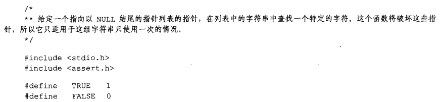
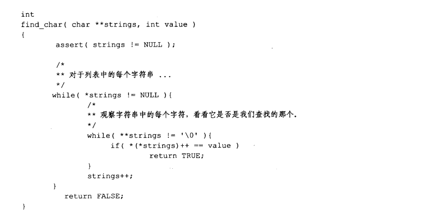
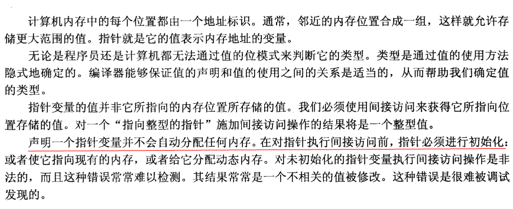
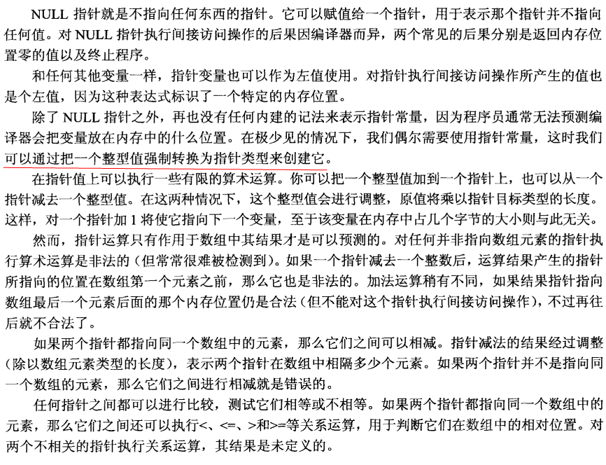
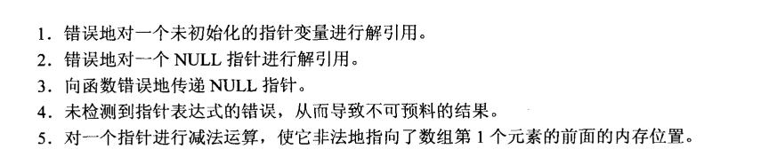

# 指针

## 内存和地址

变量的值存储于计算机的内存中，每个变量都占据着一个特定的位置。每个内存位置都由地址唯一确定并引用，就像是一条街道上的房子由他们的门牌号码标识一样。指针只是地址的另一个名字罢了。指针变量就是一个其值为另外一个内存地址的变量。

首先必须要非常明确的是：指针的实质就是个变量，它跟普通变量没有任何区别。指针完整的名字应该叫做指针变量，简称为指针。

指针的出现是为了实现间接访问，在汇编中都有间接访问，其实就是 CPU 寻址方式中的间接寻址。间接访问（CPU 的间接访问）是 CPU 设计时决定的，这个决定了汇编语言必须能够实现间接寻址，又决定了汇编之上的 C 语言也必须实现间接寻址。

间接寻址：意思就是不是通过一个立即数直接找到具体的数据，而是这个数据的地址被放在了一个寄存器中，我们先访问寄存器得到数据的地址，然后在通过得到的地址去访问所需要的数据。这里的寄存器在 C 语言中表现为指针变量，寄存器中的地址在 C 语言中表现为目标数据的地址，然后通过解引用指针变量中的地址来访问目标数据。原来 C 语言实现指针的机制后面是有硬件作为基础的，这才是本质。

## 值和类型

不能简单地通过检查一个值地位来判断一个数值的类型。为了判断这个值的类型（以及它的值），必须观察程序中使用这个值的方式。

## 指针变量的内容

变量的值就是分配给这个变量的内存位置所存储的数值，即使是指针变量也不例外。

## 间接访问操作符

通过一个指针访问它所指向的地址的过程称为间接访问（indirection）或解引用指针（dereferencing the pointer）。这个用于执行间接访问的操作符是单目操作符 *。

指针变量的值就是一个数字。箭头显示了这个数字的值，但箭头记法并未改变它本身就是个数字的事实。指针并不存在内建的间接访问属性，所以除非表达式中存在间接访问操作符，否则你不能按箭头所示实际访问它所指向的位置。

## 未初始化和非法的指针

### 野指针概念

野指针就是指针指向的位置是不可知的（随机的，不正确的，没有明确限制的）

野指针很可能触发运行时段错误（sgmentation fault）。

因为指针变量在定义时如果未初始化，值也是随机的。指针变量的值其实就是别的变量的地址，所以意味着这个指针指向了一个地址是不确定的变量，这时候去解引用就是去访问这个地址不确定的变量，所以结果是不可知的。

### 如何避免野指针

野指针的错误来源就是指针定义了以后没有初始化，也没有赋值，没有明确指向一个可用的内存空间，然后就去解引用了。

避免野指针的方法：在指针的解引用之前，一定确保指针指向一个绝对可用的空间。

常规的做法是：

1.定义指针时，同时初始化为NULL.

2.在指针解引用之前，先去判断这个指针是不是NULL。

3.在指针使用完之后，将其赋值为NULL。

4.在指针使用之前，将其赋值绑定一个可用地址你空间。

这四点防止野指针的方案绝对可行，在实践中在中小型的程序中，自己的水平可以把握的时候，可以不必严格按照这个标准，但是在大型程序中，或者自己水平感觉不好把握时，需要严格按照这样的标准。

## NULL 指针

NULL 在 C/C++ 中定义为：

```c
#ifdef _cplusplus			// 定义这个符号就表示当前是C++环境
#define NULL 0	            // 在C++中NULL就是0
#else
#define NULL (void *)0		// 在C中NULL是强制类型转换为void *的0
#endif
```
在C语言中，int *p，可以用 p = (int *)0，但是不可以 p = 0；因为类型不相同。

所以 NULL 的实质就是 0，然后我们给指针赋初值为 NULL，其实就是让指针指向 0 地址处。为什么要指向0地质处呢？原因有两个：

1.第一个原因是 0 地址处作为一个特殊地址，我们认为指针指向 0 地址就表示指针没有被初始化，就表示为野指针。

2.第二个原因是 0 地址一般在操作系统中都是不可被访问的，如果 C 程序员不检查指针是否等于 NULL，就直接去解引用这个指针，那么就会触发段错误，这已经是最好的结果了。

一般判断指针是否是野指针就写成 if (NULL == p)，而不写成 if(p == NULL)，这样写如果将 == 写成了 = 编译器就会报错，程序员就会发现这个问题。

## 指针、间接访问和左值

指针变量可以作为坐值，并不是因为他们是指针，而是因为他们是变量。对指针变量进行间接访问表示我们应该访问指针所指向的位置。间接访问制定了一个特定的内存位置看这样我们把间接访问表达式当作左值使用。

## 指针、间接访问和变量

```c
*&a = 25; 
```

上面这一句的效果和 a = 25 是一样的，但是它涉及更多的操作。除非编译器知道你在干什么并丢弃额外的操作，否则它所产生的目标代码将会更大、更慢。更糟糕的是，这些额外的操作符会使源代码的可读性变差。基于这些原因，没人会故意使用像 *&a 这样的表达式。

## 指针常量

访问内存中某个特定的位置，通过强制类型转换将一个整数转化为指针类型。
```
*(int *)100 = 25;
```

## 指针的指针

假定有如下的声明：
```c
int a = 12;
int *b = &a;
int **c = &b;
```

上面的新面孔是最后一个表达式，让我们来对它进行分析。 * 操作符有从右向左的结核性，所以这个表达式相当于 `*(*c)`，我们从里向外逐层求值。`*c` 访问 c 所指向的位置，我们知道这是变量 b。第二个间接访问操作符访问这个位置所指向的地址，也就是变量 a。指针的指针并不难懂，只需要留心所有的箭头，如果表达式中出现了间接访问操作符，就随箭头访问它所指向的位置。

## 指针表达式

声明如下：
```c
char ch = 'a';
char *cp = &ch;
```

### &ch

| 表达式 | 右值           | 左值 |
| ------ | -------------- | ---- |
| &ch    | 变量 ch 的地址 | 非法 |

&ch 不能当作左值使用，因为当表达式 &ch 进行求值时，它的结果存在何处是未知的。这个表达式并没有标识任何机器内存的特定位置，所以它不是一个合法的左值。

### cp

| 表达式 | 右值           | 左值 |
| ------ | -------------- | ---- |
| cp    | cp 的值 | cp 所处的内存位置 |

### &cp

| 表达式 | 右值           | 左值 |
| ------ | -------------- | ---- |
| cp    | 指针变量的地址| 非法 |

这次所取得的是指针变量的地址，这个结果的类型是指向字符的指针的指针。同样，这个值得存储位置并未清晰定义，所以这个表达式不是一个合法的左值。

### `*cp`

| 表达式 | 右值           | 左值 |
| ------ | -------------- | ---- |
| *cp   | cp 指针指向变量的值 | cp 指针指向的地址 |

### `*cp + 1`

| 表达式 | 右值           | 左值 |
| ------ | -------------- | ---- |
| `*cp + 1`  | cp 指针指向变量的值加一 | 非法|

表达式的最终结果为字符 'b'，但是这个表达式的最终结果的存储位置并未清晰定义，所以它不是一个合法的左值。**优先级表格证实 + 的结果不能作为左值**。

### `*(cp + 1)`

| 表达式 | 右值           | 左值 |
| ------ | -------------- | ---- |
| `*(cp + 1)`   | cp 指针加一位置的值 | cp 指针加一位置本身|

这里需要学习很重要的一点。注意指针加法运算地结果是个右值，因为它的存储位置并未清晰定义。如果没有间接访问操作，这个表达式将不是一个合法的左值。然而，间接访问跟随指针访问一个特定地位置。这样，`*(cp + 1)`就可以用来当作左值使用，尽管 `cp+1` 本身并不是左值。间接访问操作符是少数几个其结果为左值地操作符之一。

### ++cp

| 表达式 | 右值           | 左值 |
| ------ | -------------- | ---- |
| ++cp  |cp 指针增值后的一份拷贝  | 非法|

我们增加了指针变量 cp 的值。表达式的结果是增值后的指针的一份拷贝，因为前缀 ++ 先增加它的操作数的值再返回这个结果。这份拷贝的存储位置并未清晰定义，所以它不是一个合法的左值。

### cp++

| 表达式 | 右值           | 左值 |
| ------ | -------------- | ---- |
| cp++  |cp 指针的一份拷贝  | 非法|

后缀++操作符同样增加 cp 的值，但是它先返回 cp 值得一份拷贝然后再增加 cp 得值。这样这个表达式的值就是 cp 原理指针的一份拷贝。

++cp 和 cp++ 这两个表达式的值都不是合法的左值。但是如果我们再表达式中增加了间接访问操作符，他们就可以成为合法的左值，如下面两个表达式：

### `*++cp`

| 表达式 | 右值           | 左值 |
| ------ | -------------- | ---- |
| `*++cp`|cp 指针指向地址后面那个地址上的值 | cp 指针指向的地址后面那个地址的位置本身|

### `*cp++`

| 表达式 | 右值           | 左值 |
| ------ | -------------- | ---- |
| `*cp++` |cp 指针指向地址后面那个地址上的值 | cp 指针指向的地址后面那个地址的位置本身|

使用后缀 ++ 操作符所产生的结果不同：它的右值和左值分别是变量 ch 的值和 ch 的内存位置，也就是 cp 原先所指。同样，后缀++操作符在周围的表达式中使用其原先操作数的值。间接访问操作符和后缀++操作符的组合常常令人误解。优先级表格显示后缀++操作符的优先级高于`*`操作符，但表达式的结果看上去像是先执行间接访问操作。事实上，这里涉及3个步骤：

1. ++ 操作符产生 cp 的一份拷贝
2. 然后 ++ 操作符增加 cp 的值
3. 最后，在 cp 的拷贝上执行间接访问操作

这个表达式常常在循环中出现，首先用一个数组的地址初始化指针，然后使用这种表达式就可以依次访问该数组的内容了。

### `++*cp`

| 表达式 | 右值           | 左值 |
| ------ | -------------- | ---- |
| `*cp++` |cp 指针指向位置的值加1 | 非法|

这个表达式的最终结果的存储位置并未清晰定义，所以它不是一个合法的左值。

下面是三个使用较少的表达式：

### `(*cp)++`

| 表达式 | 右值           | 左值 |
| ------ | -------------- | ---- |
| `(*cp)++` |cp 指针指向位置加 1 前的值 | 非法|

使用后缀++操作符，我们必须加上括号，使它首先执行间接访问操作。这个表达式的计算过程与前一个表达式相似，但是它的结果值是ch增值前的原先值。因为后缀++表达式会先把`(*cp)`的值给出去，然后再将其值+1。

### `++*++cp`

| 表达式 | 右值           | 左值 |
| ------ | -------------- | ---- |
| `++*++cp` |cp 指针指向位置的后一个位置的值加1 | 非法|

cp 指向地址后面那个位置的值加 1，作为左值是非法的，因为不知道最后的运行结果存储位置是在什么地方。

### `++*cp++`

| 表达式 | 右值           | 左值 |
| ------ | -------------- | ---- |
| `++*cp++` |cp 指针指向位置的值加1 | 非法|

这个表达式和前一个表达式的区别在于这次第一个++操作符是后缀形式，而不是前缀形式。由于它的优先级较高，所以先执行它。间接访问操作所访问的是 cp 所指向的位置而不是 cp 所指向位置后面的那个位置。分解步骤：

1. ++操作符产生一份 cp 的一份拷贝
2. 然后 ++ 操作符增加 cp 的值
3. 在 cp 的拷贝上执行间接访问操作
4. 将上一步获得的，间接访问的值加1

这样就解释了这个表达式，同时由于无法知道最终结果的存储位置，所以不能作为左值。

## 实例

### 示例：字符串长度


指针到达字符串末尾的 NULL 字节之前，while 语句中 `*string++` 表达式的值一直为真。它同时增加指针的值，用于下一次测试。这个表达式甚至可以正确地处理空字符串。

### 示例：在一组字符串中查找字符值

在示例二和示例三中，增加了一层间接访问。他们在一些字符串中搜索某个特定的字符值，但我们使用指针数组来表示这些字符串。函数的参数是 strings 和 value，strings 是一个指向指针数组的指针，value 是我们所查找的字符值。注意指针数组以一个 NULL 指针结束。函数将检查这个值以判断循环何时结束。指向字符串的指针的数组由下图表示：


#### 版本1

下面这行表达式：

```C
while( (string = *strings++ ) != NULL )
```

完成三项任务：

1. 它把 strings 当前所指向的指针复制到变量 string 中。
2. 它增加 strings 的值，使它指向下一个值。
3. 它测试 string 是否为 NULL。当 string 指向当前字符串中作为终止标志的 NULL 字节时，内层的 while 循环就终止。


如果 string 尚未到达其结尾的 NULL 字节，就执行下面这条语句：

```c
if( *string++ == value )
```

它测试当前的字符串是否与需要查找的字符匹配，然后增加指针的值，使它指向下一个字符。

#### 版本2

下面的这个程序实现相同的字符值查找功能，但**它不需要对指向每个字符串的指针作一份拷贝**。但是，由于在程序中直接对 strings 进行操作，这将会修改字符串指针数组里面的值，**导致这个指针数组被破坏**。这个副作用导致这个函数不如前面那个版本有用，因为它**只适合用于字符串只需要查找一次的情况**。





这里由两个有趣的表达式：

- `**string`：第一个间接访问操作访问指针数组中的当前指针，第二个间接访问操作随该指针访问字符串中的当前字符。内层的 while 语句测试这个字符的值并观察是否到达了字符串的末尾。
- `*(*strings)++`：括号是需要的，这样才能使表达式以正确的顺序进行求值。第 1 个间接访问操作访问列表中的当前指针，增值操作把该指针所指向的那个位置的值加 1，但第 2 个间接访问操作作用于原先那个值得拷贝上。这个表达式的直接作用是对当前字符串中的当前字符进行测试，看看是否到达了字符串的末尾。作为副作用，指向当前字符串字符的指针值将增加 1。

## 指针运算

当一个指针和一个整数量执行算数运算时，整数在执行加法运算前始终会根据合适的大小进行调整。这个“合适的大小”就是指针所指向类型的大小，“调整”就是把整数值和“合适的大小”相乘。为了更好地说明，试想在某台机器上，float 占据 4 个字节。在计算 float 型指针加 3 的表达式时，这个 3 将根据 float 类型的大小（此例中为 4）进行调整（相乘）。这样实际加到指针上的整型值为 12。

### 算术运算

#### 第一种形式：指针 ± 整数


#### 第二种形式：指针 - 指针

只有当两个指针都指向同一个数组中的元素时，才允许从一个指针减去另一个指针，如下图所示：


### 关系运算


需要注意的是，标准允许指向数组元素的指针与指向数组最后一个元素后面的那个内存位置的指针进行比较，但**不允许与指向数组第一个元素之前的那个内存位置的指针进行比较**。

尽管在大多数C编译器中这种才做可以执行，但是并不能保证它在所有的机器上都可以运行，因为标准并不保证它可行。如果遇到一个执行这种操作失败的机器，对于负责可移植代码的程序员而言，这类问题是很严重的。

## 总结




## 警告的总结



## 编程提示的总结

1. 一个值应该只具有一种意思。
2. 如果指针并不指向任何有意义的东西，就把它设置为 NULL。
