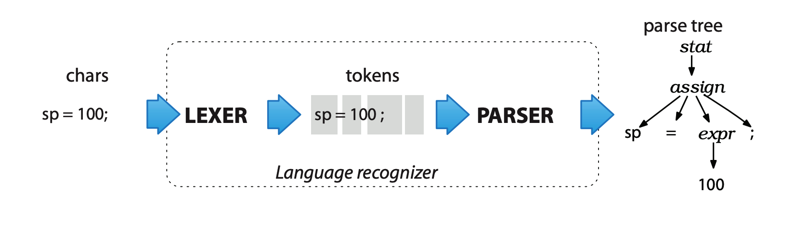

# 编译器前端实现研究

实现一种语言的编译器前端有多种方法，主要包括两个部分：

- 词法解析器
- 语法解析器

其中词法解析过程可以使用手动编程构建有限状态机的方式来实现，而语法解析器则需要手动实现上下文无关文法的分析。如果语言比较复杂的话，手动实现工作量巨大，也不易于修改和完善，这是手动实现的一些弊端，当然手动实现是一种非常棒的学习方法，这一点是不可否认的。

如果有能力手动实现那自然是很好的，在这其中也有一个陷阱，那就是不要做没有理论指导的手动实现。例如实现词法解析器的过程，你当然可以自己创造一种蹩脚的方式来实现词法解析，但是如果读过词法解析的相关理论，就自然知道有更好的实现方法，那么在初期学习的阶段就没有必要自己绞尽脑汁去做一种坐井观天的实现，而是要先学习现有的理论知识，后续知道更多了，再来改进现有的工作才是更好的做法。

说实话手动实现一个编译器前端对我来说确实是个比较困难的工作，但是我感觉这项技能似乎用到的地方很多，比如说：

- 理解不同语言之间的异同点
- 根据 BNF 理解某段代码是否符合语言规范
- 理解自动生成程序流程图的过程
- 更快地学会一门新的语言

理解编译原理好处多多，因此我不想放弃，决定花费更多时间在这项技能上，我决定先学习 ANTLR，后续利用该工具能解决一些工作上所需要处理的形式文本的问题，在实践中不断理解编译原理。话不多说，接下来就认真学习 ANTLR 工具吧。 

## ANTLR 安装配置方法

具体的安装方法可以在每次安装的时候到 ANTLR 的官方仓库去找，就没必要写的很仔细了，linux 机器上的安装时比较方便的，所以这里就只列出 windows 下安装以及配置方法了。

### Windows

安装 java 开发环境，修改 antlr_jar 文件夹下的 bat 文件，将 jar 文件的指定路径修改正确，
然后将 bat 文件所在目录加入系统环境变量，即可使用 antlr 与 grun 命令开发与验证语法分析应用。

## ANTLR 使用方法初探

### 利用 ANTLR 进行词法解析

用于测试的语法规则如下：

```c
grammar Hello;            // Define a grammar called Hello
r  : 'hello' ID ;         // match keyword hello followed by an identifier
ID : [a-z]+ ;             // match lower-case identifiers
WS : [ \t\r\n]+ -> skip ; // skip spaces, tabs, newlines, \r (Windows)
```

1. 使用 ANTLR 编译语法规则

```
antlr Hello.g4
```
2. 使用 Java 编译 ANTLR 生成的文件，生成语法分析器

```
javac *.java
```

- 调用生成的分析器，打印出对 hello.txt 的语法分析结果

```shell
grun Hello tokens -tokens hello.txt
```

### ANTLR 语法解析示例

在语法解析前需要先进行词法解析，将输入的文本提取为一个个 token，然后再进行语法分析，生成抽象语法树即 AST。所以语法解析一般都会引用先前编写的词法解析规则，然后在此基础上扩展语法规则。

一般情况下，如果词法解析文件比较复杂，那么会将词法解析规则单独放置在一个文件中，然后在语法解析规则文件中引用词法解析规则文件。当然如果词法解析非常简单，那么自然可以将词法解析与语法解析放置在一个文件中。

1. 生成解析器与词法分析器

```
antlr Hello.g4
```

2. 编译规则文件，生成语法分析器

```
javac *.java
```

3. 利用 `grun` 验证规则文件

```shell
grun Hello r -tokens
```

```
grun Hello r -tree
```

```shell
grun Hello r -tree -gui # 图形化的方式展示语法树
```

运行上述命令后会要求输入将要被解析的文本，输入相应文本后使用在 unix 下使用 `ctrl + d` 或者在 windows 下按下 `Ctrl+Z` 结束输入。

### Options briefly

| Options                | 作用                                                         |
| ---------------------- | ------------------------------------------------------------ |
| -tokens                | 打印出字元流（tokens）                                       |
| -tree                  | 使用 LISP 形式打印出解析树                                   |
| -gui                   | 使用对话框的形式可视化展示解析树                             |
| -ps file.ps            | generates a visual representation of the parse tree in PostScript and stores it in file.ps. The parse tree figures in this chapter were generated with -ps. |
| -encoding encodingname | specifies the test rig input file encoding if the current locale would not read the input properly. |
| -trace                 | 按照规则进入和退出的时候打印规则名称以及当前 token           |
| -diagnostics           | 在解析过程中打开诊断信息。这个选项产生的信息只是为了一些非一般的情况，例如模棱两可的输入短语 |
| -SLL                   | 使用一种更快速但是更弱的解析策略                             |

## 整体概念

通过操作解析树，多个需要识别相同语言的应用可以复用同一个解析器。另一种选择是将应用特有的代码片段直接嵌入到语法中，这是解析器传统的方式，但是如果使用解析树的话，可以做到更内聚和解耦的设计。也就是说后续的应用直接再次使用解析树就可以了，这样做到了更好的分层设计。

解析树对于要多次遍历的应用很有用，同时编码和测试也都更方便，不会过于复杂。比起每次都重新解析一次输入的字符，仅仅多次遍历解析树也是更有效率的一种方式。

### 解析过程如何实现



以一个简单的赋值语句为例：

```c
// assign : ID '=' expr ';' ;
void assign() { // method generated from rule assign
match(ID);      // compare ID to current input symbol then consume
match('=');
expr();         // match an expression by calling expr()
match(';');
}
```

### 模棱两可的语句

在自然语言中模棱两可的语句可能会比较好玩，但是会对基于计算机的语言应用造成问题。为了解释或者翻译一个短语，一个程序必须独一无二地理解它的含义。这也就是说我们必须提供没有二义性的语法，这样产生的解析器才可以用精确地方式匹配输入的短语。

在后续生成解析器的过程中，要逐渐学会处理各种二义性问题。在一些情况下，如果输入的词组符合多重选择，ANTLR 会选择可选项的第一个作为当前匹配项。

### Parse-Tree Listeners and Visitors

ANTLR  provides  support  for  two  tree-walking  mechanisms  in  its  runtimelibrary.  

这两种机制用来连接应用专用的代码和解析器

####Parse-Tree Listeners

####  Parse-Tree Visitors

#### Parsing Terms

- Parser

  一个解析器通过根据语法的规则检查句子的结构来检查句子是否属于特定的语言。对于解析过程最好的类比是穿过一个迷宫，将句子中的词组和写在一路地板上的词组作对比，来从入口走到出口。

- Recursive-descent parser

  这是一种特定类型的自顶向下的解析器，为语法中的每一个规则都实现了一个函数。

- Lookahead

  解析器通过比较每一个可选择路径起始的符号，使用 lookahead 来做决定。


