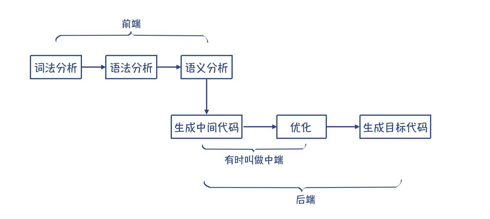
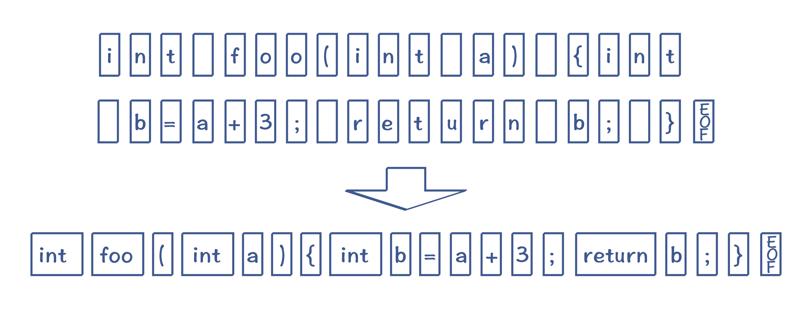
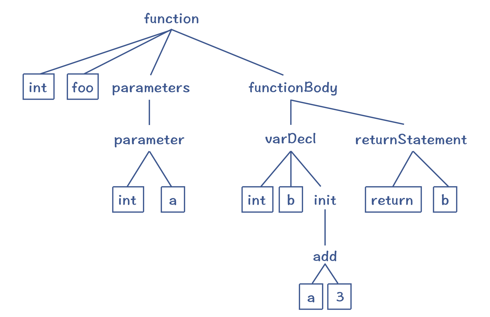
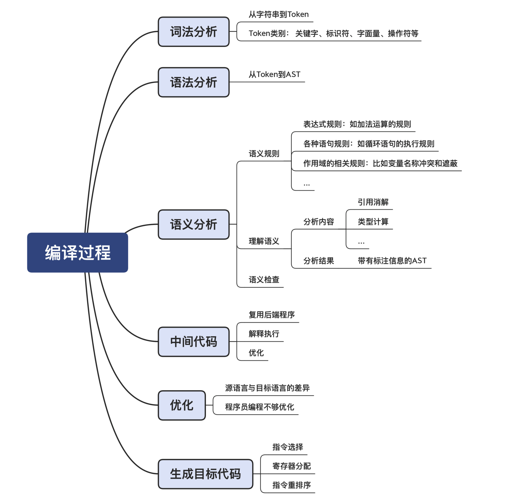

#  编译的各个阶段

编译，其实就是把源代码编程目标代码的过程。

## 词法分析

在编译之前，源代码只是一长串字符而已，这显然不利于编译器理解程序的含义。所以，编译的第一步，就是要像读文章一样，先把里面的单词和标点符号识别出来。程序里面的单词叫做 Token，它可以分成关键字、标识符、字面量、操作符号等多个种类。把字符串转换为 Token 的这个过程，就叫做词法分析。

## 语法分析

识别出 Token 以后，离编译器明白源代码的含义仍然有很长一段距离。下一步，我们需要让编译器像理解自然语言一样，理解它的语法结构。这就是第二步，语法分析。

那么在编译器里，语法分析阶段也会把 Token 串，转换成一个体现语法规则的、树状的数据结构，这个数据结构叫做抽象语法树（AST，Abstract Syntax Tree）。我们前面的示例程序转换为 AST 以后，大概是下面这个样子：

这样的一棵 AST 反映了示例程序的语法结构。比如说，我们知道一个函数的定义包括了返回值类型、函数名称、0 到多个参数和函数体等。这棵抽象语法树的顶部就是一个函数节点，它包含了四个子节点，刚好反映了函数的语法。再进一步，函数体里面还可以包含多个语句，如变量声明语句、返回语句，它们构成了函数体的子节点。然后，每个语句又可以进一步分解，直到叶子节点，就不可再分解了。而叶子节点，就是词法分析阶段生成的 Token（图中带边框的节点）。对这棵 AST 做深度优先的遍历，你就能依次得到原来的 Token。

## 语义分析

在语义分析阶段，编译器会做语义理解和语义检查这两方面的工作。词法分析、语法分析和语义分析，统称编译器的前端，它完成的是对源代码的理解工作。

做完语义分析以后，接下来编译器要做什么呢？本质上，编译器这时可以直接生成目标代码，因为编译器已经完全理解了程序的含义，并把它表示成了带有语义信息的 AST、符号表等数据结构。生成目标代码的工作，叫做后端工作。做这项工作有一个前提，就是编译器需要懂得目标语言，也就是懂得目标语言的词法、语法和语义，这样才能保证翻译的准确性。这是显而易见的，只懂英语，不懂汉语，是不可能做英译汉的。通常来说，目标代码指的是汇编代码，它是汇编器（Assembler）所能理解的语言，跟机器码有直接的对应关系。汇编器能够将汇编代码转换成机器码。熟练掌握汇编代码对于初学者来说会有一定的难度。但更麻烦的是，对于不同架构的 CPU，还需要生成不同的汇编代码，这使得我们的工作量更大。所以，我们通常要在这个时候增加一个环节：先翻译成中间代码（Intermediate Representation，IR）。

## 中间代码（Intermediate Representation）

中间代码（IR），是处于源代码和目标代码之间的一种表示形式。我们倾向于使用 IR 有两个原因。第一个原因，是很多解释型的语言，可以直接执行 IR，比如 Python 和 Java。这样的话，编译器生成 IR 以后就完成任务了，没有必要生成最终的汇编代码。第二个原因更加重要。我们生成代码的时候，需要做大量的优化工作。而很多优化工作没有必要基于汇编代码来做，而是可以基于 IR，用统一的算法来完成。

## 优化（Optimization）

那为什么需要做优化工作呢？这里又有两大类的原因。

- 第一个原因，是源语言和目标语言有差异。源语言的设计目的是方便人类表达和理解，而目标语言是为了让机器理解。在源语言里很复杂的一件事情，到了目标语言里，有可能很简单地就表达出来了。

- 第二个需要优化工作的原因，是程序员写的代码不是最优的，而编译器会帮你做纠正。

## 生成目标代码

编译器最后一个阶段的工作，是生成高效率的目标代码，也就是汇编代码。

这个阶段，编译器也有几个重要的工作。

- 第一，是要选择合适的指令，生成性能最高的代码。

- 第二，是要优化寄存器的分配，让频繁访问的变量（比如循环变量）放到寄存器里，因为访问寄存器要比访问内存快 100 倍左右。

- 第三，是在不改变运行结果的情况下，对指令做重新排序，从而充分运用 CPU 内部的多个功能部件的并行计算能力。

目标代码生成以后，整个编译过程就完成了。

## 总结

计算机语言的编译和自然语言的翻译的异同点。

相同的地方：

- 都需要对源语言和目标语言非常熟悉
- 都需要经历词法分析、语法分析、语义分析等过程
- 都经过一个 **意译** 的过程，翻译后和原来的语句不通，但是信息具有等价性

不同的地方：

- 自然语言要比一门编程语言的复杂性要大得多
- 自然语言的翻译有更大的模糊性，或者说自然语言本身就不像编程语言那般精确，没有歧义
- 自然语言的词汇量和语法要复杂很多
- 编程语言的翻译可以经过很强的优化，优化过后的代码机器还可以正确执行，但是如果对自然语言进行这样的优化，可能会丢失很多有用的信息，变得不易读，不易理解
