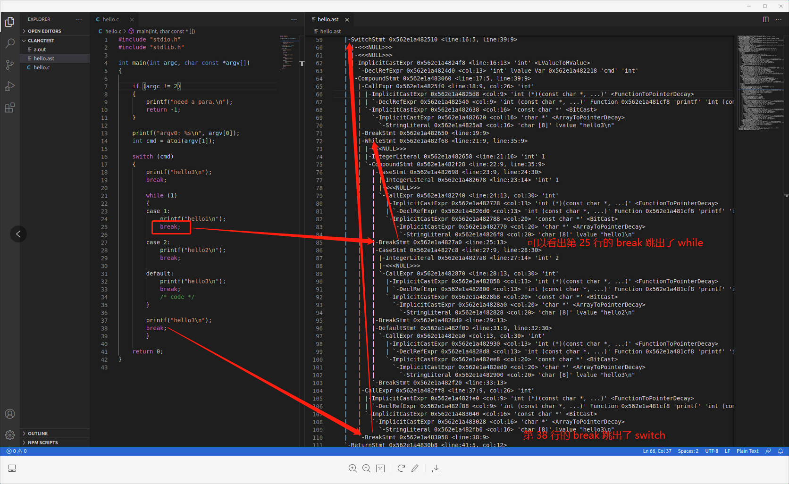

# 通过 Clang 生成 AST

通过查看 C 语言的 BNF （[The syntax of C in Backus-Naur Form](https://cs.wmich.edu/~gupta/teaching/cs4850/sumII06/The%20syntax%20of%20C%20in%20Backus-Naur%20form.htm)）可以知道：

```
<selection-statement> ::= if ( <expression> ) <statement>
                        | if ( <expression> ) <statement> else <statement>
                        | switch ( <expression> ) <statement>
```

switch 语句后只要是 `<statement>` 即可，也就是说，可以是任意合法语句，通过下面的实验，通过 C 语言的 AST 推断程序的运行行为。

## 巴科斯范式

巴科斯范式（英语：Backus Normal Form，缩写为 BNF），又称为巴科斯-诺尔范式（英语：Backus-Naur Form，缩写同样为 BNF，也译为巴科斯-瑙尔范式、巴克斯-诺尔范式），是一种用于表示上下文无关文法的语言，上下文无关文法描述了一类形式语言。它是由约翰·巴科斯（John Backus）和彼得·诺尔（Peter Naur）首先引入的用来描述计算机语言语法的符号集。

尽管巴科斯范式也能表示一部分自然语言的语法，它还是更广泛地使用于程序设计语言、指令集、通信协议的语法表示中。大多数程序设计语言或者形式语义方面的教科书都采用巴科斯范式。在各种文献中还存在巴科斯范式的一些变体，如扩展巴科斯范式 EBNF 或扩充巴科斯范式 ABNF。

### 介绍

BNF 规定是推导规则(产生式)的集合，写为：

<符号> ::= <使用符号的表达式>

这里的 <符号> 是非终结符，而表达式由一个符号序列，或用指示选择的竖杠 '|' 分隔的多个符号序列构成，每个符号序列整体都是左端的符号的一种可能的替代。从未在左端出现的符号叫做终结符。

## 环境准备

- apt-get install llvm
- apt-get install clang
- clang -v

## 测试过程

测试代码:

```
#include "stdio.h"
#include "stdlib.h"

int main(int argc, char const *argv[])
{

    if (argc != 2)
    {
        printf("need a para.\n");
        return -1;
    }

    printf("argv0: %s\n", argv[0]);
    int cmd = atoi(argv[1]);

    switch (cmd)
    {
        printf("hello3\n");
        break;

        while (1)
        {
        case 1:
            printf("hello1\n");
            break;

        case 2:
            printf("hello2\n");
            break;

        default:
            printf("hello3\n");
            break;
            /* code */
        }

        printf("hello3\n");
        break;
        }

    return 0;
}
```

## 使用 clang 命令生成 AST

```
clang -cc1 -ast-dump hello.c > hello.ast
```

运行结果如下图所示：


