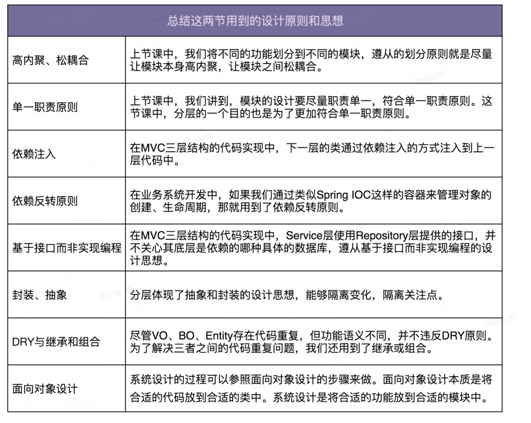

# 软件设计思想与原则

## 单一职责原则

单一职责原则是类划分的重要参考依据，是保证代码高内聚的有效手段，是面向对象前两步（划分职责并只识别出有哪些类、定义类及其属性的方法）的主要指导原则。单一职责原则的难点在于，对代码职责是否足够单一的判定。要根据场景的具体分析。同一个类的设计，在不同的场景下，对职责是否单一的判定，可能是不同的。

## OCP 开闭原则

一个软件模块实现了很多通用逻辑，如果想添加一些特殊处理进去而不想修改软件模块，可以考虑给这个模块添加拓展点，让其他模块注册更多处理逻辑到该模块中。这样增加功能时就不需要修改原有代码。

## 里氏替换原则

## 接口隔离原则

对于接口隔离原则的重点是理解接口的意义，这里有三种不同的理解：

如果把接口理解为一组接口集合，可以是某个微服务的接口，也可以是某个类库的接口等。如果部分接口只被部分调用者使用，我们就需要将这部分接口隔离出来，单独给这部分调用者使用，而不强迫其他调用者也依赖这部分不会被用到的接口。

如果把接口理解为单个 API 接口或者函数，部分调用者只需要函数中的部分功能，那我们就需要把函数拆分成粒度更细的多个函数，让调用者只依赖他需要的那个细粒度函数。

如果把接口理解成 OOP 中的接口，也可以理解为面向对象编程语言中的接口语法。那接口的设计要尽量单一，不要让接口的实现类和调用类，依赖不需要的接口函数。

- 实践思考

有些时候一个头文件中暴露出了过多的接口，如果某个调用者只依赖部分接口，那么可以针对该调用者提供暴露功能更少的头文件。

在 C 语言中，如果调用者拿到了一个对象的结构体，那么它就有能力直接访问该对象的所有成员变量，但是有些时候我们并不希望调用者有能力访问对象部分属性。这时候我们可以只向调用者提供对象结构体的某些成员变量类型，然后实现一组必要的 SET/GET 函数，让调用者使用这一组有限的接口修改对象的属性。

## 依赖反转原则

### 控制反转

控制反转是一个比较笼统的设计思想，并不是一种具体的实现方法，一般用来指导框架层面的设计。这里所说的控制指的是对程序执行流程的控制，而反转指的是在没有使用框架之前，程序员自己控制整个程序的执行。在使用了框架之后，整个流程的执行流程通过框架来控制。程序的控制权从程序员反转给了框架。

### 依赖注入

依赖注入和控制反转恰恰相反，它是一种具体的编码技巧，我们不通过 new 的方式在类内部创建依赖类的对象，而是将依赖的类对象在外部创建好之后，通过构造函数、函数参数等方式传递（或注入）给类来使用。

### 依赖注入框架

我们通过依赖注入框架提供的扩展点，简单配置一下所有需要的类及其类与类之间依赖关系，就可以实现由框架来自动创建对象、管理对象的声明周期、依赖注入等原本需要程序员来做的事情。

### 依赖反转

依赖反转原则也叫做依赖倒置原则。这条原则跟控制反转有点类似，主要用来指导框架层面的设计。高层模块不依赖低层模块，他们共同依赖一个抽象。抽象不要依赖具体实现细节，具体实现细节依赖抽象。

> High-level modules shouldn’t depend on low-level modules. Both modules 
> should depend on abstractions. In addition, abstractions shouldn’t depend on 
> details. Details depend on abstractions

高层模块（High-level modules）不要依赖底层模块（low-level）。高层模块和底层模块应该通过抽象（abstractions）来互相依赖。除此之外，抽象（abstractions）不要依赖具体实现细节（details），具体实现细节（details）依赖抽象（abstractions）。

所谓高层模块和低层模块的划分，简单来说就是，在调用链上，调用者属于高层，被调用者属于低层。在平时的业务代码开发中，高层模块依赖底层模块没有任何问题。实际上这条原则主要还是用来指导框架层面的设计，跟控制反转类似。

## KISS

尽量保持简单，KISS 原则是保持代码可读和可维护的重要手段，代码足够简单，也就意味着很容易读懂，bug 难以隐藏，即使出现 bug，修复起来也比较简单，可以考虑以下原则：

- 不要使用同事可能不懂得技术来实现代码
- 不要重复造轮子，要善于是用已经有的工具类库
- 不要过度优化，不要过度使用一些技巧（比如位运算代替算数运算、复杂的条件语句替代 if else、使用一些过于底层的函数等）来优化代码，牺牲代码的可读性

## YAGNI

不要设计当前用不到的功能，不要去编写当前用不到的代码，这条原则的核心思想是不要做过度设计。

KISS 原则讲的是如何做的问题，即实现的时候尽量保持简单。而 YAGNI 原则说的是要不要做的问题（当前不需要的就不做）。

## 迪米特法则

Law of Demeter 缩写是 LOD，还有一个更加达意的名字叫做最小知识原则，英文翻译为 The Least Knowledge Principle。

```
Each unit should have only limited knowledge about other units: only units
“closely” related to the current unit. Or: Each unit should only talk to its
friends; Don’t talk to strangers.
```

1. 不该有直接依赖关系的类之间，不要有依赖。
2. 有依赖关系的类之间，尽量只依赖必要的接口（也就是定义中的有限知识）。
3. 基于最小接口而非最大实现编程，依赖的接口越多，那么当接口的实现有变动时，就需要执行更多的测试工作量。

迪米特法则是希望减少类之间的耦合，让类越独立越好。每个类都应该少了解系统的其他部分。一旦发生变化，需要了解这一变化的类就会比较少。

## 高内聚、松耦合

如何理解高内聚、低耦合？

- “高内聚、松耦合”是一个非常重要的设计思想，能够有效提高代码的可读性和可维护性，缩小功能改动导致的代码改动范围。“高内聚”用来指导类本身的设计，“松耦合”用来指导类与类之间依赖关系的设计。

- 所谓高内聚，就是指相近的功能应该放到同一个类中，不相近的功能不要放到同一类中。相近的功能往往会被同时修改，放到同一个类中，修改会比较集中。所谓松耦合指的是，在代码中，类与类之间的依赖关系简单清晰。即使两个类有依赖关系，一个类的代码改动也不会或者很少导致依赖类的代码改动。

## 如何提高代码复用性

- 减少代码耦合

  - 对于高度耦合的代码，当我们希望复用其中的一个功能，想把这个功能的代码抽取出来成为一个独立的模块、类或者函数的时候，往往会发现牵一发而动全身。移动一点代码，就要牵连到很多其他相关的代码。所以，高度耦合的代码会影响到代码的复用性，我们要尽量减少代码耦合。

- 满足单一职责原则

  - 我们前面讲过，如果职责不够单一，模块、类设计得大而全，那依赖它的代码或者它依赖的代码就会比较多，进而增加了代码的耦合。根据上一点，也就会影响到代码的复用性。相反，越细粒度的代码，代码的通用性会越好，越容易被复用。

- 模块化

  - 这里的“模块”，不单单指一组类构成的模块，还可以理解为单个类、函数。我们要善于将功能独立的代码，封装成模块。独立的模块就像一块一块的积木，更加容易复用，可以直接拿来搭建更加复杂的系统。

- 业务与非业务逻辑分离

  - 越是跟业务无关的代码越是容易复用，越是针对特定业务的代码越难复用。所以，为了复用跟业务无关的代码，我们将业务和非业务逻辑代码分离，抽取成一些通用的框架、类库、组件等。

- 通用代码下沉

  - 从分层的角度来看，越底层的代码越通用、会被越多的模块调用，越应该设计得足够可复用。一般情况下，在代码分层之后，为了避免交叉调用导致调用关系混乱，我们只允许上层代码调用下层代码及同层代码之间的调用，杜绝下层代码调用上层代码。所以，通用的代码我们尽量下沉到更下层。

- 继承、多态、抽象、封装

  - 在讲面向对象特性的时候，我们讲到，利用继承，可以将公共的代码抽取到父类，子类复用父类的属性和方法。利用多态，我们可以动态地替换一段代码的部分逻辑，让这段代码可复用。除此之外，抽象和封装，从更加广义的层面、而非狭义的面向对象特性的层面来理解的话，越抽象、越不依赖具体的实现，越容易复用。代码封装成模块，隐藏可变的细节、暴露不变的接口，就越容易复用。

- 应用模板等设计模式

  - 一些设计模式，也能提高代码的复用性。比如，模板模式利用了多态来实现，可以灵活地替换其中的部分代码，整个流程模板代码可复用。


除了上面的这些方法之外，复用意识也非常重要。在设计每个模块、类、函数的时候，要像设计一个外部 API 一样去思考它的复用性。

我们在第一次写代码的时候，如果当下没有复用的需求，而未来的复用需求也不是特别明确，并且开发可复用代码的成本比较高，那我们就不需要考虑代码的复用性。在之后开发新的功能的时候，发现可以复用之前写的这段代码，那我们就重构这段代码，让其变得更加可复用。

相比于代码的可复用性，DRY 原则适用性更强一些。我们可以不写可复用的代码，但一定不能写重复的代码。

# 业务系统分析与设计

要有能力独立负责一个系统，能端到端开发一个完整的系统，这其中的工作就包括，前期的需求沟通分析，中期的代码设计实现，后期的系统上线维护等。

大多数软件开发项目背后的想法其实就是要把一个手工的过程自动化，或者换句话说就是要创建一种新的自动化方式来做一些对于手工操作而言过于困难的事情。

这里有一个核心概念：

- **在自动化一个过程之前，你必须知道手动完成这件事情的全过程。**

软件开发的过程往往都是从对问题的透彻理解开始的。也就是说，你要自动化些什么？

## 需求分析

通过一些工具收集需求，罗列用户用例。

## 系统设计

面向对象设计聚焦在代码层面（主要是针对类），那系统设计就是聚焦在架构层面（主要是针对模块）两者有很多相似之处。很多设计原则和思想不仅仅可以应用到代码设计中，还能用到架构设计中。

### 合理地将功能划分到不同模块

面向对象设计的本质就是把合适的代码放到合适的类中。合理地划分代码可以实现代码的高内聚、低耦合，类与类之间的交互简单清晰，代码整体结构一目了然，那代码的质量就不会差到哪里去。类比面向对象设计，系统设计实际上就是将合适的功能放到合适的模块中。合理地划分模块也可以做到模块层面的高内聚、低耦合，架构整洁清晰。

### 模块间的交互关系

常见的系统之间的交互关系有两种：

- 一种是同步接口调用
- 另一种是利用消息中间件异步调用

第一种方式简单直接，第二种方式的解耦效果更好。上下层系统之间的调用倾向于通过 同步接口，同层之间的调用倾向于异步消息调用。

## 模块的接口、数据库、业务模型

业务系统本身的设计无外乎有这样三方面的工作要做：

- 接口设计
- 数据库设计
- 业务模型设计（也就是业务逻辑）

### 数据库

主要设计事务表（每次操作时产生的数据）的内容，一些总体的信息可以通过统计计算这些表的内容来得到。

### 接口设计

接口设计要符合单一职责原则，粒度越小通用性就越好。但是接口粒度太小也会带来一些问题，一个功能的实现需要调用多个小接口

- 如果接口走网络，多次调用会影响性能
- 本该在一个接口中完成的原子操作，现在拆分成多个小接口来完成，就可能会涉及分布式事务的数据一致性问题（一个接口执行成功了，另一个接口执行失败了）

所以为了兼顾易用性和性能，我们可以借鉴 facade（外观）设计模式，在职责单一的细粒度接口之上，在封装一层粗粒度的接口给外部使用。

### 业务模型

从代码实现的角度来说，大部分业务系统的开发都可以分为 controller、service、repository 三层。

- controller 层负责接口暴露
- repository 层负责数据读写
- service 层负责核心业务逻辑，也就是这里的业务模型

## 为什么需要 MVC 三层开发

- 分层能起到代码复用的作用
  - 同一个 repository 可能会被多个 service 调用
  - 同一个 service 可能会被多个 controller 调用
  - 如果没有 service 层，每个 controller 可能需要实现同样的逻辑，违背 DRY 原则
- 分层能起到隔离变化的作用
  - 分层体现了抽象和封装的设计思想。比如 repo 实现了对数据库访问的操作，提供了抽象的数据访问接口。
  - 基于接口而非实现编程的设计思想，service 层使用 repo 层提供的接口，并不关心底层依赖的是那种具体的数据库，便于替换数据库。
  - controller service repository 三层的稳定程度不同，分层之后，controller 层的变化不会影响到稳定的的 repository 层。
- 分层能起到隔离关注点的作用
  - repository 层只关注数据的读写
  - service 层只关注业务逻辑，不关心数据来源
  - controller 层只关注与外界打交道，数据校验、封装、格式转换，不关心业务
  - 三层之间的关注点不同，分层之后，职责分明，更加符合单一原则，代码的内聚性更好
- 分层能提高代码的可测试性
  - 下层的代码通过依赖注入的方式供上层使用
  - 可以用 mock 的数据来替代真实数据
- 分层能应对系统的复杂性
  - 当一个类或者一个函数的代码过多之后，可读性、可维护性就会变差，那就要想办法拆分，拆分分为垂直和水平两个方向：
    - 水平方向基于业务来做拆分，就是模块化
    - 竖直方向基于流程来做拆分，就是这里说的分层
  - 不管是分层、模块化，还是 OOP、DDD、以及各种设计模式，原则和思想，都是为了应对复杂系统，应对系统的复杂性，对于简单系统是发挥不了作用的。

## 设计模型与思想



# 通用框架分析与设计

## 需求分析

### 功能性需求分析

### 非功能性需求分析

## 框架设计

基于最小原型的思想，先聚集一个简单的场景，基于此设计实现一个简单的原型。

- 根据上面的功能性需求分析，选择一个简单的应用场景
- 实现最简小原型时可以不考虑各种复杂的软件设计要求，先实现一个最简单的功能，把功能先写到一个类中就可以了，有了基础原型，后续才可以慢慢迭代
- 实现一个最简单的原型后，可以帮我们理顺思路，基于这个最小原型，可以开始进行框架设计，画出系统设计图，让我们的脑子释放一部分资源去思考更细节的内容

对于复杂框架的设计，一开始的时候会觉得无从下手。这里有几个小技巧，包括：

- 画产品线框图
- 聚焦简单应用场景
- 设计实现最小原型（MVP）
- 画系同设计图等

这些方法的目的都是为了让问题简化、具体、明确，提供一个迭代设计开发的基础，逐步推进。

## 代码实现

前面我们已经对框架进行了需求分析和粗略的模块划分，后面我们就可以利用面向对象设计、实现方法，并结合之前学过的设计思想、设计原则来考虑如何编写灵活、可扩展、高质量的代码实现。

实际上，优秀的代码都是重构出来的，复杂的代码都是慢慢堆砌出来的。那些优秀而复杂的开源代码和项目代码，也都是靠几年时间慢慢迭代优化出来的，罗马不是一天建成的。

迭代思维很重要，不要刚开始就追求完美。

面相对象设计和实现要做的事情，就是把合适的代码放到合适的类中。至于到底选择哪种划分方法，判定的标准是让代码尽可能地满足低耦合、高内聚、单一职责、对扩展开放对修改关闭等各种设计原则和思想，尽可能做到代码客服用、易读、易扩展、易维护。

# 开发流程

## 需求分析

可用的需求分析方法：

1. 画线框图
2. 写用户用例
3. 测试驱动开发

我们借助用户用例和测试驱动开发的思想，先去思考，如果框架最终被开发出来之后，他会如何被使用。我们可以找一个框架的应用场景，针对这个场景写一个框架使用 demo 程序，这样能够很直观的看到框架长什么样子。知道了框架应该长什么样子，就相当于确定了考试题目，针对明确的考题去想解决方案，会让事情变得容易很多。

### 需求场景

先要考虑开发的业务模块/组件的应用场景，会遇到什么问题，有什么解决方法。

### 需求分析

针对需求进行进一步分析和整理，包括功能性需求和非功能性需求，功能性需求比较容易理解，即实现用户所需要的功能特性。非功能性需求可以从以下方面考虑：

- 易用性
  - 考虑使用配置文件等方式，不需要频繁修改代码或者重启系统
- 扩展性、灵活性
  - 考虑支持不同方式来配置、存储
- 性能
  - 考虑通信延迟
  - 外部存储的限制
- 容错性（异常情况处理）
  - 不能因为框架本身的异常，导致接口响应异常
  - 尽可能捕获异常，并且在内部消化掉，不要往上层业务代码中抛出

## 系统设计

1. 考虑正常业务流程如何实现
2. 考虑非功能性需求如何实现

## 代码实现

1. 从完成需求中剥离出 V1 版本需求，最小原型代码开始，实现一个最小版本的功能
2. review 最小原型代码，对代码进行重构优化，考虑代码的可读性，可扩展性，可测试性，灵活性等等
3. 一些框架、组件、类库的功能性需求都不复杂，相反，非功能性需求是开发的重点、难点

这一步就可以利用面向对象分析、设计、编程来进行代码实现，面向对象分析就是需求分析，面相对象设计就是代码层面的设计，输出的结果是类。面向对象编程就是将设计的结果翻译成代码的过程。

## 总结

对于项目中的一些通用功能，要主动思考代码的复用问题，考虑如何抽象成框架、类库、组件。在开发时，注意应用思考路径、开发套路来推动项目。

