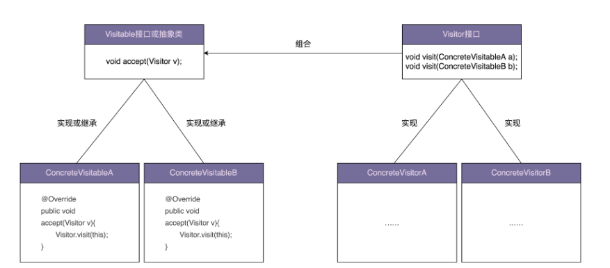
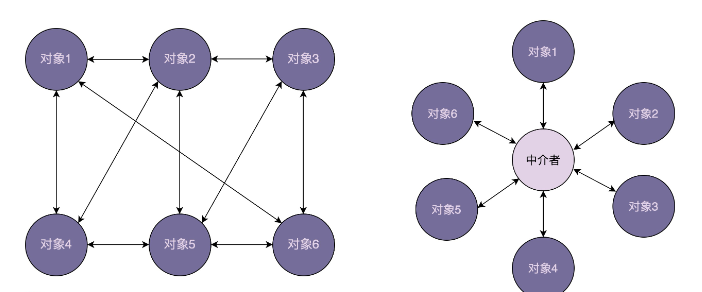

# 设计模式

如果说设计原则相当于编程心法，那设计模式相当于具体的招式。设计模式是针对软件开发中经常遇到的一些设计问题，总结出来的一套解决方案或者设计思路，我们用设计原则来评判代码设计哪里有问题，然后再通过具体的设计模式来改善。

## 概述

每个设计模式都由两部分组成：

- 第一部分是应用场景，即这个模式可以解决哪类问题
- 第二部分是解决方案，即这个模式的设计思路和具体的代码实现

如果只关注解决方案这一部分，甚至只关注代码实现，就会产生大部分模式看起来都很相似的错觉。实际上设计模式之间的主要区别还是在于设计意图，也就是应用场景。单纯地看设计思路或者代码实现，有些模式确实很相似，比如策略模式和工厂模式。

要重点**理解不同设计模式在应用场景上的侧重点**，不能仅仅关注解决方案。


## 创建型模式

创建型设计模式主要解决对象的创建问题，封装复杂的创建郭成，解耦对象的创建代码和使用代码。

### 单例模式

单例模式理解起来非常简单。一个类只允许创建一个对象（或者叫实例），那这个类就是一个单例类，这种设计模式就叫做单例设计模式，简称单例模式。

从业务概念上，有些数据在系统中只应该保存一份，就比较适合设计为单例类。比如系统配置信息类，除此之外我们还可以使用单例解决资源访问冲突的问题。

单例模式的问题：

- 单例对 OOP 特性的支持不友好
- 单例会隐藏类之间的依赖关系
- 单例对代码的扩展性不友好
- 单例对代码的可测试性不友好
- 单例不支持有参数的构造函数

### 工厂模式

工厂模式分为简单工厂、工厂方法和抽象工厂。简单工厂和工厂方法原理比较简单，在实际的项目中也比较常用，示例代码：

```
package com.example.product;

public interface Product {
    void use();
}

package com.example.product;

public class ConcreteProductA implements Product {
    @Override
    public void use() {
        System.out.println("Using Product A");
    }
}

package com.example.product;

public class ConcreteProductB implements Product {
    @Override
    public void use() {
        System.out.println("Using Product B");
    }
}

package com.example.factory;

import com.example.product.ConcreteProductA;
import com.example.product.ConcreteProductB;
import com.example.product.Product;

public class SimpleFactory {
    public static Product createProduct(String type) {
        switch (type) {
            case "A":
                return new ConcreteProductA();
            case "B":
                return new ConcreteProductB();
            default:
                throw new IllegalArgumentException("Unknown product type: " + type);
        }
    }
}

package com.example;

import com.example.factory.SimpleFactory;
import com.example.product.Product;

public class Client {
    public static void main(String[] args) {
        Product productA = SimpleFactory.createProduct("A");
        productA.use();

        Product productB = SimpleFactory.createProduct("B");
        productB.use();
    }
}
```

#### 思考总结

标准的工厂模式通过 type 来创建继承同一个父类的不同子类对象，而通过传递不同参数，来创建同一个类的对象的过程更像是建造者模式。

### 建造者模式

用来创建复杂对象，可以通过设置不同的可选参数，定制化地创建不同的对象。如果一个类中有很多属性，为了避免构造函数的参数列表过长，影响代码的可读性和易用性，我们可以通过构造函数配合 set() 方法来解决。但是如果存在下面情况中的任意一种，就要考虑使用建造者模式了。

- 我们把类的必填属性放到构造函数中，强制创建对象的时候就设置。如果必填的属性有很多，把这些必填的属性都放到构造函数中设置，那构造函数就又会出现参数列表很长的问题。如果把必填的属性通过 set() 方法设置，那校验这些必填属性是否已经填写的逻辑就无处安放了。
- 如果类的属性之间有一定的依赖关系或者约束条件，我们继续使用构造函数配合 set() 方法的设计思路，那这些依赖关系或约束条件的校验逻辑就无处安放了。
- 如果我们希望创建不可变对象，也就是说，对象在创建好之后，就不能再修改内部的属性值，要实现这个功能，我们就不能在类中暴露 set() 方法。构造函数配合 set() 方法来设置属性值的方式就不适用了。

```java
private ResourcePoolConfig(Builder builder){this.name=builder.name;this.maxTotal=builder.maxTotal;this.maxIdle=builder.maxIdle;this.minIdle=builder.minIdle;}
//...省略getter方法...

//我们将Builder类设计成了ResourcePoolConfig的内部类。
//我们也可以将Builder类设计成独立的非内部类ResourcePoolConfigBuilder。
public static class Builder {
 private static final int DEFAULT_MAX_TOTAL = 8;
 private static final int DEFAULT_MAX_IDLE = 8;
 private static final int DEFAULT_MIN_IDLE = 0;

 private String name;
 private int maxTotal = DEFAULT_MAX_TOTAL;
 private int maxIdle = DEFAULT_MAX_IDLE;
 private int minIdle = DEFAULT_MIN_IDLE;

 public ResourcePoolConfig build() {
 // 校验逻辑放到这里来做，包括必填项校验、依赖关系校验、约束条件校验等
 if (StringUtils.isBlank(name)) {
 throw new IllegalArgumentException("...");
 }
 if (maxIdle > maxTotal) {
 throw new IllegalArgumentException("...");
 }
 if (minIdle > maxTotal || minIdle > maxIdle) {
 throw new IllegalArgumentException("...");
 }

 return new ResourcePoolConfig(this);
 }

 public Builder setName(String name) {
 if (StringUtils.isBlank(name)) {
 throw new IllegalArgumentException("...");
 }
 this.name = name;
 return this;
 }

 public Builder setMaxTotal(int maxTotal) {
 if (maxTotal <= 0) {
 throw new IllegalArgumentException("...");
 }
 this.maxTotal = maxTotal;
 return this;
 }

 public Builder setMaxIdle(int maxIdle) {
 if (maxIdle < 0) {
 throw new IllegalArgumentException("...");
 }
 this.maxIdle = maxIdle;
 return this;
 }

 public Builder setMinIdle(int minIdle) {
 if (minIdle < 0) {
 throw new IllegalArgumentException("...");
 }
 this.minIdle = minIdle;
 return this;
 }
 }
 }

 // 这段代码会抛出IllegalArgumentException，因为minIdle>maxIdle
 ResourcePoolConfig config = new ResourcePoolConfig.Builder()
 .setName("dbconnectionpool")
 .setMaxTotal(16)
 .setMaxIdle(10)
 .setMinIdle(12)
 .build();
```

#### 思考总结

使用建造者模式的时候，我们使用 builder 类来创建对象，一般都是先级联一组 `setxxx` 方法来设置属性，然后再调用 build() 方法最终创建对象，这样做就可以解决上面列出的三种情况了。

这里的 builder 类可以设计成 `ResourcePoolConfig` 的内部类，也可以将 builder 类设计成独立的非内部类 `ResourcePoolConfigBuilder`。

### 原型模式

如果对象的创建成本比较大，而同一个类的不同对象之间差别不大（大部分字段都相同），在这种情况下，我们可以**利用已有对象（原型）进行复制（或者叫拷贝）的方式来创建新对象**，已达到节省创建时间的目的。这种基于原型来创建对象的方式就叫做原型设计模式（Prototype Design Pattern），简称原型模式。

如果对象中的数据需要经过复杂的计算才能得到（比如排序、计算哈希值）或者需要从 RPC、网络、数据库、文件系等非常慢速的  IO 中读取，在这种情况下，我们就可以利用原型模式，从其他已有对象中直接拷贝得到，而不用每次在创建新对象的时候，都重复执行这些耗时的操作。

#### 思考总结

在神经网络推理的过程中，需要将 network 的信息（网络的指令和权重，这些信息是只读的）从用户态传入内核态，然后在内核态为网络的推理申请运行时的内存空间，即 graph（graph ）。在多进程场景中，每个进程可能创建相同的网络，此时如果多次执行网络只读信息的搬运（需要从文件系统读取，然后从用户态搬运到内核态），效率比较低，也会占用很多内存，此时可以考虑：

- 多进程多次创建同一个网络时，在 KMD 中只维护一个 network 对象，并为该网络维护一个运行时 graph 的内存池，以后只要有进程创建这个网络，都利用该网络的唯一内存池。
  - 这样做的好处是，避免在内核中创建多个 network 对象和相关内存池的副本，提高了内存利用效率
  - 坏处是当某个进程退出时，无法精确释放自己创建网络时在内存池里申请的资源，造成资源释放的问题
- 如果针对每一个进程分别创建 network 对象和 graph 内存池，则可以在进程退出时做到资源的精确释放，但是这里就会造成多次创建 network 对象的问题

解决第二种情况的问题，可以采用原型模式（**或者也考虑使用享元模式来复用现有不可变对象？感觉原来这种做法就是享元模式，会造成大家共享同一个对象，导致每个进程没有绑定专有的网络对象**），后续创建相同 network 对象执行对第一个 network 对象的浅拷贝，以避免多次从内存中加载网络，提高性能，这样可以为每一个进程分配专用的网络对象和内存池对象。

这里有一个新问题，如果第一个对象被释放了怎么办？

- 可能需要结合工厂模式重新创建对象，在清理时还要注意合理的清理对象的引用
- 添加引用计数机制，直到最终没有人引用才会真正删除共享对象

如果目的是想完全共享某些对象，甚至不做拷贝，这里指的是享元模式，而原型模式更强调通过拷贝现有对象来快速创建对象。

## 结构型模式

结构型设计模式主要总结了一些类或对象组合在一起的经典结构，这些经典结构可以解决特定应用场景的问题。

### 代理模式

- 代理模式的原理与实现

在不改变原始类（或者叫被代理类的情况下），通过引入代理类来给原始类增加附加功能。一般情况下我们让代理类和原始类实现同样的接口。但是，如果原始类并没有定义接口，并且原始类代码并不是我们开发维护的。在这种情况下，我们可以通过让代理类继承原始类的方法来实现代理模式。


C 语言实现：

```c
#include <stdio.h>

// 定义一个接口的结构体，包含一个函数指针
typedef struct {
    void (*performTask)(void);
} ITask;

// 实现结构体，这里模拟一个具体的任务
void RealTask() {
    printf("Performing the real task.\n");
}

// 代理结构体，包含一个ITask类型的指针，指向真实的任务
typedef struct {
    ITask* realTask;
} ProxyTask;

// 代理方法，调用真实任务的方法
void ProxyPerformTask(ProxyTask* proxy) {
    printf("Proxy: Calling the real task.\n");
    proxy->realTask->performTask();
}

int main() {
    // 创建真实任务和代理任务的实例
    ITask realTask = {RealTask};
    ProxyTask proxy = {&realTask};

    // 通过代理执行任务
    ProxyPerformTask(&proxy);

    return 0;
}
```

在这个例子中：

- ITask 结构体定义了一个可以执行任务的接口，这里是一个函数指针 performTask。

- RealTask 是一个具体的任务函数，执行实际的操作。

- ProxyTask 结构体充当代理，持有一个指向 ITask 的指针。

- ProxyPerformTask 函数通过代理调用实际的任务。

这种方式允许在调用实际任务之前或之后添加额外的逻辑，例如权限检查、日志记录等，从而实现代理模式的核心目的.

- 动态代理的原理与实现

静态代理需要针对每个类都创建一个代理类，并且每个代理类中的代码都有点像模版模式的重复代码，增加了维护成本和开发成本。对于静态代理存在的问题，我们可以通过动态代理来解决。我们不事先为每个原始类编写代理类，而是在运行的时候动态地创建原始类对应的代理类，然后在系统中用代理类替换掉原始类。

C 语言实现：

在 C 语言中实现动态代理比较复杂，因为 C 语言本身不支持面向对象编程的许多特性，如反射或动态绑定，这些通常是实现动态代理所需的。不过，我们可以通过一些技巧模拟出动态代理的效果，主要是利用函数指针和一些运行时决策逻辑。

以下简单的示例，展示如何在 C 语言中模拟动态代理的基本思想：

```c
#include <stdio.h>
#include <stdlib.h>

// 定义一个任务接口，使用函数指针
typedef void (*TaskFunction)(void);

// 真实任务
void RealTask() {
    printf("Executing the real task.\n");
}

// 代理执行前的额外操作
void BeforeTask() {
    printf("Before the task: Security check or logging.\n");
}

// 代理执行后的额外操作
void AfterTask() {
    printf("After the task: Cleanup or logging.\n");
}

// 动态代理的执行函数
void DynamicProxy(TaskFunction realTask) {
    BeforeTask();  // 前置操作
    realTask();    // 执行真实任务
    AfterTask();   // 后置操作
}

int main() {
    // 使用动态代理执行真实任务
    DynamicProxy(RealTask);
    return 0;
}
```

在这个例子中：

- `TaskFunction` 是一个函数指针类型，用于指向具体的任务函数。

- `RealTask` 是实际的任务函数。

- `BeforeTask` 和 `AfterTask` 是在任务执行前后要进行的额外操作。

- `DynamicProxy` 函数接受一个 `TaskFunction` 类型的函数指针，实现了在执行真实任务前后插入额外操作的逻辑。

这种方式虽然不是传统意义上的动态代理（因为它不涉及到运行时的方法查找或自动方法调用），但它通过在运行时决定哪个函数被调用，以及在调用前后执行哪些附加操作，从而模拟了动态代理的某些行为。这种方法在 C 语言的限制下是一种可行的解决方案。

- 实践思考

代理模式常用在业务系统中开发一些非功能性需求，比如：监控、统计、鉴权、限流、事务、幂、日志。我们将这些附加功能与业务功能解耦，放到代理类统一处理，让程序员只需要关注业务方面的开发。除此之外，代理模式还还可以用在 RPS、缓存等应用场景中。

可以考虑给系统的 profiler 接口做一个代理，以避免 profiler 功能支持直接修改业务代码。

### 桥接模式

桥接模式有两种不同的理解方式：

- 将抽象和实现解耦，让他们可以独立变化
- 一个类存在两个（或多个）独立变化的维度，我们通过组合的方式，让这两个（或多个）维度可以独立进行扩展

C 语言实现：

桥接模式使用聚合关系，在抽象类对象中通过指针的方式引用另一个对象，另一个对象表示某一个维度，引用多个其他对象，则可以表示多个不同维度。还可以通过 set 的方式替换不同的对象引用，以实现通过多个不同维度对象来生成抽象类对象。

#### 思考总结

如果一个系统可以通过多个角度进行分类，每一种分类都有可能变化，那么就将各个角度分离出来让他们独立变化，减少这些角度之间的耦合。

当我们需要多角度来分类对象的时候，如果只用继承会造成大量的类的增加，而且需要做很多改动，不满足开闭原则，此时可以考虑使用桥接模式。

### 装饰器模式

装饰器模式主要解决继承关系过于复杂的问题，通过组合来替代继承。他的主要作用是给原始类添加增强功能。这也是判断是否该用装饰器模式的一个重要依据。除此之外，装饰器模式还有一个特点，那就是可以对原始类嵌套使用多个装饰器。为了满足这个应用场景，在设计的时候，装饰器类需要跟原始类继承相同的抽象类或者接口。

装饰器模式是一种结构型设计模式，用于动态地给一个对象添加一些额外的职责或功能。它提供了一种灵活的替代方案来扩展功能，而不是通过继承来实现。在装饰器模式中，组件和装饰器都遵循同一个接口，装饰器持有组件的一个引用，并在调用组件功能前后可以执行额外的行为。

核心概念：

1. 组件接口：定义了对象的接口，装饰器和具体的对象都要实现这个接口。
2. 具体组件：实现或继承组件接口的功能，提供基本功能。
3. 装饰器基类：实现具体接口的同时持有一个组件接口的引用，这个引用指向一个具体的组件或另一个装饰器。
4. 具体装饰器：扩展装饰器基类，在调用组件的功能前后添加额外的行为。

C 语言实现：

在这个例子中，我们定义了一个组件接口 Component，它包含一个函数指针 operation。`concreteOperation` 是具体组件的实现。Decorator 结构体扩展了 Component 并包含了一个指向另一个 Component 的指针，这样它就可以装饰其他组件。`enhancedOperation` 在调用原始组件的操作前后添加了额外的行为，实现了装饰的功能。

```c
#include <stdio.h>
#include <stdlib.h>

// 定义组件接口
typedef struct Component {
    void (*operation)(struct Component* self);
} Component;

// 具体组件实现
void concreteOperation(Component* self) {
    printf("Concrete Component Operation\n");
}

Component* createConcreteComponent() {
    Component* comp = (Component*)malloc(sizeof(Component));
    comp->operation = concreteOperation;
    return comp;
}

// 装饰器基类
typedef struct {
    Component component;
    Component* wrappedComponent;
} Decorator;

void baseDecoratorOperation(Component* self) {
    Decorator* decorator = (Decorator*)self;
    decorator->wrappedComponent->operation(decorator->wrappedComponent);
}

Decorator* createDecorator(Component* wrapped) {
    Decorator* decorator = (Decorator*)malloc(sizeof(Decorator));
    decorator->component.operation = baseDecoratorOperation;
    decorator->wrappedComponent = wrapped;
    return decorator;
}

// 具体装饰器实现
void enhancedOperation(Component* self) {
    printf("Before Enhanced Operation\n");
    baseDecoratorOperation(self);
    printf("After Enhanced Operation\n");
}

Decorator* createEnhancedDecorator(Component* wrapped) {
    Decorator* decorator = createDecorator(wrapped);
    decorator->component.operation = enhancedOperation;
    return decorator;
}

int main() {
    Component* simple = createConcreteComponent();
    Decorator* decorated = createEnhancedDecorator(simple);

    decorated->component.operation((Component*)decorated);

    free(decorated);
    free(simple);

    return 0;
}
```

下面的例子展示了多层装饰的实现（即嵌套使用多个装饰器），可以通过创建多个装饰器实例，并将一个装饰器的输出作为另一个装饰器的输入来实现。每个装饰器都包装了前一个装饰器，从而形成一个装饰链。

```c
#include <stdio.h>
#include <stdlib.h>

// 定义组件接口
typedef struct Component {
    void (*operation)(struct Component* self);
} Component;

// 具体组件实现
void concreteOperation(Component* self) {
    printf("Concrete Component Operation\n");
}

Component* createConcreteComponent() {
    Component* comp = (Component*)malloc(sizeof(Component));
    comp->operation = concreteOperation;
    return comp;
}

// 装饰器基类
typedef struct {
    Component component;
    Component* wrappedComponent;
} Decorator;

void baseDecoratorOperation(Component* self) {
    Decorator* decorator = (Decorator*)self;
    decorator->wrappedComponent->operation(decorator->wrappedComponent);
}

Decorator* createDecorator(Component* wrapped) {
    Decorator* decorator = (Decorator*)malloc(sizeof(Decorator));
    decorator->component.operation = baseDecoratorOperation;
    decorator->wrappedComponent = wrapped;
    return decorator;
}

// 具体装饰器实现
void enhancedOperation(Component* self) {
    printf("Before Enhanced Operation\n");
    baseDecoratorOperation(self);
    printf("After Enhanced Operation\n");
}

Decorator* createEnhancedDecorator(Component* wrapped) {
    Decorator* decorator = createDecorator(wrapped);
    decorator->component.operation = enhancedOperation;
    return decorator;
}

int main() {
    Component* simple = createConcreteComponent();
    Decorator* firstDecorator = createEnhancedDecorator(simple);
    Decorator* secondDecorator = createEnhancedDecorator((Component*)firstDecorator);

    secondDecorator->component.operation((Component*)secondDecorator);

    free(secondDecorator);
    free(firstDecorator);
    free(simple);

    return 0;
}
```

在这个例子中，main 函数中首先创建了一个基本的组件 simple。然后，我们创建了第一个装饰器 `firstDecorator`，它包装了 simple。接着，我们创建了第二个装饰器 `secondDecorator`，它包装了 `firstDecorator`。当调用 `secondDecorator` 的 operation 方法时，它会首先执行 `secondDecorator` 的增强操作，然后调用 `firstDecorator` 的增强操作，最后执行基本组件 simple 的操作。

这种方式允许你灵活地添加多个装饰器，每个装饰器都可以添加额外的行为，而不影响其他装饰器的功能。这样的设计使得功能的扩展变得非常灵活和强大。

#### 思考总结

装饰器模式主要利用组合模式，通过将被装饰的对象传递给装饰器类，生成新的装饰器类，然后由装饰器类来增强原对象的能力。

### 适配器模式

适配器模式的英文翻译是 Adapter Design Pattern。这个模式是用来做适配的，他将不兼容的接口转换为可兼容的接口，让原本由于接口不兼容而不能一起工作的类可以一起工作。

适配器模式是用来做适配，他将不兼容的接口转换为可兼容的接口，让原本由于接口不兼容而不能一起工作的类可以一起工作。适配器模式有两种实现方式：类适配器和对象适配器。其中类适配器使用继承关系来实现，对象适配器使用组合关系来实现。

适配器模式可以作为一种补偿模式，用来补救设计上的缺陷。下面这些接口不兼容的场景可以考虑使用适配器模式：

1. 封装有缺陷的接口设计
2. 统一多个类的接口设计
3. 替换依赖的外部系统
4. 兼容老版本接口
5. 适配不同格式的数据

#### 思考总结

在适配器模式中，传递给适配器构造函数的是被适配的类对象，感觉组合关系在很多模式都被使用到，是一种需要充分理解的关系类型。

### 门面模式

门面模式原理和实现都非常简单，应用场景比较明确。通过封装细粒度的接口，提供组合各个细粒度接口的高层次接口，来提高接口的易用性，或者解决性能、分布式事务等问题。

### 组合模式（不常用）

组合模式跟我们之前讲的面向对象设计中的“组合关系（通过组合来组装两个类）”，完全是两码事。这里讲的“组合模式”，主要是用来处理树形结构数据。正因为其应用场景的特殊性，数据必须能表示成树形结构，这也导致了这种模式在实际的项目开发中并不那么常用。

但是，一旦数据满足树形结构，应用这种模式就能发挥很大的作用，能让代码变得非常简洁。

组合模式的设计思路，与其说是一种设计模式，倒不如说是对业务场景的一种数据结构和算法的抽象。其中，数据可以表示成树这种数据结构，业务需求可以通过在树上的递归遍历算法来实现。组合模式，将一组对象组织成树形结构，将单个对象和组合对象都看作树中的节点，以统一处理逻辑，并且它利用树形结构的特点，递归地处理每个子树，依次简化代码实现。

### 享元模式

所谓享元，顾名思义就是被共享的单元。享元模式的**意图是复用对象，节省内存，前提是享元对象是不可变对象**。

具体来讲，当一个系统中存在大量重复对象，而大量的这些对象造成了很大的存储开销，我们就可以利用享元模式，将对象设计成享元，在内存中只保存一份实例，以供多处代码引用，这样可以减少内存中对象的数量，以起到节省内存的目的。

实际上，不仅仅相同的对象可以设计成享元，对于相似对象，我们也可以将这些对象中相同的部分（字段），提取出来设计成享元，让这些大量相似对象引用这些享元。

#### 关键点

- 共享：通过共享相同的对象来减少内存消耗。

- 内部状态和外部状态：将对象的状态分为内部状态（可以共享）和外部状态（不共享）。
  - 通过将对象的状态分为内部状态和外部状态，享元模式能够有效地减少内存消耗。内部状态是共享的、不可变的，而外部状态是可变的、由客户端管理的。这种设计使得享元模式在需要大量细粒度对象的场景中非常高效
  - 在调用享元对象时，将外部状态对象传递给他，这样就可以将少数的可复用的享元对象和用户自定义的外部状态对象组合起来使用。

- 工厂：使用工厂来管理和创建享元对象。

#### 思考总结

享元模式带来的问题是要维护一个记录了系统已有的所有享元的列表，这本身需要耗费资源，另外享元模式使得系统更加复杂。为了使对象可以共享，需要将一些状态外部化，使得程序的逻辑复杂化。因此，应当在有足够多的对象实例可供共享时才值得使用享元模式。

当调用

## 行为型模式

### 观察者模式

在对象之间定义一个一对多的依赖，当一个对象状态改变的时候，所有依赖的对象都会自动收到通知。一般情况下，被依赖的对象叫做被观察者（observable），依赖的对象叫做观察者（Observer）。

设计模式要干的事情就是解耦，创建型模式是将创建和使用代码解耦，结构型模式是将不同功能代码解耦，行为型模式是将不同的行为代码解耦。具体到观察者模式，它将观察者和被观察者代码解耦。借助设计模式，我们利用更好的代码结构，将大块代码拆分成职责更单一的小类，使其满足开闭原则、高内聚低耦合等特性，以此来控制和应对代码的复杂性，提高代码的可扩展性。

观察者模式的应用场景非常广泛，小道代码层面的解耦，大到架构层面的系统解耦，再或者一些产品的设计思路，都有这种模式的影子，比如邮件订阅，RSS feeds，本质上都是观察者模式。不同应用场景和需求下，这个模式也有截然不同的实现方式，有同步阻塞的实现方式，也有异步非阻塞的实现方式。有进程内的实现方式，也有跨进程的实现方式。

### 模板模式

#### 模版方法

模版方法模式在一个方法中定义一个算法骨架，并将某些步骤推迟到子类中实现。模版方法模式可以让子类在不改变算法整体结构的情况下，重新定义算法中的某些步骤。这里的算法，我们可以理解为广义上的业务逻辑，并不特指数据结构和算法中的算法。这里的算法骨架就是模版，包含算法骨架的方法就是模板方法，这也是模版方法模式名字的由来。

在模版模式经典的实现中，模版方法定义为 final，可以避免被子类重写。需要子类重写的方法定义为 abstract，可以强迫子类去实现。不过，在实际项目开发中，模版模式的实现比较灵活，以上两点都不是必须的。

模版模式有两大作用，复用和扩展。其中，复用指的是，所有的子类可以复用父类中提供的模版方法的代码。扩展指的是，框架通过模版模式提供功能扩展点，让框架用户可以在不修改框架源码的情况下，基于扩展点定制化框架的功能。

#### 回调

回调，它跟模板模式具有相同的作用：代码复用和扩展。在一些框架、类库、组件等的设计中经常会用到。

相对于普通的的函数调用，回调是一种双向调用关系。A 类事先注册某个函数 F 到 B 类，A 类在调用 B 类的 P 函数的时候，B 类反过来调用 A 类注册给它的 F 函数。这里的 F 函数就是“回调函数”。A 调用 B，B 反过来又调用 A，这种调用机制就叫作“回调”。

回调可以细分为同步回调和异步回调。从应用场景来看，同步回调看起来更像是模板模式，异步回调看起来更像是观察者模式。回调跟模版模式的区别，更多的是在代码实现上，而非应用场景上。

回调基于组合关系来实现，模版模式基于继承关系来实现，回调比模板模式更加灵活。

#### 模板 VS 回调

从应用场景上来看，同步回调跟模版模式几乎一致。他们都是在一个大的算法骨架中，自由替换其中的某个步骤，起到代码复用和扩展的目的。而回调跟模板模式有较大差别，更像是观察者模式。

从代码实现上来看，回调和模板模式完全不同。

- 回调基于组合关系来实现，把一个对象传递给另一个对象，是一种对象之间的关系；
- 模板模式基于继承关系来实现，子类重写父类的抽象方法，是一种类之间的关系。

我们认为组合优于继承，这里也不例外。在代码实现上，回调相对于模版模式会更加灵活，主要体现在下面几点：

1. 像 java 这种语言只支持单继承，基于模版模式编写的子类，已经继承了一个父类，不再具有继承的能力。
2. 回调可以使用匿名类来创建回调对象，可以不用事先定义类；而模版模式针对不同的实现都要定义不同的子类。
3. 如果某个类中定义了多个模版方法，每个方法都有对应的抽象方法，那即便我们只用到其中的一个模版方法，子类也必须实现所有的抽象方法。而回调就更加灵活，我们只需要向用到的模版方法中注入回调对象即可。

#### 思考总结

如何区分继承关系还是模版模式关系呢？

```java
public abstract class BaseExecutor implements Executor {
    // ...省略其他无关代码...

 @Override
 public int update(MappedStatement ms, Object parameter) throws SQLException {
 ErrorContext.instance().resource(ms.getResource()).activity("executing an u")
    if (closed) {
    throw new ExecutorException("Executor was closed.");
    }
    clearLocalCache();
    return doUpdate(ms, parameter);
 }

    protected abstract int doUpdate(MappedStatement ms, Object parameter);
}
```

模版模式基于继承来实现代码复用。如果抽象类中包含模版方法，模版方法调用有待子类实现的抽象方法，那这一般就是模版模式的代码实现。而且，在命名上，模版方法与抽象方法一般是一一对应的，抽象方法在模版方法前面多一个 do，比如，在 `BaseExecutor` 类中，其中一个模版的方法叫 update，那对应的抽象方法就叫 `DoUpdate`。

### 策略模式

策略模式定义一组算法类，将每个算法分别封装起来，让他们可以互相替换。策略模式可以使算法的变化独立于使用他们的客户端（这里的客户端代指使用算法的代码）。

策略模式用来解耦策略的定义、创建、使用，一个完整的策略模式就是由这三个部分组成的。

- 策略类的定义比较简单，包含一个策略接口和一组实现这个接口的策略类
- 策略的创建由工厂类来完成，封装策略创建的细节
- 策略模式包含一组策略可选，客户端代码如何选择使用哪个策略，有两种确定方法：
  - 编译时静态确定
  - 和运行时动态确定
  - 其中运行时动态确定才是策略模式最典型的应用场景。
- 除此之外，还可以通过策略模式来移除 if-else 分支判断。实际上这得益于策略工厂类，更本质上点讲，是借助查表法，根据 type 查表代替根据 type 进行分支判断。

策略模式的主要作用还是解耦策略的定义、创建和使用，控制代码的复杂度，让每个部分都不至于过于复杂、代码量过多。除此之外，对于复杂代码来说，策略模式还能让其满足开闭原则，添加新策略的时候，最小化、集中化代码改动，减少引入 bug 的风险。

实际上**，设计原则和思想比设计模式更加普世和重要**。掌握代码的设计原则和思想，我们能更清楚的了解，为什么要用某种设计模式，就能更恰到好处地应用设计模式。

### 职责链模式

将请求的发送和接收解耦，让多个接收对象都有机会处理这个请求。将这些接收对象串成一条链，并沿着这条链传递这个请求，直到链上的某个接收对象能够处理它为止。

在职责链模式中，多个处理器（也就是刚刚定义中说的接收对象）依次处理同一个请求。一个请求先经过 A 处理器处理，然后再把请求传递给 B 处理器，B 处理器处理完后再传递给 C 处理器，以此类推，形成一个链条。链条上的每个处理器各自承担各自的处理职责，所以叫做职责链模式。

在 `GoF` 的定义中，一旦某个处理器能处理这个请求，就不会继续将请求传递给后续的处理器了。在实际的开发中，也存在对这个模式的变体，那就是请求不会中途终止传递，而是会被所有的处理器都处理一遍。

职责链模式有两种常见的实现。一种是使用链表来存储处理器，另一种是使用数组来存储处理器。

职责链模式常用在框架开发中，用来实现框架的过滤器、拦截器功能，让框架的使用者在不需要修改框架源码的情况下，添加新的过滤拦截功能。这也体现了之前讲到的对扩展开放、对修改关闭的设计原则。

#### 思考总结

工作中遇到一个场景，需要将一个计算任务，依次发送给满足处理要求的处理器，如果有一个处理器可以进行处理，就终止传递，这也是职责链模式的一种应用。

### 状态模式

状态模式是状态机的一种实现方式，状态机又叫做有限状态机，它有 3 个部分组成，状态、事件、动作。其中，事件也称为转移条件。事件触发状态的转移及动作的执行。不过动作不是必须的，也可能只转移状态，不执行任何动作。

针对状态机，有三种实现方式：

- 分支逻辑法：利用 if else 或者 switch case 分支逻辑，参照状态转移图，将每一个状态转移原模原样地直译成代码。对于简单的状态机来说，这种实现方式最简单、最直接，是首选。
- 第二种实现方式叫查表法，对于状态很多、状态转移比较复杂的状态机来说，查表法比较合适。通过二维数组来表示状态转移图，能极大地提高代码的可读性和可维护性。
- 第三种实现方式叫状态模式，对于状态不多、状态转移也比较简单，但事件触发执行的动作包含的业务逻辑比较复杂的状态机来说，我们首选这种实现方式。

### 迭代器模式

迭代器模式，也叫游标模式。它用来遍历集合对象。这里说的集合对象，我们也可以叫做容器，聚合对象，实际上就是包含一组对象的对象，比如数组、链表、树、图、跳表。

一个完整的迭代器模式，一般会涉及容器和容器迭代器两部分，为了达到基于接口而非实现变成的目的，容器又包含容器接口、容器实现类，迭代器又包含迭代器接口、迭代器实现类。容器中需要定义 iterator() 方法，用来创建迭代器。迭代器接口中需要定义 `hasNext()`，`currentitem()`，`next()` 三个最基本的方法。容器对象通过依赖注入传递到迭代器类中。

遍历集合一般有三种方式，for 循环、foreach 循环、迭代器遍历。后两种本质上属于一种，都可以看做迭代器遍历。相对于 for 循环遍历，利用迭代器遍历有下面三个优势：

1. 迭代器模式封装集合内部的复杂数据结构，开发者不需要了解如何遍历，直接使用容器提供的迭代器即可。
2. 迭代器模式将集合对象的遍历操作从集合类中拆分出来，放到迭代器类中，让两者的职责更加单一。
3. 迭代器模式让添加新的遍历算法更加容易，更符合开闭原则。除此之外，因为迭代器都实现自相同的接口，在开发中，基于接口而非实现编程，替换迭代器也变得更加容易。

### 访问者模式

访问者模式允许一个或者多个操作应用到一组对象上，设计意图是解耦操作和对象本身，保持类职责单一、满足开闭原则以及应对代码的复杂性。

对于访问者模式，难点在代码实现。而代码实现比较复杂的主要原因是，函数重载在大部分面向对象编程语言中是静态绑定的。也就是说，调用类的哪个重载函数，是在编译期间，由参数的声明类型决定的，而非运行时，根据参数的实际类型决定的。




如果某种语言支持 double dispatch，那就不需要访问者模式，直接利用语法特性来将操作 dispatch 到对象和对象中的多个重载方法。

### 备忘录模式

备忘录模式也叫快照模式，具体来说，就是在不违背封装原则的前提下，捕获一个对象的内部状态，并在该对象之外保存这个状态，以便之后恢复对象为先前的状态。这个模式的定义表达了两部分内容：

1. 存储副本以便后期恢复
2. 要在不违背封装原则的前提下，进行对象的备份和恢复

备忘录模式的应用场景也比较明确和有限，主要是用来防丢失、撤销、恢复等。它跟平时我们常说的备份很相似。两者的主要区别在于，备忘录模式更侧重于代码的设计和实现，备份更侧重架构设计或者产品设计。

对于大对象的备份来说，备份占用的存储空间会比较大，备份和恢复的耗时会比较长。针对这个问题，不同的业务场景有不同的处理方式。比如

- 只备份必要的恢复信息，结合最新的数据来恢复
- 全量备份和增量备份相结合，低频全量备份，高频增量备份，两者结合来做恢复

### 命令模式

命令模式将请求（命令）封装为一个对象，这样可以使用不同的请求参数化其他对象（将不同请求依赖注入到其他对象），并且能够支持请求（命令）的排队执行，记录日志、撤销等（附加控制）功能。

落实到编码实现，命令模式用的最核心的实现手段，是将函数封装成对象。我们知道，C 语言支持函数指针，我们可以把函数当作变量传递来传递去。但是，在大部分编程语言中，函数没法儿作为参数传递给其他函数，也没法儿赋值给变量。

借助命令模式，我们可以将函数封装成对象。具体来说就是，设计一个包含这个函数的类，实例化一个对象传来传去，这样就可以实现把函数像对象一样使用。从实现的角度来说，它类似回调。

当我们把函数封装成对象后，对象就可以存储下来，方便控制执行。所以命令模式的主要作用和应用场景，是用来控制命令的执行，比如，异步、延迟、派对执行命令、撤销重做命令、存储命令、给命令记录日志等等，这才是命令模式能发挥独一无二作用的地方。

#### 思考总结

学习了命令模式，我突然意识到，操作系统的设计和实现广泛应用了多种设计模式。这些模式帮助解决了操作系统中的各种复杂问题。而且操作系统本身提供的一些机制已经给出应用设计模式的方法：

- 比如 `linux` 编程时经常使用的 `workqueue` 机制，就可以很好地用于实现命令模式

命令模式（Command Pattern）是一种行为设计模式，它将一个请求封装为一个对象，从而允许用户使用不同的请求、队列或日志请求，并支持可撤销的操作。命令模式通常涉及到三个角色：发送者（Invoker）、接收者（Receiver）、命令对象（Command）。

在 Linux 内核中，workqueue 是一种机制，用于在内核中管理工作项（work items），这些工作项代表了需要延迟执行的任务。workqueue 可以看作是命令模式中的一种实现，其中：

**命令对象（Command）**：在 workqueue 的上下文中，每个工作项（work item）可以视为一个命令对象。这个对象包含了要执行的任务的所有必要信息。

**接收者（Receiver）**：这是实际执行工作项的部分，通常是一个函数或者是一个处理器，它知道如何执行与工作项关联的具体任务。

**发送者（Invoker）**：在 workqueue 的情况下，发送者是内核机制或者是触发工作项排队的代码部分。它不需要知道工作项具体如何执行，只需要知道如何触发执行。

使用 workqueue 的好处是它提供了一种灵活的方式来处理需要延迟执行或在不同上下文中执行的任务，这与命令模式的目的非常相似，即将请求的发出与执行解耦，增加系统的灵活性和可扩展性。

在系统设计中实现命令模式，特别是在需要处理多种异步任务的环境中，Linux 的 `workqueue` 确实是一个很好的实际应用例子。它展示了命令模式如何在复杂的系统中提供清晰和有效的任务管理和调度策略。

### 解释器模式

解释器模式为某个语言定义它的语法（或者叫文法）表示，并定义一个解释器用来处理这个语法。实际上，这里的语言不仅仅指我们平时所说的中、英、日、法等各种语言。从广义上来讲，只要是能承载信息的载体，我们都可以称之为“语言”，比如，古代的结绳记事、盲文、哑语、摩斯密码等。

想要了解语言表达的信息，就必须定义相应的语法规则。这样，书写者就可以根据语法规则来书写句子（或者说表达式），阅读者根据语法规则来阅读句子，这样才能做到信息的正确传递。而我们要讲的解释器模式，其实就是用来实现根据语法规则解读句子的解释器。

解释器模式的代码实现比较灵活，没有固定的模版。应用设计模式主要是为了应对代码的复杂性，解释器模式也不例外。它的代码实现的核心思想，就是将语法解析的工作拆分到各个小类中，以此来避免大而全的解析类。一般的做法是，将语法规则拆分一些小的独立单元，然后对每个单元进行解析，最终合并为对整个语法规则的解析。

### 中介模式

中介模式定义了一个单独的（中介）对象，来封装一组对象之间的交互。将这组对象之间的交互委派给中介对象交互，来避免对象之间的直接交互。

中介模式的设计思想跟中间层很像，通过引入中介这个中间层，将一组对象之间的交互关系（或者说依赖关系）从多对多（网状关系）转换为一对多（星状关系），原来一个对象要个 N 个对象交互，现在只需要跟一个中介对象交互，从而最小化对象之间的交互关系，降低了代码的复杂度，提高了代码的可读性和可维护性。

右图是利用中介模式对左边交互关系优化之后的结果，可以看出右边的交互关系更加清晰简洁。



#### 思考总结

中介模式 VS 观察者模式

前面讲观察者模式的时候，我们讲到，观察者模式有多种实现方式。虽然经典的实现方式没法彻底解耦观察者和被观察者，观察者需要注册到被观察者中，被观察者状态更新需要调用观察者的 update() 方法。但是，在跨进程的实现方式中，我们可以利用消息队列实现彻底解耦，观察者和被观察者都只需要跟消息队列交互，观察者完全不知道被观察者的存在，被观察者也完全不知道观察者的存在。

我们前面提到，中介模式也是为了解耦对象之间的交互，所有的参与者都只与中介进行交互。而观察者模式中的消息队列，就有点类似中介模式中的“中介”，观察者模式的中观察者和被观察者，就有点类似中介模式中的“参与者”。那问题来了：中介模式和观察者模式的区别在哪里呢？什么时候选择使用中介模式？什么时候选择使用观察者模式呢？

在观察者模式中，尽管一个参与者既可以是观察者，同时也可以是被观察者，但是，大部分情况下，交互关系往往都是单向的，一个参与者要么是观察者，要么是被观察者，不会兼具两种身份。也就是说，在观察者模式的应用场景中，参与者之间的交互关系比较有条理。

而中介模式正好相反。只有当参与者之间的交互关系错综复杂，维护成本很高的时候，我们才考虑使用中介模式。毕竟，中介模式的应用会带来一定的副作用，前面也讲到，它有可能会产生大而复杂的上帝类。除此之外，如果一个参与者状态的改变，其他参与者执行的操作有一定先后顺序的要求，这个时候，中介模式就可以利用中介类，通过先后调用不同参与者的方法，来实现顺序的控制，而观察者模式是无法实现这样的顺序要求的。

观察者模式和中介模式都是为了实现参与者之间的解耦，简化交互关系。两者的不同在于应用场景上。在观察者模式的应用场景中，参与者之间的交互比较有条理，一般都是单向的，一个参与者只有一个身份，要么是观察者，要么是被观察者。而在中介模式的应用场景中，参与者之间的交互关系错综复杂，既可以是消息的发送者，也可以同时是消息的接收者。

## 总结

设计模式脱胎于设计思想，比设计思想更加具象化，平时做软件设计的时候，可以先从设计思想的角度出发来考虑，然后根据问题的具体场景需求选择特定的模式。

- 在选择设计模式时，我觉的应该先考虑这是哪一类问题，是对象创建问题，还是结构问题，还是行为问题
- 确定问题的性质之后，根据具体情况（问题严重程度、effort）是否利用模式进行优化
- 代理模式、装饰器、适配器模式可以统称为 Wrapper 模式，通过 Wrapper 类二次封装原始类。他们的代码实现也很相似，都可以通过组合的方式，将 Wrapper 类的函数实现委托给原始类的函数来实现。

# 实战项目

## 发现和开发通用模块

无论是类库、框架还是功能组件，这些通用功能模块有两个最大的特点：复用和业务无关。

## 函数式编程

函数式编程认为，程序可以用一系列数学函数或表达式的组合来表示。

具体到编程实现，函数式编程以无状态函数作为组织代码的单元。函数执行结果只与入参有关，跟其他任何外部变量无关。同样的入参，不管则呢么执行，得到的结果都是一样的。
