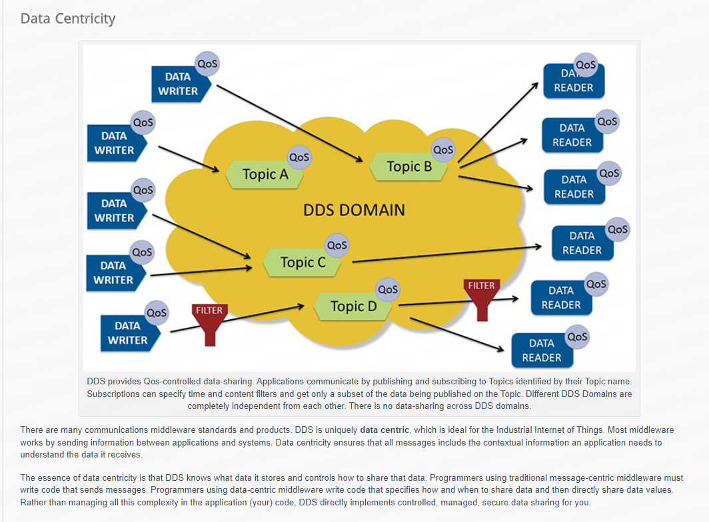
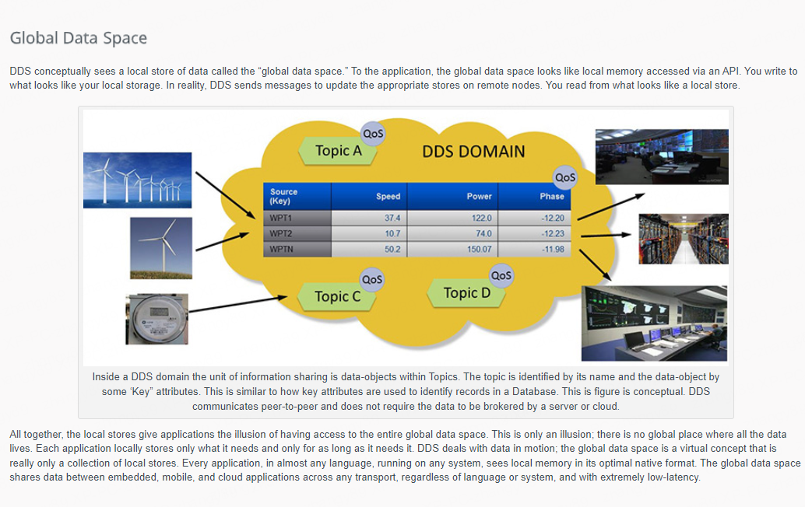
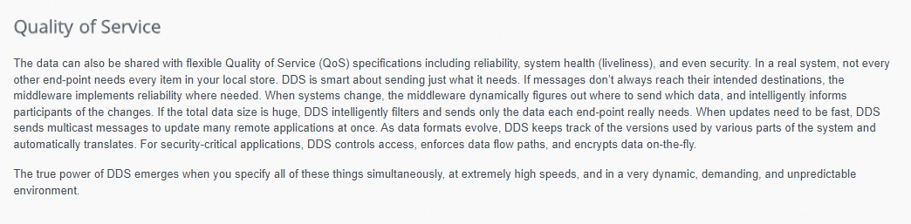
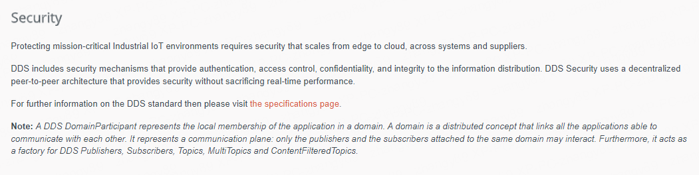
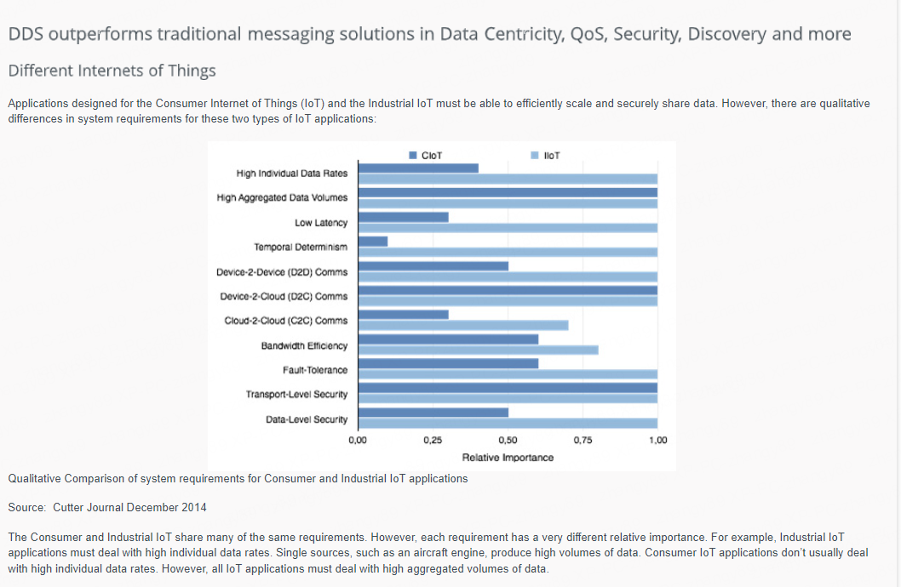
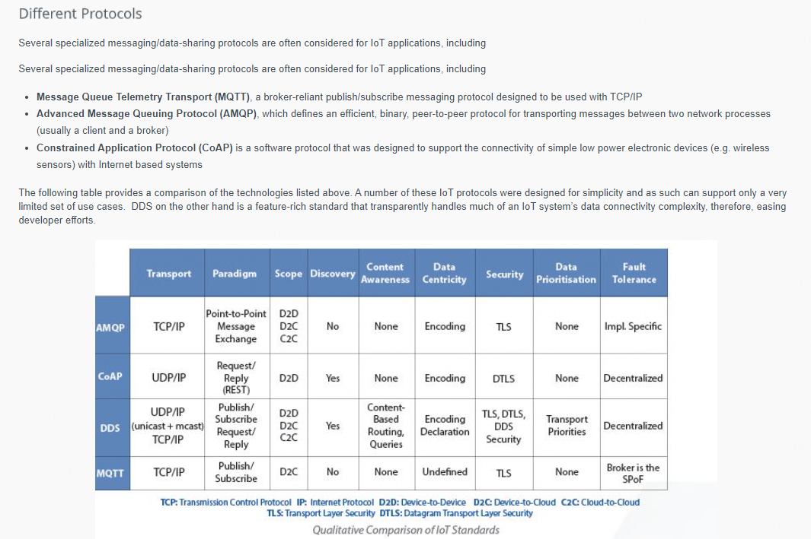
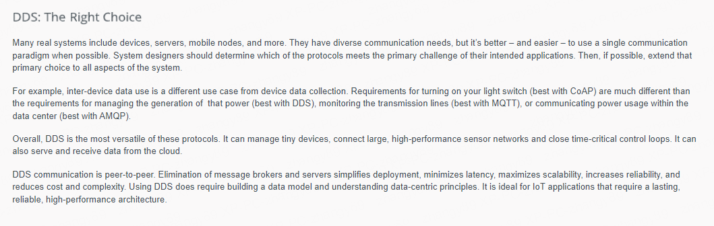

# DDS 基础

DDS 是 OMG 组织发布的一种中间件协议和 API 标准，它将系统的组件集成在一起，提供业务和任务关键型物联网 (IoT) 应用程序所需的低延迟数据连接、极高的可靠性和可扩展架构。

**DDS(Data Distribution Service,数据分发服务)** 是一种以数据为中心的通信协议，用于分布式软件应用程序通信。

它描述了支持 **数据提供者(Data Providers)** 和 **数据消费者(Data Consumers)** 之间通信的通信应用程序编程接口 (API) 和通信语义。

# DDS compare to other IOT tech

