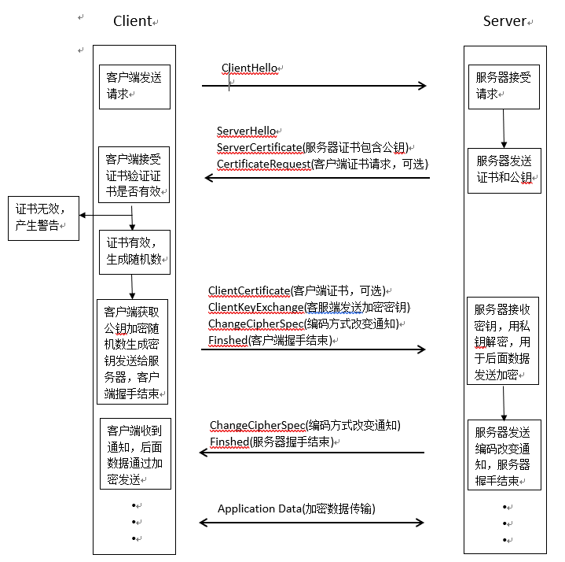
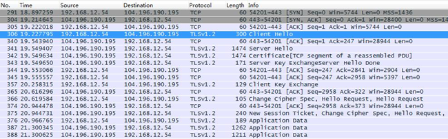
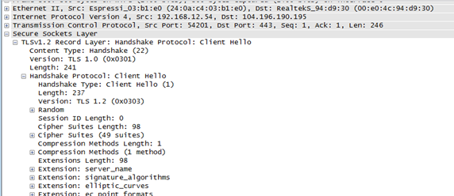
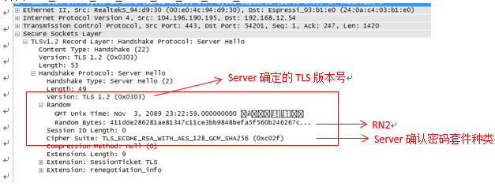
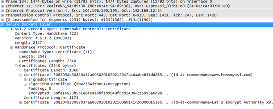
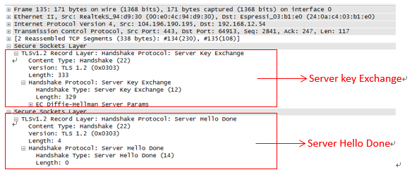
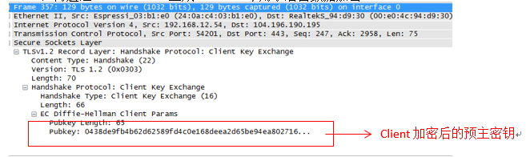
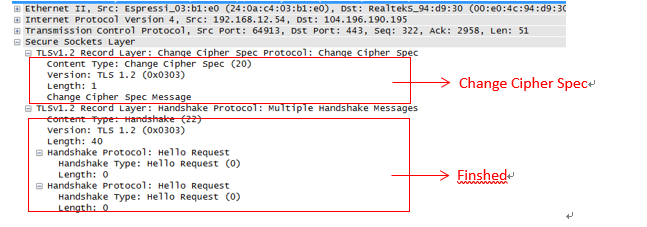
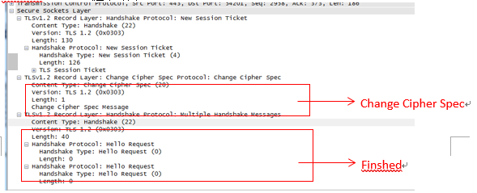

# mbedTLS握手简介

## 一、基本原理

SSL/TLS协议的基本思路是采用**非对称加密法**。也就是说，客户端先向服务器端索要公钥，然后用公钥加密信息，服务器收到密文后，用自己的私钥解密。

## 二、握手流程图

## 三、握手流程介绍

### 3.1.   第一阶段

客户端向服务器发送加密通信的请求：

1）ClientHello：包括协议版本（TLS 1.0），生成随机数（RN1），设备所有支持的密码套件（CipherSuites）

### 3.2.   第二阶段

服务器收到客户端请求后，向客户端发出回应：

1）ServerHello：确认协议版本号，生成随机值（RN2），确定使用哪个CipherSuites；

2）ServerCertificate：服务器发送证书（Certificate）给客户端，证书中包含公钥；

3）CertificateRequest：向客户端请求证书（功能可选）。

### 3.3.   第三阶段

客户端收到服务器证书后，验证证书是否正确：如果正确从证书中获取服务器公钥，如果不正确提示设备；本地生成随机数RN3通过获取的服务器公钥加密生成密钥（pre-master key）之后发给服务器：

1）ClientKeyExchange：客服端发送加密后的密钥；

2）ClientCertificate：客户端发送证书给服务器（功能可选）；

3）ChangeCipherSpec：编码方式改变通知，客户端通知服务器之后数据通过加密发送；

4）Finshed：客户端握手结束。

### 3.4.   第四阶段

服务器收到客户端密钥（pre-master key）后用私钥解密生成密钥用于后面数据传输加密：

1）ChangeCipherSpec：编码方式改变通知，服务器通知客户端之后数据通过加密发送；

2）Finshed：服务器握手结束。

注：密码套件（CipherSuites）介绍

密码套件是在SSL/TLS握手过程中用于磋商安全设置的算法（随机数生成相关）的组合，在ClientHello时客户端将发送它所支持的密码套件的优先级列表，服务器在ServerHello过程中从列表中选择一个密码套件进行响应。

例如：**TLS_ECDHE_RSA_WITH_AES_128_GCM_SHA256** 

密码套件以指定的下列内容的组合:

- 密钥交换算法：决定客户端与服务器之间在握手时如何身份认证（例中为ECDHE_RSA）；
- 批量加密算法：用于加密信息流（例中为AES_128_GCM）；
- 消息认证码算法：用于创建消息摘要，消息流每个数据的加密散列，验证数据完整性（例中为SHA256）；
- 伪随机函数：创建会话密钥（session key）时作为熵(随机数种子)来源。

## 四、   握手抓包

### 4.1.   整体流程抓包

### 4.2.   具体细节

#### 4.2.1.     client发送Client Hello

附带的随机数（RN1）会在生成session key时使用，密码套件(ciphersuites)列出了client支持的所有加密算法组合，server会选出一个作为本次SSL连接使用。

#### 4.2.2.     server回应Server Hello

确认版本号为TLS1.2，生成随机数（RN2）用于生成session key，确认密码套件为TLS_ECDHE_RSA_WITH_AES_128_GCM_SHA256。

Certificate:服务器下发证书给客户端验证，包含public key。

Server key Exchange：发送密钥交换算法所需的额外参数；

Server Hello Done：服务器回应结束。

#### 4.2.3.     client发送Client key Exchange

Client key Exchange : 包含数据与所选密钥交换方式有关（RSA、DH、DHE），用于加密生成的预主密钥（通过服务器公钥加密后的密钥）；

Client拿到server的certificate开始利用certificate中的publickey进行session key的交换。 设备这边生成随机数pre-master secret（RN3）加密之后生成预主密钥发给服务器。服务器拿预主密钥用自己私钥解密。client和server双方现在存在三个随机数RN1，RN2，RN3，双方通过协商好的加密算法获取48字节的master secret，再通过master secret生成session key用于后面数据加密。

Change Cipher Spec：指示server从现在开始发送的数据都是加密之后的；

Finshed：client 握手结束。

#### 4.2.4.     Server发送Change Cipher Spec 和 Finshed

Change Cipher Spec：Server指示client从现在开始发送的消息都是加密的。

Finshed：server 握手结束。

#### 4.2.5.     TLS握手成功后

数据的传输方式和正常的TCP传输方式一致，需要通过双方协商的密钥加密和解密。