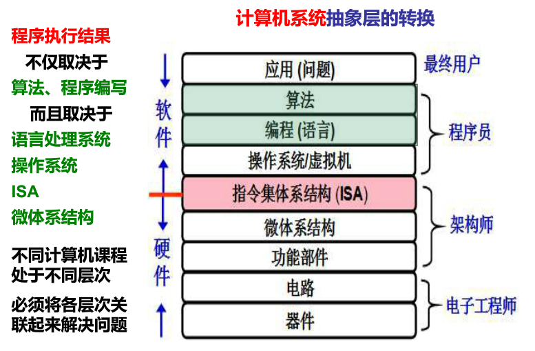

# EmbeddedSystem

总结嵌入式系统基础知识、编程语言、高效工具等内容。

最近听到一位小伙伴说了句很赞的话：

iPhone 是跑着 OS 的嵌入式 ARM，CUDA 也可以理解为一种异构的嵌入式。

从这个角度来考虑的话，将计算机科学与嵌入式分开，仅仅把单片机、ARM、FPGA 等技术叫嵌入式，只学习狭隘的技术领域，怎么可能成为一名优秀的嵌入式工程师呢？

# 主要内容

技术文档与学习记录：

- [Articles](Articles/)

嵌入式系统基础：

- [ARM](Arm/)
- [Network](Network/)
- [RTOS](RTOS/)
- [Embedded Linux](Linux/)

机器学习：

- [Machine Learning](MachineLearning/)

编程语言：

- [C](C/)
- [C++](C++/)
- [Python](Python/)
- [Java](Java/)
- [JavaScript](JavaScript/)
- [Go](Go/)

环境搭建及工具：

- [Gist](Gist/) 
- [Tools](Tools/) 

理论基础：

- [Math](Math/)
- [DataStructure](DataStructure/)
- [Compiler](Compiler/)

本仓库将会长期更新嵌入式领域相关的知识，一部分内容是作者的学习笔记和心得总结，一部分是日常工作中的常用技巧，还有通过各种方式收集的嵌入式知识。通过总结提炼所拥有的知识，不断学习更多有用的技能。

## 何为嵌入式工程师？

对于嵌入式工程师的定位最近我有了新的看法，嵌入式技术是计算机科学体系中的一个分支。

电子类专业的毕业生从机器级的层面开始学习，如单片机，微机原理，后来到语言层面，如 C 语言和 Python，然后学习数据结构和算法。这个路线看起来还不错，也适合来入门，但是这条路线里有很严重的问题，只是学习这些知识你会发现自己很难做到知其然而又知其所以然。

在嵌入式工作中遇到的问题往往是综合性的，也就是说仅仅从语言级别或者算法级别入手往往不能解决问题，有时候需要深入到机器级。那么问题来了，整个嵌入式系统到底分了哪些层级，或者说整个计算机系统有哪些层级？要对整个知识体系框架有所了解，知道自己的位置，你需要对计算机的组成原理有较为深入的了解。

在这里我推荐书籍是由 [Randal E. Bryant](http://www.cs.cmu.edu/~bryant) and [David R. O'Hallaron](http://www.cs.cmu.edu/~droh) 所著的《深入理解计算机系统》第三版。相应可以找到的课程是 MOOC 平台上的由袁春风教授讲授的 [《计算机系统基础》](https://www.icourse163.org/course/NJU-1001625001)课程，帮助我们建立对整个计算机系统抽象层的认识，增强我们解决嵌入式问题中的综合能力。

## 技术深度

嵌入式工程师的技术积累要有足够的深度。

经过几年工程开发，接触了各种各样的处理器，也自己设计并实现了一款简单的 16位 CPU。我逐渐认识到某几种 CPU 的使用方式并不是最重要的知识，更重要的内容是计算机组成原理以及计算机体系架构（x86 ARM RISC-V）。对计算机基础知识的深入的理解，可以让我们在学习新的计算硬件时能够做到触类旁通， 学习一些新的异构计算技术时也不会觉得太过困难，例如 GPU、TPU 以及 NPU。

各种编程语言是工程师手边必备的工具，如果现在要我说是否需要不断学习新的编程语言，答案是肯定的。但我认为最重要的东西却不是编程语言本身，而是语言的设计思想以及它的适用场景，更进一步的是编译原理等用于创造编程语言的基础知识，这些底层技术是构建起一门新语言的知识根基。理解了编程语言背后的东西，学习并使用一门新的语言就会变得非常容易。

