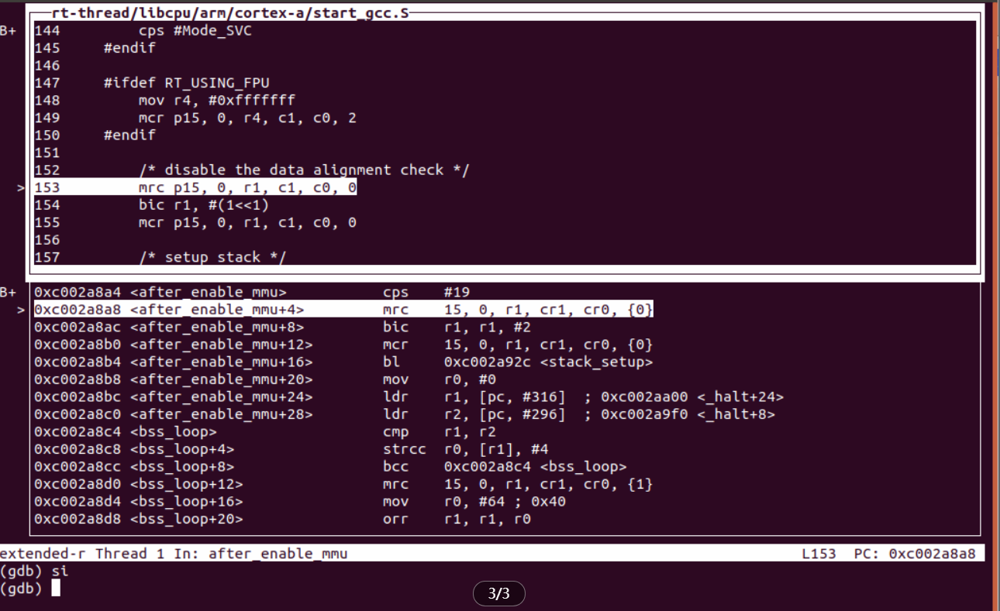
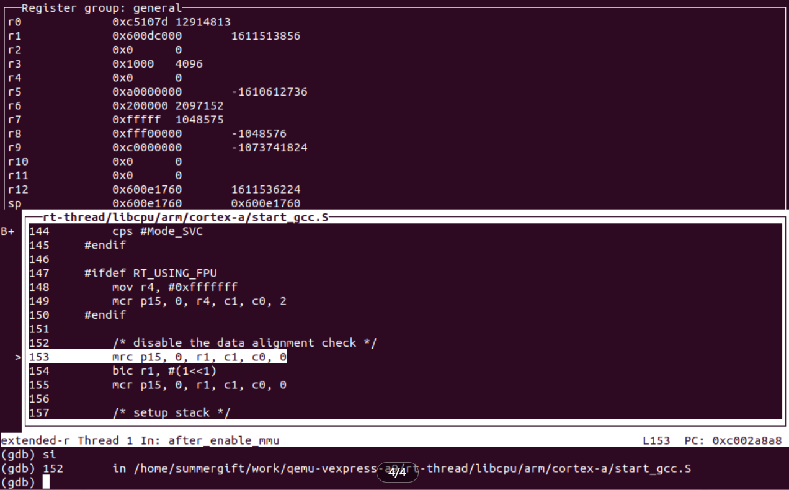
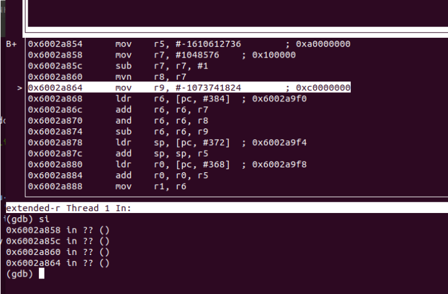
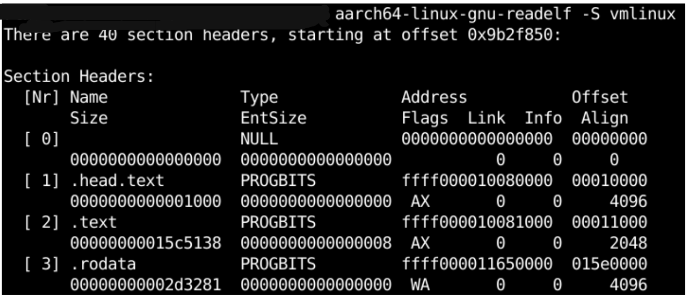

# RTOS 内核调试技巧

记录在嵌入式开发的过程中的调试技巧。

## 基础技巧

### 代码反汇编

在代码调试以及查找错误时，有时会需要对 elf 进行反汇编做代码查看和对比的情况，此时需要使用工具链进行反汇编，命令如下：

```shell
arm-linux-musleabi-objdump -S rtthread.elf > rtthread.S
```

### DTB 反汇编

```
dtc -I dtb -O dts dtb.img -o xxx.dts
```

### kernel module 反汇编

```
aarch64-none-elf-objdump -D xxx_module.ko > xxx_module.S
```

### 预处理

GCC 的“-E”选项可以让编译器在预处理阶段就结束，选项“-o”可以指定输出的文件格式。通过编译器的预处理，可以查看真实参与编译代码的实际情况，便于理解代码。另外在软件测试领域，很多情况下要对原始代码插装，查看预处理后的代码可以有助于理解代码的实际行为。

```shell
aarch64-linux-gnu-gcc -E test.c -o test.i
```

### 编译

编译阶段主要是对预处理好的.i 文件进行编译，并生成汇编代码。GCC 首先检查代码是否有语法错误等，然后把代码编译成汇编代码。可以使用“-S”选项来编译。还可以设定不同的优化等级，查看编译器对代码的优化情况。

```shell
aarch64-linux-gnu-gcc -S test.i -o test.s
```

### 汇编

汇编阶段是将汇编文件转化成二进制文件，利用“-c”选项就可以生成二进制文件。

```shell
aarch64-linux-gnu-gcc -c test.s -o test.o
```

### 修改 bin 固件体积

使用 dd 命令可以修改固件大小，解决固件拷贝时可能出现的不对齐问题，如下代码将固件大小调整为 8k，并在没有数据的内存区域补零。

```
dd if=fw.bin of=fw_align.bin bs=8K count=1  conv=sync
```

### 利用 uboot 调试

可以使用 ret 指令从用户代码中返回到 uboot 来进行调试，可以用于判断代码运行到什么位置，示例代码如下所示：

```c
__start:

    ret   /* 可以返回到 uboot */
  
    /* read cpu id, stop slave cores */
    mrs     x1, mpidr_el1           /* MPIDR_EL1: Multi-Processor Affinity Register */
    and     x1, x1, #3
    cbz     x1, .L__cpu_0           /* .L prefix is the local label in ELF */
```

### 栈溢出

栈内存被写穿的情况，由于线程栈太小，导致在函数较深调用时，导致栈溢出，破坏了系统中其他的数据结构。如果在调试的时候发现如下现象，可以怀疑是否出现了栈溢出。

- 某个变量在没有主动修改的时候突然发生改变
- 系统经常崩溃，但是出错的情况很随机，莫名奇妙出现各种故障，例如 data abort 或者 prefetch abort 等

### 读取符号表

可以使用 readelf 命令查看可执行文件中符号的链接位置，便于分析程序链接情况。

```shell
aarch64-linux-gnu-readelf -S vmlinux
```

### 利用内联汇编

可以参考详细 [ Arm 内联汇编语法](http://www.ethernut.de/en/documents/arm-inline-asm.html)。

系统在 C 语言环境下可以使用内联汇编读取系统状态。

```c
__asm__ volatile ("mrs %0, cpsr" : "=r"(cp_value) : : "memory");
```

### 串口打印

在系统启动的调试过程中，有一个实时的输出功能非常重要，如果使用常规的 log 系统，可能会导致输出信息被缓存，不能及时打印，更有可能由于后续系统出错，而看不到任何输出。因此在系统启动时，可以先在跳转到 C 语言环境之前，先初始化串口，然后基于串口寄存器进行打印输出，可以打印字符和整形数值。

```c
#define UART_OUTPUT_REG_ADDR ((volatile char *)0x10000000)

#define nop()   __asm__ volatile("" ::: "memory")
#define dsb()   __asm__ volatile("dsb sy" ::: "memory")
#define dmb()   __asm__ volatile("dmb sy" ::: "memory")
#define isb()   __asm__ volatile("isb" ::: "memory")

unsigned int sys_read32(unsigned int addr)
{
    unsigned int val = *(volatile unsigned int *)addr;

    dmb();
    return val;
}

void sys_write32(unsigned int data, unsigned int addr)
{
    dmb();
    *(volatile unsigned int *)addr = data;
}

void nop_delay(unsigned int count)
{
    int i;
    for (i = 0; i < count; i++) {
        __asm__ volatile("nop");
    }
}

static void put_delay(uint32_t Cnt)
{
	uint32_t i;

    for (i = 0; i < 0x1000; i++)
    {
        __asm__ volatile("nop");
    }
}

void output_char(char c)
{
	sys_write32(c, UART_OUTPUT_REG_ADDR);
	put_delay(1);
}

void print_string(char *string)
{
	char *c = string;

	while (*c) {
		output_char(*c);
		c++;
	}

	output_char('\r');
	output_char('\n');
}

void print_int(unsigned int integer)
{
    char number_string_inverse[100];
    char number_string[100];
    int  count, cont_inverse;

    count = 0;

    // Force to print always at least one character
    while ((integer > 0) || (count == 0))
    {
        // Add the offset for 0 to the remainder
        number_string_inverse[count] = integer % 10 + 48; 
        integer   = integer / 10;
        count++;
    }

    number_string[count] = 0;
    cont_inverse = 0;
    while (count>0)
    {
        count--;
        number_string[count] = number_string_inverse[cont_inverse];
        cont_inverse++;
    }

    print_string(number_string);
}
```

### 内存访问

使用下面的代码片段可以访问内存空间，同时支持读改写逻辑：

```c
#include <stdint.h>

/* low level macros for accessing memory mapped hardware registers */
#define REG64(addr) ((volatile uint64_t *)(uintptr_t)(addr))
#define REG32(addr) ((volatile uint32_t *)(uintptr_t)(addr))
#define REG16(addr) ((volatile uint16_t *)(uintptr_t)(addr))
#define REG8(addr) ((volatile uint8_t *)(uintptr_t)(addr))

#define RMWREG64(addr, startbit, width, val) *REG64(addr) = (*REG64(addr) & ~(((1<<(width)) - 1) << (startbit))) | ((val) << (startbit))
#define RMWREG32(addr, startbit, width, val) *REG32(addr) = (*REG32(addr) & ~(((1<<(width)) - 1) << (startbit))) | ((val) << (startbit))
#define RMWREG16(addr, startbit, width, val) *REG16(addr) = (*REG16(addr) & ~(((1<<(width)) - 1) << (startbit))) | ((val) << (startbit))
#define RMWREG8(addr, startbit, width, val) *REG8(addr) = (*REG8(addr) & ~(((1<<(width)) - 1) << (startbit))) | ((val) << (startbit))

#define writeq(v, a) (*REG64(a) = (v))
#define readq(a) (*REG64(a))
#define writel(v, a) (*REG32(a) = (v))
#define readl(a) (*REG32(a))
#define writeb(v, a) (*REG8(a) = (v))
#define readb(a) (*REG8(a))
```

### 寄存器读改写

This code defines a macro called RMWREG32 that can be used to read-modify-write a 32-bit register at a given address.

Here's an example of how you can use this macro:

Suppose you have a 32-bit register located at address 0x1000, and you want to set bits 5-8 to the value 0x7. You can use the RMWREG32 macro as follows:

```
RMWREG32(0x1000, 5, 4, 0x7);
```

This will read the 32-bit value at address 0x1000, clear bits 5-8, set bits 5-8 to the value 0x7, and write the modified value back to address 0x1000.

Note that the second argument (startbit) specifies the starting bit position of the field you want to modify, and the third argument (width) specifies the width of the field in bits. The fourth argument (val) is the value you want to write to the field.

### addr2line

根据程序地址找到代码所在行，有些情况下需要使用对应工具链的 addr2line 来检查才可以，否则可能无法找到对应的代码行。

```
addr2line -e xxx.elf 0x133bc -f -a -p -C
```

上面的命令如果无法工作，则需要使用下列命令：

```
/gcc/gcc-arm-11.2-2022.02-x86_64-aarch64-none-elf/bin/aarch64-none-elf-addr2line -e xxxx.elf -f -a -p -C 0xffff00000000xxxx 0xffff00000000xxxx 0xffff00000000xxxx 0xffff00000000xxxx 0xffff00000000xxxx
```

### 查看 MD5

有时需要查看文件是否一致，一个更稳妥的方法是查看文件的 MD5 值，例如：

```
md5sum xx.elf 
52294aacc76a732e7a4ed304b24985f0  xx.elf
```

## 使用 GDB

### 开发配置

1. 在 `~/.bachrc` 配置好工具链地址，避免重复配置。
```
export RTT_CC=gcc
export RTT_EXEC_PATH=your_musleabi_toolchain_path/bin
export RTT_CC_PREFIX=arm-linux-musleabi-
export PATH=$PATH:$RTT_EXEC_PATH:$RTT_EXEC_PATH/../arm-linux-musleabi/bin
```

2. 编译项目

- scons 编译工程（编译选项需要加 -g 参数，在 elf 中加入调试信息）
- 生成 elf 格式的可执行文件
- 运行 `qemu-dbg.bat` 以调试模式启动 QEMU 模拟

### 选择调试器

可以选择 `arm-none-eabi-gdb` 或者 `gdb-multiarch` 作为 `gdb` 服务端进行调试。

#### 使用 `gdb-multiarch` 

- 安装 `gdb-multiarch` 作为 `gdb` 服务端 
- `gdb-multiarch rtthread.elf -ex "tar ext localhost:1234"` 连接到 QEMU 进行代码调试

#### 使用 `arm-none-eabi-gdb`

- `arm-none-eabi-gdb rtthread.elf -ex "tar ext localhost:1234"` 连接到 QEMU 进行代码调试

#### 图形化界面

如果想要以 GUI 模式启动 `gdb`，可以在命令行中添加参数 `-tui`，如下面的命令：

- `gdb-multiarch rtthread.elf -ex "tar ext localhost:1234" -tui`

## GDB 调试操作

### 打开和关闭

| 命令                     | 说明           |
| ------------------------ | -------------- |
| ctrl + d                 | 退出 GDB       |
| ctrl + a，松开后再按下 x | 退出 QEMU 调试 |

### 常用调试命令

| 命令    | 说明                                                         |
| ------- | ------------------------------------------------------------ |
| r       | Start debugged program                                       |
| c       | Continue program being debugged                              |
| n       | Step program                                                 |
| ni      | 运行到下一条汇编指令，但是不进行 bl 跳转                     |
| s       | Step program until it reaches a different source line        |
| si      | 运行到下一条汇编指令，会跳转到下一条汇编执行，跟进 bl 命令   |
| b       | Set breakpoint at specified line or function                 |
| display | Print value of expression EXP each time the program stops    |
| p       | Print value of expression EXP，p /x exp ：以 16 进制格式打印目标值 |
| u       | until 可以当做单次断点，使用 u *0x60000000 跳转到指定地址，u 指令后面跟想要跳转的位置 |
| x       | x  0x60000000 显示指定地址中的数值，相当于 dump 功能         |
| q       | 退出 gdb                                                     |

如果打 s、n 指令的话，必须要有源代码支持，如果没有源代码支持，只能打出 si、ni，这里  si ni 是针对反汇编指令来说的，如果有源代码的话就可以使用 s、n 指令。

### 信息查询与断点操作

| 命令           | 说明                                 |
| -------------- | ------------------------------------ |
| info b         | 查询当前系统中断点命令，简写为 `i b` |
| dis + 断点编号 | 使指定编号的断点 disable             |
| ena + 断点编号 | 使指定编号的断点 enable              |
| del + 断点编号 | 删除指定编号的断点                   |
| info files    | 查询加载的符号表文件                 |

### 查看反汇编

1. 按下 ctrl + x 然后再按下 2 将会切换视图，例如汇编视图和寄存器视图
2. 按下 ctrl + x 然后再按下 1 将会聚焦选择其中一个视图

### 调试示例

因为 RT-Smart 内核的加载地址与链接地址不一致，所以开始调试时，只能将调试断点打在 MMU 使能之后。


打开图形化界面后，使用 si 指令进行单步调试：



如果想观察寄存器中数值的变化，可以切换到通用寄存器视角：



### 数据断点

#### 监控变量名

使用变量名 watch var，var 为变量的名字。

如下，设置监控全局变量j，可以看到，当全局变量的由初始值0变为1的时候，被gdb监控到，并打印出这个全局变量被改变的位置。

```
(gdb) start
Temporary breakpoint 1 at 0x40058f: file test_gdb.c, line 19.
Starting program: /home/test_demo/gdb/test_gdb 
Temporary breakpoint 1, main () at test_gdb.c:19
19		int i  = 0;
(gdb) 
(gdb) 
(gdb) 
(gdb) watch j
Hardware watchpoint 2: j
(gdb) info breakpoints
Num     Type           Disp Enb Address            What
2       hw watchpoint  keep y                      j
(gdb) continue
Continuing.

Hardware watchpoint 2: j

Old value = 0
New value = 1
main () at test_gdb.c:24
24			printf("-------->index %d\n", i);
(gdb) 

```

#### 监控变量地址

watch addr，除了直接使用变量名之外，还可以使用变量名的地址来进行监控。

在下面的例子中，我们首先获取了全局变量j的地址为 0x601044，然后再使用 watch 命令对这个地址进行监控，但是并不是直接使用 “watch 0x601044” 这种方式，而是需要将地址转换为适当的数据类型。在这个例子中，全局变量 j 的类型为 int，因此需要使用命令 `watch *(int *)0x601044`，代表需要监视以地址 `0x601044` 为开始，4字节区域的值（假定int为4字节，为啥假定，不同的处理器可能定义不一样）。

```
(gdb) start
Temporary breakpoint 1 at 0x40058f: file test_gdb.c, line 19.
Starting program: /home/test_demo/gdb/test_gdb 
Temporary breakpoint 1, main () at test_gdb.c:19
19		int i  = 0;
(gdb) 
(gdb) 
(gdb) 
(gdb) watch j
Hardware watchpoint 2: j
(gdb) info breakpoints
Num     Type           Disp Enb Address            What
2       hw watchpoint  keep y                      j
(gdb) continue
Continuing.

Hardware watchpoint 2: j

Old value = 0
New value = 1
main () at test_gdb.c:24
24			printf("-------->index %d\n", i);
(gdb) 

```

#### 条件断点

先设置数据观察点，然后对观察点设置条件表达式，参考[文档](http://c.biancheng.net/view/8255.html)，直接创建观察断点的命令为：

-  `(gdb) watch expr if cond`

也可以先添加数据观察点然后再次添加条件表达式，如下所示：


### 通过函数查看地址

info address function_name，示例如下：

```
(gdb) info address test
Symbol "test" is a function at address 0x9e250
```

### 通过地址查看函数名

info symbol func_addr，示例如下：

```
(gdb) info symbol 0x9e250
test in section .text
```

通过 l* 命令通过地址查看函数：

```
gdb-multiarch vmlinux
(gdb) 1* 0xffffffc0103c5e34
```

### 查询函数反汇编

使用 GDB 反汇编指定的函数，注意函数不要 static 避免被优化掉就查不到了，以及要编译 debug 版本。

先查看 map 文件或者通过地址查询，找到指定地址对应的函数，然后再通过 `gdb` 查看 elf 文件获取函数的反汇编信息：

```
gdb-multiarch firmware.elf
disassemble symbol
```

### 加载与链接地址不同

在 RT-Smart 调试的过程中，发现如果把断点打在 `_reset` 符号时，执行调试时无法停在指定的断点，这个问题的原因是程序的链接地址与加载地址不一致导致的。

RT-Smart 系统被链接在 `0xC0000000` 起始的地址上，但是加载地址为 `0x60000000`，这就导致了在 MMU 没有开启之前，GDB 尝试到 `0xC0000000` 的地址去找符号相应的代码，但是却无法找到。

解决的办法是在指定符号的链接地址上减去 PV_OFFSET，打断点的时候可以使用如下指令：

```shell
b *((char *)_reset + 0xa0000000) 
```

以上命令即可将断点打在相应的物理地址上，此时打开 GDB 的代码调试窗口，还不能看到对应汇编源码，但是在浏览窗口可以看到反汇编代码，使用 si ni 指令查看汇编代码调试。



这里 `0xa0000000` 就是 PV_OFFSET。如果是想从物理地址获得虚拟地址，需要 P - (P-V) = V，如果是先要从虚拟地址获得物理地址，则需要 V + (P - V) = P。

这里的 PV_OFFSET 是 0xa0000000 而不是 0x60000000，是因为要用物理地址减去虚拟地址，而不是用虚拟地址减去物理地址.

### 重新加载符号表

```shell
aarch64-linux-gnu-readelf -S vmlinux
```

在进行调试时，如下情况可能导致需要重新加载符号表：

- 在 aarch64 下切换异常级别时
- MMU 开启前后，链接地址与加载地址不符时

此时可以使用 `readelf` 命令查看可执行文件中符号的链接位置：



如果发现加载地址与链接地址不符，可以算出 PV_OFFSET，然后使用 `add-symbil-file` 命令将符号加载到代码实际运行的地址上，例如：

| 功能                             | 命令                                                         |
| -------------------------------- | ------------------------------------------------------------ |
| 计算偏移量                       | `0x80080000− 0xffff000010080000 = −0xfffeffff90000000`       |
| DS-5 重新加载符号表              | `add-symbol-file /home/vmlinux -0xfffeffff90000000`          |
| 在 DS-5 中 add-symbol-file 命令  | `add-symbol-file filename [offset] [-s section address]...`  |
| 而 GDB 中的 add-symbol-file 命令 | `add-symbol-file filename [ textaddress ] [-s section address ... ]` |

其中 `textaddress` 指的是文件镜像将要加载的地址。因此，DS-5 和 GDB 中的参数有区别。

## Trace32 基础命令

### 调试控制

| `go (g)`                        | 启动仿真                                                     |
| ------------------------------- | ------------------------------------------------------------ |
| `Break (b)`                     | 设置断点                                                     |
| `step`                          | 单步调试                                                     |
| `b.set function`                | 通过 symbol (function) 设置断点 （需要预先加载elf）          |
| `b.set 0x12000000++100 /rw`     | 设置读、写断点，当 CPU 读/写 0x12000000 时，触发 breakpoint，trace32 将 halt CPU |
| `r.set pc 0x12000000`           | 将 pc 设置到 0x12000000                                      |
| `b.set sync_exc_current_el_SP0` | 当 CPU 发生 sync exception (比如 data abort）时，halt CPU，常用于分析 `mmu/serror ` 等异常 |
| `b.set fiq_current_el_SP0`      | 将断点设置在 FIQ 入口 （APU 处于 secure)                     |
| `b.set irq_current_el_SP0`      | 将断点设置在 IRQ 入口 （APU 处于 none secure)                |
| `list.asm`                      | 仅显示 assemble code                                         |
| `list.mix`                      | 显示 symbol + assemble code                                  |
| `frame /locals`                 | 显示 stack 调用栈                                            |

### 数据加载

| 分类                                 | 说明                                                         |
| ------------------------------------ | ------------------------------------------------------------ |
| ```data.load xxx.elf /nocode```      | 仅加载 elf 中的 symbol，不加载代码，加载速度较快，需要先加载 bin 文件到内存中。常用于调试场景，便于查看调用栈 |
| `data.load xxx.elf`                  | 常规加载方式，加载符号表和代码                               |
| `Data.LOAD.Binary xx.bin 0x00100000` | 加载 bin 文件到指定地址                                      |

### 数据查看

| 命令                                             | 说明                                                         |
| ------------------------------------------------ | ------------------------------------------------------------ |
| `Data.Print %Hex.long.LE 0x80000000--0x80000010` | 以 16 进制打印一段内存，以当前 master 的普通视角，主要用于查看一小段内存，以避免有部分内存无法访问，需要注意这种访问方式有可能被 MPU 阻止。如果被阻止无法查看，可以考虑使用其他视角来访问。 |
| `d.dump anc:0x12000000`                          | CPU 视角，但是 bypass MMU+CACHE，等同于0x12000000 是物理地址，常用于 kernel 下访问 physical memory |
| `d.dump azs:0x12000000`                          | Secure  + physical 方式访问 0x12000000，常用于 kernel 下访问 secure device/memory |
| `d.dump eaxi:0x12000000`                         | 不 halt CPU 情况下，通过 `coresight axiap` 访问0x12000000 (PA) |
| `per`                                            | 查看 CPU 相关 system register，比较常用的是 `ELR_ELx/FAR_ELx/ESR_ELx/TTBR_ELx` |
| `r`                                              | 查看 `cpu register (arm64:x0-x30, pc / arm: r0-r15, lr)`     |
| `mmu.info 0x12000000`                            | 查看 0x12000000(VA) 对应的 MMU 信息（trace32 将根据 TTBR 来进行 page table walk） |
| `d.dump 0x12000000 /spotlight `                  | 用 CPU 的视角去访问 memory，当数据有变化时，高亮显示如果开启了 MMU，那么 0x12000000 就是 VA(virtual address)  如果 disable MMU，则 0x12000000 是 PA(physical address) 如果 enable cache，则访问cache/memory 中的有效数据 |
| `v.v handler gicd_lock`                          | 查看 handler 和 `gicd_lock` 这两个 symbol 的值（需加载elf)   |
| `(struct ihandler *)0x12040000`                  | 查看存储在 0x12040000 地址的 `ihandler` 结构体               |
| `list.asm`                                       | 仅显示 assemble code                                         |
| `list.mix`                                       | 显示 symbol + assemble code                                  |
| `frame /locals`                                  | 显示 stack 调用栈                                            |
| `cache.dump dc`                                  | `Dump dcahe`                                                 |
| `Data.SAVE.Binary`                               | 示例 1 用于dump kernel `dmesg`，通过获取 dmesg.log 分析 kernel panic 原因，0x20000 是想要 dump 的数据长度，如果长度太短，可能会没能获取有效信息。 |
|                                                  | `data.save.binary dmesg.log __log_buf++0x20000`              |
|                                                  | 示例 2 通过 `eaxi` 视角 dump DDR 中的数据到 bin 文件， 使用 `eaxi` 视角的原因是有时候 mater 没有访问特定 DDR 的权限。 |
|                                                  | `data.save.binary data_dump.bin eaxi:0x80000000--0x80001000` |
| `mmu.dump pagetable 0x1800000000`                | 对虚拟地址 0x1800000000 进行 Walk page table                 |

## 问题解决思路

1. 充分理解问题

2. 尝试复现问题

3. 识别根本原因

4. 修复该问题

5. 检查是否修复成功，失败则返回第一步

## 参考资料

- [GDB 调试参考](https://blog.csdn.net/u011003120/article/details/109813935)