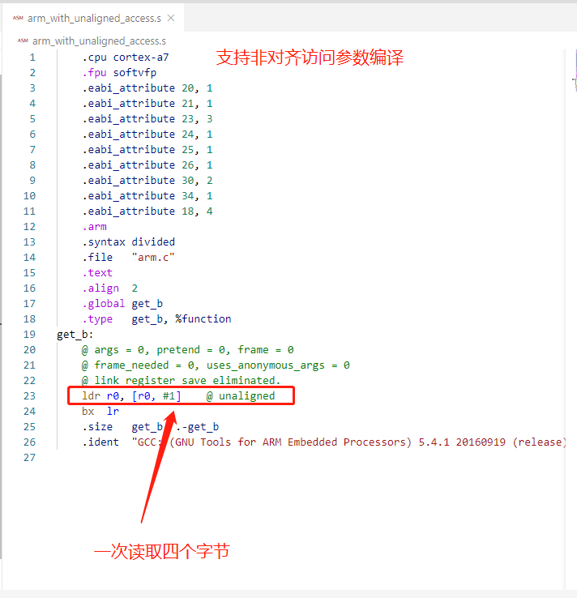

# 内存非对齐访问问题的研究

在代码调试的过程中，偶尔会遇到由于内存非对齐访问导致的错误，下面用一些例子来说明非对齐访问错误产生的原因，以及如何解决非对齐访问错误。

## 示例一

```
-munaligned-access
-mno-unaligned-access

Enables (or disables) reading and writing of 16- and 32- bit values from addresses that are not 16- or 32- bit aligned. 
By default unaligned access is238 Using the GNU Compiler Collection (GCC) disabled for all pre-ARMv6, 
all ARMv6-M and for ARMv8-M Baseline architectures, and enabled for all other architectures. 
If unaligned access is not enabled then words in packed data structures are accessed a byte at a time.

The ARM attribute Tag_CPU_unaligned_access is set in the generated object file to either true or false, 
depending upon the setting of this option. 
If unaligned access is enabled then the preprocessor symbol __ARM_FEATURE_UNALIGNED is also defned.
```

系统中的结构体数据，如果添加了 `__packed` 属性，则会以紧凑的方式进行内存排布，此时其中的一些数据在内存中的排布就是非对齐的。在程序运行时，如果系统不允许非对齐访问，此时对该结构体中的非对齐数据进行访问，则会出现 data abort 的错误。

如果在编译和链接时添加 `-mno-unaligned-access` 不支持非对齐内存访问选项，将会告诉编译器，生成操作这些非对齐数据指令，需要一个字节一个字节地读取，然后将结果拼凑成最终的数据。用这种方式操作数据降低了数据的访问效率，但是可以避免出现非对齐访问错误。

在 armv7 中可以开启或者关闭非对齐访问检查，例如使用如下指令关闭非对齐访问检查：

```
    /* disable the data alignment check */
    mrc p15, 0, r1, c1, c0, 0
    bic r1, #(1<<1)
    mcr p15, 0, r1, c1, c0, 0
```
如果关闭了非对齐访问检查，此时 CPU 访问非对齐数据将不会报错，在底层硬件实现时，可能会将一次访问拆成多次对齐访问来实现，但是在软件层是不感知的。尽管如此，还是降低了数据的访问效率。另外，一些**强序内存**（例如设备内存）是不支持非对齐访问的。

### 非对齐访问参数测试

编译如下源码：

```
struct st_a {
    char a;
    int  b;
} __attribute__((packed));

int get_b(struct st_a *p)
{
    return p->b;
}
```

编译命令如下：

- 支持非对齐访问
```
arm-none-eabi-gcc.exe -S arm.c -o arm_with_unaligned_access.s -O2 -mcpu=cortex-a7
```

- 不支持非对齐访问
```
arm-none-eabi-gcc.exe -S arm.c -o arm_no_unaligned_access.s -O2 -mno-unaligned-access -mcpu=cortex-a7
```

实验结果如下：




可以清楚地在汇编在代码中看到，如果开启了禁止非对齐访问，在操作非对齐地址的数据时，读取了多次，每次只读取一个字节。

### 结论

如果系统中出现了非对齐访问错误，则要从两方面入手检查：

1.  cpu 是否开启了非对齐访问检查，如果开启了该检查，那么出现非对齐访问就会出现 data abort。

2. 编译时，是否告知编译器帮忙处理非对齐访问的问题，如果告诉编译器，目标机器不允许非对齐访问，那么编译器发现将要访问非对齐的地址时，会执行单字节的访问指令，进而避免非对齐访问错误。

## 示例二

C lib 库中的 `memcpy` 函数的行为与 rt-thread 中 `rt_memcpy` 不一致，可能导致的非对齐访问错误，该问题最早出现在基于 `sdio` 的存储器的文件系统的读写过程中。

该问题是由于使用了 C lib 库中的 `memcpy` 函数导致的硬件错误，如果使用 RT-Thread 提供的 `rt_memcpy`，该函数会判断源地址和目标地址是否为四字节对齐，如果不是，那么将会尝试使用单字节的方式进行数据拷贝，这样做避免出现非对齐访问错误。

## 结论

对于 SDIO 驱动而言，其传输所使用的内存地址是否支持非对齐，是要仔细考虑的地方，这里可能需要后续继续完善。我感觉这样修改没能从根本上解决驱动的问题，而只是避过了驱动程序中可能出现的错误。

如果以兼容性为先，那么可以使用 `rt_memcpy` 来代替 C 库中的  `memcpy` 函数，这种系统将默认处理非对齐的问题，但是使用单字节拷贝的情况会降低系统的效率，这点在后期系统优化的过程中应该需要重新考虑和完善。