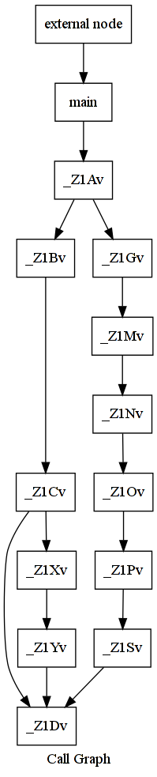
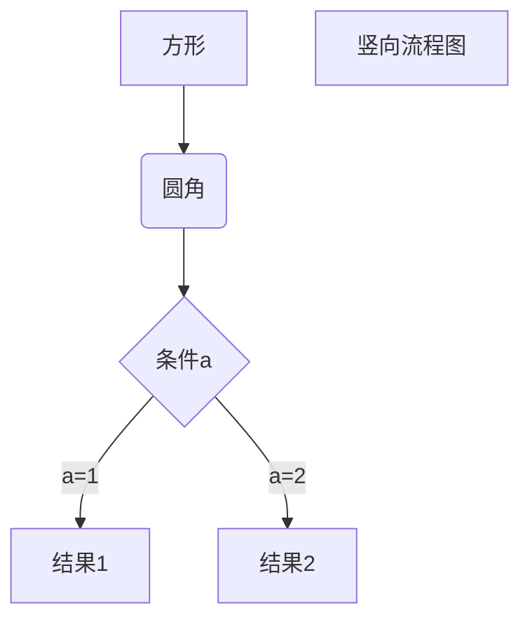
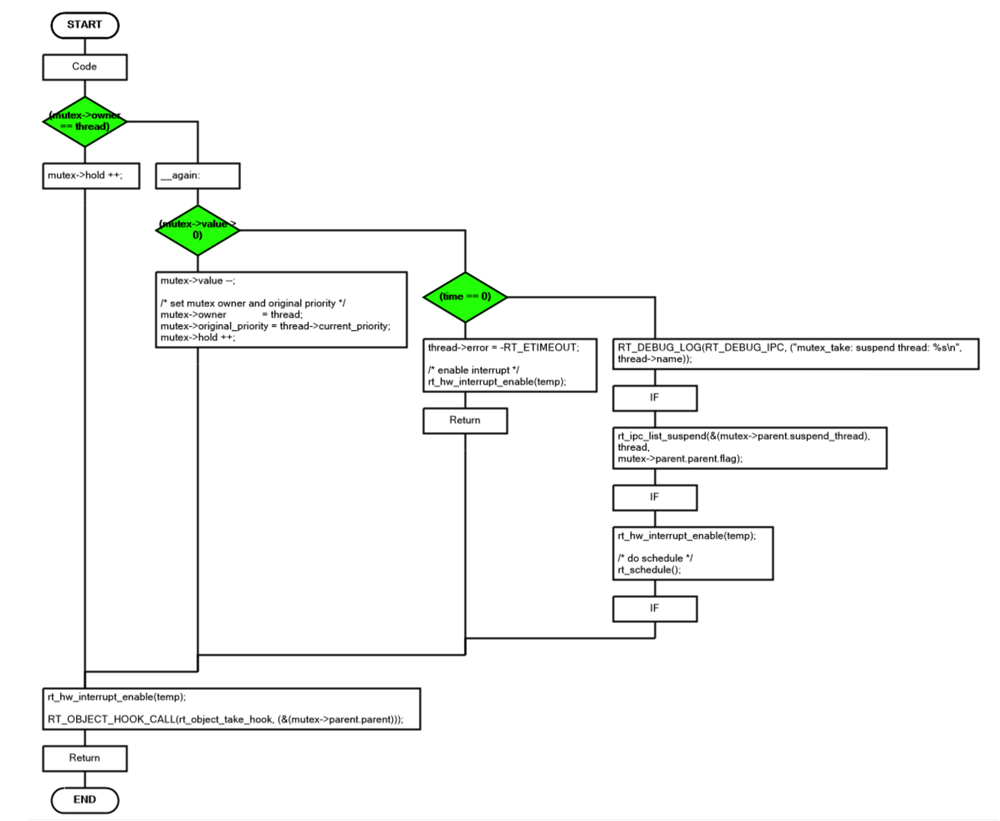

# 程序流程图自动生成技术研究

最近工作中有画出所有函数流程图的需求，由于需要化的流程图太多，又没有足够的时间来完成这个工作，因此想要通过一些技术手段来自动化处理一些流程图绘制的工作量。

## 初步尝试

最初想法是我可以利用 clang 来编译整个 RT-Thread 项目，生成中间过程的 AST，然后对 AST 进行处理，产生调用图，生成类似于 .dot 的文件作图（[参考 stack overflow](https://stackoverflow.com/questions/5373714/how-to-generate-a-calling-graph-for-c-code)），或者是生成 markdown 兼容的流程图语法形式，折腾了一番短时间没有能给出很好的结果。

以下面的例子来说明如何生成函数调用图：

```c
static void D() { }
static void Y() { D(); }
static void X() { Y(); }
static void C() { D(); X(); }
static void B() { C(); }
static void S() { D(); }
static void P() { S(); }
static void O() { P(); }
static void N() { O(); }
static void M() { N(); }
static void G() { M(); }
static void A() { B(); G(); }

int main() {
  A();
}
```

流程图生成指令如下：

```sh
$ clang++ -S -emit-llvm main1.cpp -o - | opt -analyze -dot-callgraph
$ dot -Tpng -ocallgraph.png callgraph.dot
```

dot 是一种可以用于描述各种图示的语言，被普遍用于各种绘图场景，例如程序流程图，调用关系图，数据图等。使用 .dot 文件来描述图的连接，生成的流程图效果大致如下：



## 继续折腾

后来又想到，其实程序流程图主要是反映程序的控制流，其实不是太关心顺序执行的代码，想到这里觉得对代码做一些语法分析可能也不是太复杂，于是考虑是不是能用 ANTLR 工具来对只代码中的程序控制语句 `if else while for switch` 做一些简单分析。看看如果只是简单识别这些简单的语法结构，转换成等价的由 markdown 语言支持的流程图形式，再做一些修改，能不能减少工作量，使其自动生成类似如下图的形式。



基于 ANTLR 的解决方案，我仍在继续研究，不过远水救不了近火，还是先看看有没有现成的解决方案。

## 寻找现有的解决方案

上面的折腾已经花了一段时间，但是也没做出很好的效果，时间紧迫只能再换个思路。很多工具都不太好用，经过一番搜寻，最终找到了一款 [code-to-flowchart](http://www.athtek.com/code-to-flowchart/how-to.html) 流程图自动生成工具，使用起来效果不错，可以用于自动化生成程序流程图，效果如下：



这样就可以快速地完成程序流程图绘制任务了，如果要求不是特别高的话，这样做是满足要求的，可以节省大量时间。这种流程图即使不能直接使用，也可以作为参考，加快正式项目中流程图的绘制速度。