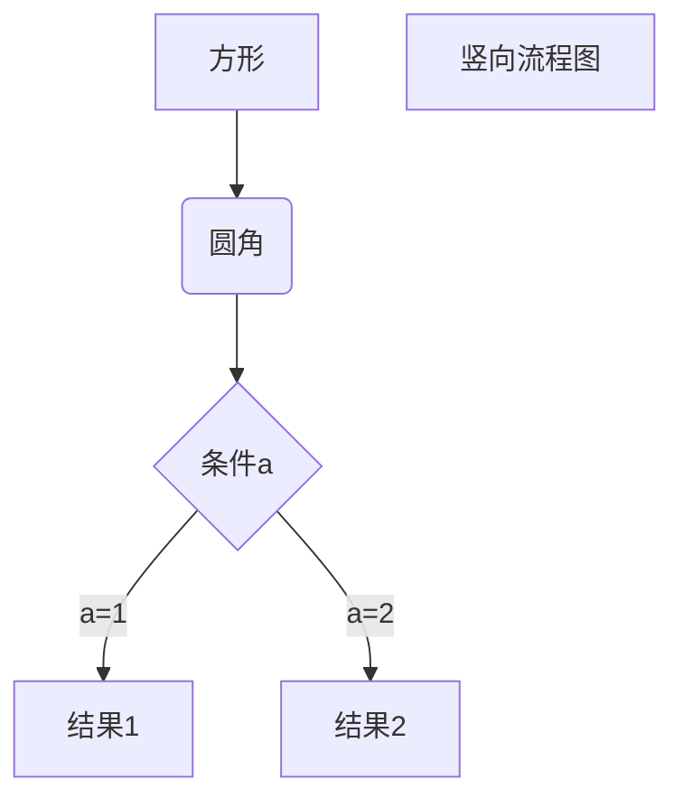

# 程序流程图自动生成技术研究

最近工作中需要给出所有函数的流程图，由于需要给出的流程图众多，需要花费大量时间，因此想要通过一些数据手段来自动化处理一些工作量。

最初想法是我可以利用 clang 来编译整个 RT-Thread 项目，生成中间过程的 AST，然后对 AST 进行处理，产生调用图，生成类似于 .dot 的文件作图（[参考 stack overflow](https://stackoverflow.com/questions/5373714/how-to-generate-a-calling-graph-for-c-code)），或者是生成 markdown 兼容的流程图语法形式，折腾了一番短时间没有能给出很好的结果。

后来又想到，其实程序流程图主要是反映程序的控制流，其实不是太关心顺序执行的代码，想到这里觉得对代码做一些语法分析可能也不是太复杂，于是年里考虑是不是能用 antlr 工具来对只代码中的程序控制语句 if else while for switch 做一些简单分析。看看如果只是简单识别这些简单的语法结构，然后转换成等价的由 markdown 语言支持的流程图形式，再做一些修改，看看能不能减少工作量，使其自动生成类似如下图的形式。

直到开年回来上班也没做出很好的效果，时间紧迫只能再换个思路，网上很多工具都不太好用，经过一番搜寻，最终找到了一款 [code-to-flowchart](http://www.athtek.com/code-to-flowchart/how-to.html) 使用起来效果不错，可以用于很快地生成程序流程图，效果如下：

这样就可以比较快速地完成程序流程图绘制任务了。