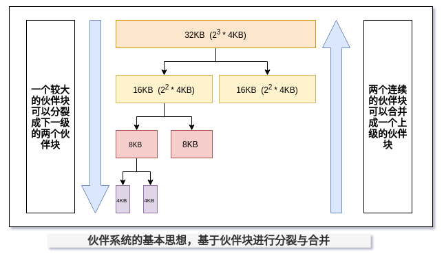

# RT-Smart 物理页管理详解

想要对 RT-Smart 的物理页内存管理功能有所了解，需要熟悉相关代码：

- RT-Smart 页初始化相关功能
- 物理页分配算法伙伴系统的实现

## 物理页管理初始化

在系统初始化早期，会先执行 `rt_page_init` 函数来对物理页管理所需要的数据结构进行初始化，下面是对这段代码的详细解释：

```c
#define ARCH_PAGE_SHIFT     12
#define ARCH_PAGE_SIZE      (1 << ARCH_PAGE_SHIFT)
#define ARCH_PAGE_MASK      (ARCH_PAGE_SIZE - 1) /* b 1111 1111 1111  */

/* 从这 PAGE_START PAGE_END 可以看出，分配给物理页的地址是从 KERNEL_VADDR_START 开始的第 16M 到 128M 之间  */
#define HEAP_END        (void*)(KERNEL_VADDR_START + 16 * 1024 * 1024)
#define PAGE_START      HEAP_END
#define PAGE_END        (void*)(KERNEL_VADDR_START + 128 * 1024 * 1024)

static struct page *page_list[ARCH_PAGE_LIST_SIZE];

/* 传入给页初始化函数的结构体，存储了物理页管理的地址范围 */
rt_region_t init_page_region = {
    (uint32_t)PAGE_START,
    (uint32_t)PAGE_END,
};

/* 物理页管理数据结构 */
struct page
{
    struct page *next;  /* same level next */
    struct page *pre;   /* same level pre  */
    uint32_t size_bits; /* if is ARCH_ADDRESS_WIDTH_BITS, means not free */
    int ref_cnt;        /* page group ref count */
};

static struct page* page_start;
static void*  page_addr;
static size_t page_nr;

/* 实际执行物理页管理数据结构的初始化，默认物理页大小为 4K */
void rt_page_init(rt_region_t reg)
{
    int i;

    LOG_D("split 0x%08x 0x%08x\n", reg.start, reg.end);

    /* 调整物理内存的起始地址为 4K 对齐 */
    reg.start += ARCH_PAGE_MASK;
    reg.start &= ~ARCH_PAGE_MASK;

    reg.end &= ~ARCH_PAGE_MASK;

    /* 计算管理物理页所需数据结构所占用的内存空间，以及可以有多少可以被分配的物理页 */
    {
        /* 计算一个物理页也就是 4k 可以存放多少个 page 结构体 */
        int nr = ARCH_PAGE_SIZE / sizeof(struct page); 
        /* 计算总共有多少个可用物理页 */
        int total = (reg.end - reg.start) >> ARCH_PAGE_SHIFT;  
        /* 计算需要多少个页的内存用于存放管理页数据结构 */
        int mnr = (total + nr) / (nr + 1);      

        LOG_D("nr = 0x%08x\n", nr);
        LOG_D("total = 0x%08x\n", total);
        LOG_D("mnr = 0x%08x\n", mnr);

        page_start = (struct page*)reg.start;
        /* 计算除去用于管理的内存页，可用于物理页分配的起始地址 */ 
        reg.start += (mnr << ARCH_PAGE_SHIFT);  
        page_addr = (void*)reg.start;
        /* 计算有多少个物理页可供分配 */ 
        page_nr = (reg.end - reg.start) >> ARCH_PAGE_SHIFT; 
    }

    LOG_D("align 0x%08x 0x%08x\n", reg.start, reg.end);

    /* 初始化空闲 page 分配链表*/ 
    for (i = 0; i < ARCH_PAGE_LIST_SIZE; i++)
    {
        page_list[i] = 0;
    }

    /* 初始化可供分配的物理页管理结构体 */
    for (i = 0; i < page_nr; i++)
    {
        page_start[i].size_bits = ARCH_ADDRESS_WIDTH_BITS;
        page_start[i].ref_cnt = 1;
    }

    /* 将所有可供分配的空闲页，使用伙伴算法加入到空闲链表 */
    while (reg.start != reg.end)
    {
        struct page *p;
        int align_bits;
        int size_bits;

        /* 计算合适的物理页大小 size_bits 值 */
        size_bits = ARCH_ADDRESS_WIDTH_BITS - 1 - rt_clz(reg.end - reg.start);
        align_bits = rt_ctz(reg.start);
        if (align_bits < size_bits)
        {
            size_bits = align_bits;
        }
        
        /* 从实际物理页地址找到相应的管理页地址 */
        p = addr_to_page((void*)reg.start);
        p->size_bits = ARCH_ADDRESS_WIDTH_BITS;
        p->ref_cnt = 1;

        /* 将相应的管理页结构体加入到页空闲链表上，
           由此可以知道物理页空闲链表上挂接的是物理页的管理结构体 */
        _pages_free(p, size_bits - ARCH_PAGE_SHIFT);
        reg.start += (1UL << size_bits);
    }
}
```

## 物理页管理算法简介

伙伴系统在现代操作系统中被广泛地用于分配连续的物理内存页。其基本思想是将物理内存划分成连续的块，以块作为基本单位进行分配。不同块的大小可以不同，但每个块都由一个或多个连续的物理页组成，物理页的数量必须是 2 的 n 次幂（ 0 <= n < 预设的最大值），其中预设的最大值将决定能够分配的连续物理内存区域的最大大小，一般由开发者根据实际需要指定。

当一个请求需要分配 m 个物理页时，伙伴系统将寻找一个大小合适的块，该块包含 $2^n$ 个物理页，且满足 $2^{n-1}  < m < 2^n$。在处理分配请求的过程中，大的块可以分裂成两半，即两个小一号的块，这两个块互为**伙伴**。分裂得到块可以继续分裂，直到得到一个大小合适的块去服务相应的分配请求。在一个块被释放后，分配器会找到其伙伴块，若伙伴块页处于空闲的状态，则将这两个伙伴块进行合并没形成一个大一号的空闲块，然后继续尝试向上合并。由分裂操作和合并操作都是级联的，因此能够很好地缓解外部碎片的问题。

下图表达了伙伴系统的基本思想，基于伙伴块进行分裂与合并。



## 伙伴系统实现

在 RT-Smart 系统中，使用空闲链表数组来实现伙伴系统。具体来说，全局有一个有序数组，数组的每一项指向一条空闲链表，每条链表将其对应大小的空闲块连接起来，一条链表中的空闲块大小相同。当接收到分配请求后，伙伴分配器首先算出应该分配多大的空闲块，然后查找对应的空闲链表。

想要了解物理页算法的实现过程，那就要熟悉物理页的申请和释放算法，也就是页面释放函数 `_pages_free` 和物理页申请函数 `_pages_alloc`。

### 物理页释放

```c
static int _pages_free(struct page *p, uint32_t size_bits)
{
    /* 根据 size_bits 获取当前物理页的大小 */
    uint32_t level = size_bits;
    
    uint32_t high = ARCH_ADDRESS_WIDTH_BITS - size_bits - 1;
    struct page *buddy;

    RT_ASSERT(p->ref_cnt > 0);
    RT_ASSERT(p->size_bits == ARCH_ADDRESS_WIDTH_BITS);

     /* 将该物理页的引用计数减一，如果引用计数不为 0 则直接返回 */
    p->ref_cnt--;
    if (p->ref_cnt != 0)
    {
        return 0;
    }

    /* 判断当前页大小是否比最大空闲页小，如果大小为最大空闲页，则直接将该页插入到最大空闲页链表 */
    while (level < high)
    {
        /* 根据当前物理页的信息和级别，判断它的 buddy 是否存在 */
        buddy = buddy_get(p, level);
        /* 如果当前物理页的 buddy 存在且级别与当前物理页相同，则将他们合并成为更高一级别的物理页 */
        if (buddy && buddy->size_bits == level)
        {
            page_remove(buddy, level);
            p = (p < buddy) ? p : buddy;
            level++;
        }
        else
        {
            /* buddy 不存在，则退出查找 */
            break;
        }
    }

    /* 将指定级别的空闲页插入到空闲链表中 */
    page_insert(p, level);
    return 1;
}
```

### 物理页申请

```c
static struct page *_pages_alloc(uint32_t size_bits)
{
    struct page *p;

    /* 查找当前级别物理页空闲链表中有没有合适大小的物理页 */
    if (page_list[size_bits])
    {
        /* 如果有，则直接从当前级别的空闲链表中取出一个物理页进行分配 */
        p = page_list[size_bits];
        page_remove(p, size_bits);
    }
    else
    {
        /* 如果没有，则考虑拆分更高级别物理页进行物理页分配 */
        uint32_t level;
        uint32_t high = ARCH_ADDRESS_WIDTH_BITS - size_bits - 1;

        /* 查找更高级别的可用物理页 */
        for (level = size_bits + 1; level <= high; level++)
        {
            if (page_list[level])
            {
                break;
            }
        }

        /* 如果找不到更高级别的可用物理页，则返回 0 */
        if (level == high + 1)
        {
            return 0;
        }

        /* 找到一个可用的物理页，将其从空闲链表中取出 */
        p = page_list[level];
        page_remove(p, level);

        /* 判断当前空闲级别的物理页是否大于所需要分配大小的物理页，
           如果大于要分配的物理页，则对其进行拆分，
           如果刚好满足，则退出判断将其分配出去 */
        while (level > size_bits)
        {
            /* 将空闲的物理页插入到更低一级别的空闲链表 */
            page_insert(p, level - 1);
            /* 取出该空闲物理页的 buddy 的指针，赋值给 p */
            p = buddy_get(p, level - 1);
            level--;
        }
    }

    /* 修改将要被分配的物理页属性，增加其引用计数 */
    p->size_bits = ARCH_ADDRESS_WIDTH_BITS;
    p->ref_cnt = 1;
    return p;
}
```

通过上面的物理页释放与分配过程，就实现了 RT-Smart 系统中的物理页管理过程。