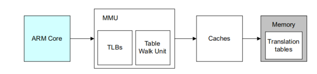
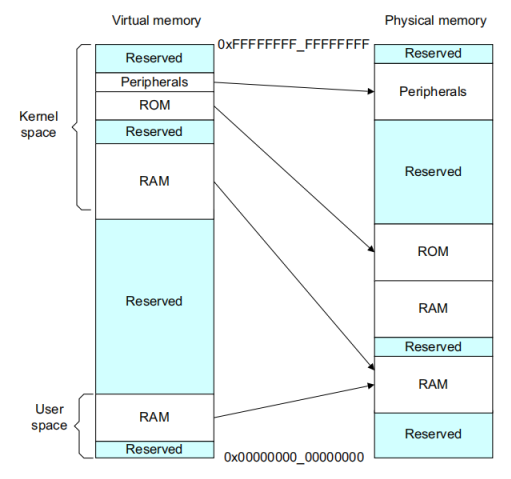
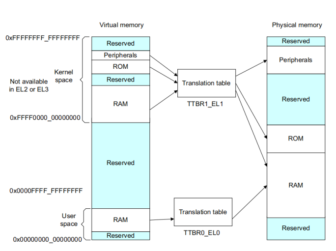
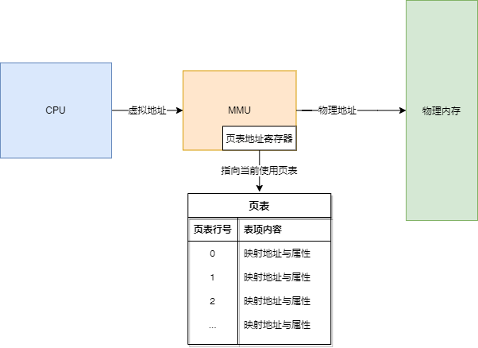

# MMU 基本原理详细分析

## 功能简介

MMU 的一个重要功能是使操作系统可以运行多任务，每一个独立的程序运行在自己私有的地址空间上。这些独立的程序不需要知道系统中的物理内存是如何分布的，也不需要知道哪些物理地址是实际被硬件使用的。

我们每个应用程序中使用相同的虚拟内存地址。我们可以可以使用一段连续的虚拟内存映射，即使真实使用的物理内存是碎片的。虚拟地址空间是与物理内存映射分离的，我们可以编译、链接应用程序运行在虚拟地址空间。

下面的示例系统展示了内存的虚拟地址（VA）和物理地址（PA）视图。操作系统通过配置 MMU 来进行两种内存视图的转换。

为了完成内存视图的转换，虚拟内存系统中的硬件必须提供地址翻译，也就是将处理器要访问的虚拟地址转换成在真实内存中的物理地址。

进行程序开发的时候，程序员、编译器和连接器使用虚拟地址，实际的硬件系统使用物理地址。

## 页表（Translation table）

MMU 使用虚拟地址的 **最高有效位**（MSB）来索引页表（Translation table）中的表项（entries），来确定哪一块内存正在被访问。MMU 转换代码和数据的虚拟地址到实际系统中的物理地址。这个转换过程由硬件自动执行，对于应用代码来说是透明的。

除了地址转换功能，MMU 还控制了内存的访问权限，memory ordering 和每一块内存区域的缓存策略。

## 页表映射详解

### 简介

对于一个有 MMU 的 CPU 来说，MMU 开启后，CPU 在任何时候想要访问的都是虚拟地址，这个虚拟地址发给 MMU 后，MMU 通过页表查询这个虚拟地址对应的物理地址在哪，然后从内存条里访问真实的物理内存。MMU 里面的页表地址寄存器，记录了页表本身的存放位置。

### 一级页表映射分析

以 32 位系统举例，假设只使用一级页表，页表的每一行占用 32 bit 空间，页表内容如下所示：

| 行号                | 物理地址    | 是否命中 | RWX 权限 | user/kernel 权限 |
| ------------------- | ----------- | -------- | -------- | ---------------- |
| 0                   |             | 否       |          |                  |
| 1                   | 6 MB        | 是       | RX       | U + K            |
| 2                   | 8 MB        | 是       | RX       | U + K            |
| 3                   | 3 MB        | 是       | RW       | U + K            |
| ... 省略中间行号    |             |          |          |                  |
| `3GB / 4KB`         | 0 MB        | 是       | RX       | K                |
| `(3GB + 4KB) / 4KB` | 0 MB + 4 KB | 是       | RX       | K                |
| ...                 |             |          |          |                  |

#### 虚拟地址访问示例

上面介绍页表时有提到，MMU 使用虚拟地址的最高有效位作为索引来查询页表，在这个例子中，MMU 使用虚拟地址的高 20 位作为页表行号的索引，下面举例分析。

#####  访问虚拟地址 0 

当 CPU 访问虚拟地址 0 时，MMU 会去查询上面页表的第 0 行（`0KB/4KB = 0`，VA 的高 20 位值为 0），发现第 0 行没有命中，于是此时无论是想以何种方式（读、写、执行）访问内存，都会出错，此时 MMU 会给 CPU 发送 page fault，CPU 发现访问错误就自动跳转到 fault 的代码去处理 fault。

#####  访问虚拟地址 `4K`

当 CPU 访问虚拟地址 `4K` 时，MMU 会去查上面页表的第 1 行（`4KB/4KB = 1`，VA 的高 20 位值为 1），发现第一行命中，如果这个时候执行读写操作，情况如下：

- 用户执行读或者执行，则 MMU 会去访问物理内存 `6 MB` 的地址，因为页表里面记录该页的读写权限是 RX

- 用户执行写操作，由于页表里面第 1 行记录的权限是 RX，没有记录用户有写的权限，MMU 会给 CPU 发出 page fault，CPU 自动跳转到 fault 的代码去处理 fault

#####  访问虚拟地址 `8KB + 16`

当 CPU 访问虚拟地址 `8KB + 16` 的时候，MMU 会查页表的第 2 行（`8KB/4KB = 2`，此时虚拟地址的高 20 位值为 2），发现第 2 行命中了物理地址 8 MB ，此时 MMU 会先检查访问权限，根据检查结果访问  `8M + 16` 这个物理地址。

#####  访问虚拟地址 `3GB`

当 CPU 访问虚拟地址 `3GB` 的时候，MMU 会去查页表的第  `3GB/4KB` 行，表中记录该物理地址是命中了，查到相对应的物理地址是 0，于是 MMU 去访问物理地址 0。而此时由于访问权限的不同，分为两种情况：

- CPU 在执行用户态应用程序的时候，去访问 `3GB`，由于页表里面记录的 U+K 权限只有 K，所以用户态程序是没有访问权限的，MMU 会向 CPU 发出 page fault，CPU 自动跳转到 fault 的代码去处理 fault
- CPU 在执行内核态程序的时候，去访问 `3GB`，由于在页表里面记录的 U+K 权限有 K，所以内核是有权限访问该内存的，这种情况下 MMU 不会报错，程序正常执行

#### 页表内存占用

从以上分析可知，在使用一级页表的情况下，每 `4KB` 的虚拟地址就需要页表里的一行（32 bit） 来存储其映射信息，那么在 32 位地址空间下，页表的大小就为 `(4GB/4KB) * 4 byte = 4MB` 。也就是说，每个页表所需要的存储空间是 `4MB`，这么一看似乎占用内存也不算是很多，但是你仔细想一下，内核态需要独立的页表，每个进程也都需要一个独立页表，这样算下来实在是消耗了太多内存。

在只使用一级页表的情况下，页表大小是 `4MB`，覆盖了整个 `0 - 4GB` 的虚拟地址空间，任何一个虚拟地址都可以用地址的高 20 位（页大小为 `4k`，低 12 位作为页内偏移）作为行号在页表中查找对应的页表项，找到对应的物理地址。

当 CPU 访问虚拟地址时，这个查表过程是由硬件 MMU 自动完成的。

#### 页表切换

现在假设我们的操作系统中有两个进程，分别是进程 1 和进程 2，他们的页表分别如下：

- 进程 1 的页表，物理地址在 255 MB

| 行号                | 物理地址    | 是否命中 | RWX 权限 | user/kernel 权限 |
| ------------------- | ----------- | -------- | -------- | ---------------- |
| 0                   |             | 否       |          |                  |
| 1                   | 6 MB        | 是       | RX       | U + K            |
| 2                   | 8 MB        | 是       | RX       | U + K            |
| 3                   | 3 MB        | 是       | RW       | U + K            |
| ... 省略中间行号    |             |          |          |                  |
| `3GB / 4KB`         | 0 MB        | 是       | RX       | K                |
| `(3GB + 4KB) / 4KB` | 0 MB + 4 KB | 是       | RX       | K                |
| ...                 |             |          |          |                  |

- 进程 2 的页表，物理地址在 280 MB

| 行号                | 物理地址    | 是否命中 | RWX 权限 | user/kernel 权限 |
| ------------------- | ----------- | -------- | -------- | ---------------- |
| 0                   |             | 否       |          |                  |
| 1                   | 100 MB      | 是       | RX       | U + K            |
| 2                   | 200 MB      | 是       | RX       | U + K            |
| 3                   | 300 MB      | 是       | RW       | U + K            |
| ... 省略中间行号    |             |          |          |                  |
| `3GB / 4KB`         | 0 MB        | 是       | RX       | K                |
| `(3GB + 4KB) / 4KB` | 0 MB + 4 KB | 是       | RX       | K                |
| ...                 |             |          |          |                  |

当 CPU 在执行进程 1 的时候，操作系统会把进程 1 的页表的物理地址 255 MB，填入 MMU 的页表地址寄存器，此时进程 1 的页表生效。根据页表内容， CPU 如果访问 4 KB 这个虚拟地址的话，MMU 将会访问物理内存的 6 MB 地址。CPU 如果访问 8 KB 这个虚拟地址的话，MMU 访问物理内存的 8 MB 地址。CPU 如果访问 3 GB 这个虚拟地址的话，MMU 访问物理内存的 0 MB 地址。

当 CPU 在执行进程 2 的时候，操作系统会把进程 2 的页表的物理地址 280 MB，填入 MMU 的页表地址寄存器，此时进程2 的页表生效，进程 1 的页表失效。根据页表内容，CPU 如果访问 4 KB 这个虚拟地址的话，MMU 将会访问物理内存的 100 MB 地址。CPU 如果访问 8 KB 这个虚拟地址的话，MMU 将访问物理内存的 200 MB 地址。CPU 如果访问 3 GB 这个虚拟地址的话，MMU 访问物理内存的 0 MB 地址。

从上面的分析可以得知，进程 1 和进程 2 去访问 3 GB 虚拟地址的时候，最终 MMU 访问的物理地址都是 0 MB，这是因为在进程 1 和进程 2 这两个进程的页表中，`3GB/4KB`  这一项的**内容是完全相同的**。