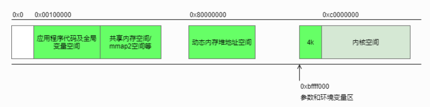
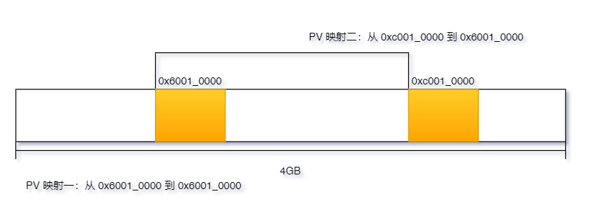

# RT-Smart 启动过程源代码分析

在熟悉 RT-Smart 架构的过程中，研究其启动过程的是必不可少的，那么在系统正常运行之前，需要做哪些准备工作呢。本文将以 32 位 RT-Smart 的源代码为基础，讲解 RT-Smart 的启动过程。

## 内核地址空间

RT-Smart 与 RT-Thread 的一大区别是用户态和内核态的地址空间被隔离开来。内核运行在内核地址空间，用户进程运行在用户地址空间。由下图可知，RT-Smart 32 位内核运行在地址空间的高地址，而用户程序代码运行在低地址。



## 系统初始化流程

上面说到 RT-Smart 将内核搬运到高地址空间运行，为了能让内核正常运行在内核地址空间，需要一些初始化对 `MMU` 进行逐步配置，初始化步骤如下：

1. 使用实际物理地址设置栈，为调用 C 语言函数对 `MMU` 页表进行初始化作准备
2. 建立从 `0x60010000` 到  `0x60010000`  的原地址映射
3. 建立从 `0x60010000` 到 `0xc0010000` 的物理地址到内核地址空间的映射
4. 使能 `MMU`，使地址映射生效，需要建立双重映射的原因是，如果只建立第三步的映射，此时程序还运行在 `0x60010000` 的物理空间上，此时开启 `MMU`，当前程序正在运行的地址空间变得无法访问，导致程序 fault 无法继续运行
5. 切换到内核地址空间，在内核地址空间重新设置栈
6. 解除 `0x60010000` 到  `0x60010000`  的原地址映射关系

## 启动过程代码详解

系统启动前，内核程序被加载到 `0x60010000` ，但内核在编译时被链接到 `0xc0010000` 的位置，此时 `MMU` 还没有开启。如果此时想要使用全局变量的，就需要将全局变量的地址加上 `PV_OFFSET`（物理地址减去虚拟地址的偏移量）获取实际的物理地址，才能正常访问该全局变量。


```assembly
.equ UND_Stack_Size,     0x00000400
.equ SVC_Stack_Size,     0x00000400
.equ ABT_Stack_Size,     0x00000400
.equ RT_FIQ_STACK_PGSZ,  0x00000000
.equ RT_IRQ_STACK_PGSZ,  0x00000800
.equ USR_Stack_Size,     0x00000400

#define ISR_Stack_Size  (UND_Stack_Size + SVC_Stack_Size + ABT_Stack_Size + \
                 RT_FIQ_STACK_PGSZ + RT_IRQ_STACK_PGSZ)

.section .data.share.isr
/* stack */
.globl stack_start
.globl stack_top

stack_start:
.rept ISR_Stack_Size
.byte 0
.endr
stack_top:

/*
使用 1M 大小的 section 映射，描述符的类型为 unsigned int，占用 4 个字节内存，整个系统地址空间为 4GB，因此需要 4096 个描述符，总共占用内存 16kb。
*/
#ifdef RT_USING_USERSPACE
.data
.align 14
init_mtbl:
    .space 16*1024
#endif

.text
/* reset entry */
.globl _reset
_reset:

#ifdef RT_USING_USERSPACE
    ldr r5, =PV_OFFSET

    mov r7, #0x100000
    sub r7, #1
    mvn r8, r7     /* r8: 0xfff0_0000 */

    ldr r9, =KERNEL_VADDR_START

    ldr r6, =__bss_end
    add r6, r7
    and r6, r8          /* r6 end vaddr align up to 1M */
    sub r6, r9          /* r6 is size */

    ldr sp, =stack_top  
    add sp, r5          /* 使用栈的物理地址初始化栈 */

    ldr r0, =init_mtbl
    add r0, r5
    mov r1, r6
    mov r2, r5
    bl init_mm_setup    /* 初始化内存映射表，建立双重映射，即程序加载原地址映射与原地址到内核地址空间映射 */

    ldr lr, =after_enable_mmu
    ldr r0, =init_mtbl
    add r0, r5
    b enable_mmu        /* 使用初始化后的映射表使能 MMU */

after_enable_mmu:
#endif

    /* set the cpu to SVC32 mode and disable interrupt */
    cps #Mode_SVC

    /* disable the data alignment check */
    mrc p15, 0, r1, c1, c0, 0
    bic r1, #(1<<1)
    mcr p15, 0, r1, c1, c0, 0

    /* setup stack */
    bl      stack_setup  /* 使用内核空间栈的虚拟地址初始化栈 */

    /* clear .bss */
    mov r0,#0                   /* get a zero                       */
    ldr r1,=__bss_start         /* bss start                        */
    ldr r2,=__bss_end           /* bss end                          */

bss_loop:
    cmp r1,r2                   /* check if data to clear           */
    strlo r0,[r1],#4            /* clear 4 bytes                    */
    blo bss_loop                /* loop until done                  */

    /* initialize the mmu table and enable mmu */
    ldr r0, =platform_mem_desc
    ldr r1, =platform_mem_desc_size
    ldr r1, [r1]
    bl rt_hw_init_mmu_table

#ifdef RT_USING_USERSPACE
    ldr r0, =MMUTable    /* vaddr    */
    add r0, r5           /* to paddr */
    bl  switch_mmu
#endif

    /* call C++ constructors of global objects                      */
    ldr     r0, =__ctors_start__
    ldr     r1, =__ctors_end__

ctor_loop:
    cmp     r0, r1
    beq     ctor_end
    ldr     r2, [r0], #4
    stmfd   sp!, {r0-r1}
    mov     lr, pc
    bx      r2
    ldmfd   sp!, {r0-r1}
    b       ctor_loop
ctor_end:

    /* start RT-Thread Kernel */
    ldr     pc, _rtthread_startup
_rtthread_startup:
    .word rtthread_startup
```

### 双重地址映射函数详解

```c
void init_mm_setup(unsigned int *mtbl, unsigned int size, unsigned int pv_off) {
    unsigned int va;

    for (va = 0; va < 0x1000; va++) {
        unsigned int vaddr = (va << 20);
        if (vaddr >= KERNEL_VADDR_START && vaddr - KERNEL_VADDR_START < size) {
            mtbl[va] = ((va << 20) + pv_off) | NORMAL_MEM;
        } else if (vaddr >= (KERNEL_VADDR_START + pv_off) && vaddr - (KERNEL_VADDR_START + pv_off) < size) {
            mtbl[va] = (va << 20) | NORMAL_MEM;
        } else {
            mtbl[va] = 0;
        }
    }
}
```

该函数初始化了内存映射表，从 0 地址开始，以 `1M` 的粒度扫描整个 `4G` 地址空间，建立两段映射关系：

1. 如果发现虚拟地址在内核地址空间上，则建立从内核地址空间到内核程序加载地址的映射
2. 如果发现虚拟地址在处于内核程序的加载地址，则建立相对应的原地址映射
3. 其他地址配置成无效，如下图中的空白部分

配置的映射关系如下图所示：




### 使能 MMU

```assembly
.align 2
.global enable_mmu
enable_mmu:
    orr r0, #0x18
    mcr p15, 0, r0, c2, c0, 0 // ttbr0

    mov r0, #(1 << 5)         // PD1=1
    mcr p15, 0, r0, c2, c0, 2 // ttbcr

    mov r0, #1
    mcr p15, 0, r0, c3, c0, 0 // dacr

    // invalid tlb before enable mmu
    mov r0, #0
    mcr p15, 0, r0, c8, c7, 0
    mcr p15, 0, r0, c7, c5, 0   ; // iciallu
    mcr p15, 0, r0, c7, c5, 6   ; // bpiall

    mrc p15, 0, r0, c1, c0, 0
    orr r0, #(1 | 4)
    orr r0, #(1 << 12)
    mcr p15, 0, r0, c1, c0, 0
    dsb
    isb
    mov pc, lr
```

### 切换 MMU

```assembly
.global switch_mmu
switch_mmu:
    orr r0, #0x18
    mcr p15, 0, r0, c2, c0, 0 //ttbr0

    // invalid tlb
    mov r0, #0
    mcr p15, 0, r0, c8, c7, 0
    mcr p15, 0, r0, c7, c5, 0   ;//iciallu
    mcr p15, 0, r0, c7, c5, 6   ;//bpiall

    dsb
    isb
    mov pc, lr
```

### 设置内核空间栈

```assembly
stack_setup:
    ldr     r0, =stack_top     /* 获取内核地址空间下的栈地址，然后设置各模式下的栈 */

    @  Set the startup stack for svc
    mov     sp, r0

    @  Enter Undefined Instruction Mode and set its Stack Pointer
    msr     cpsr_c, #Mode_UND|I_Bit|F_Bit
    mov     sp, r0
    sub     r0, r0, #UND_Stack_Size

    @  Enter Abort Mode and set its Stack Pointer
    msr     cpsr_c, #Mode_ABT|I_Bit|F_Bit
    mov     sp, r0
    sub     r0, r0, #ABT_Stack_Size

    @  Enter FIQ Mode and set its Stack Pointer
    msr     cpsr_c, #Mode_FIQ|I_Bit|F_Bit
    mov     sp, r0
    sub     r0, r0, #RT_FIQ_STACK_PGSZ

    @  Enter IRQ Mode and set its Stack Pointer
    msr     cpsr_c, #Mode_IRQ|I_Bit|F_Bit
    mov     sp, r0
    sub     r0, r0, #RT_IRQ_STACK_PGSZ

    /* come back to SVC mode */
    msr     cpsr_c, #Mode_SVC|I_Bit|F_Bit
    bx      lr
```

