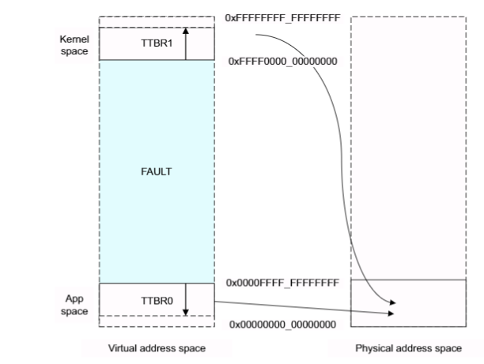

# AArch64 内核与应用虚拟地址隔离分析

一般来说在操作系统之上会有多个应用程序或者任务同时运行。每一个任务都有自己独立的页表，在进程上下文切换的过程中，也会进行页表的切换。然而，大部分内存系统只被内核所使用，并且有着固定的虚拟地址到物理地址的映射，这些页表项很少被修改。ARMv8 架构提供许多特性来高效地处理这种问题。

页表基地址被页表基址寄存器 TTBR0_RL1 和 TTBR1_EL1 指定。 当访问的虚拟地址高位全为 0 时，TTBR0 所指向的页表被选中。当虚拟地址的高位全为 1 时，TTBR1 所指向的页表被选中。

处理器获取指令或者读取数据访问的虚拟地址都是 64 位的，但是我们需要将虚拟内存映射到两部分内存区域，这两部分区域分别有 48 位地址空间。

EL2 和 EL3 都有 TTBR0，但是没有 TTBR1，这就意味着：

- 如果 EL2 运行在 AArch64，可以访问的虚拟地址范围为 `0x0 - 0x0000FFFF_FFFFFFFF`
- 如果 EL3 运行在 AArch64，可以访问的虚拟地址范围为 `0x0 - 0x0000FFFF_FFFFFFFF`

内核空间被映射到虚拟地址空间的高位地址，每一个应用被映射到虚拟地址空间的低位地址。然而，这两部分虚拟地址都要被映射到一个小得多的物理地址空间，如下图所示：

