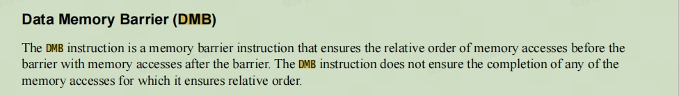
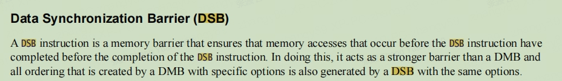
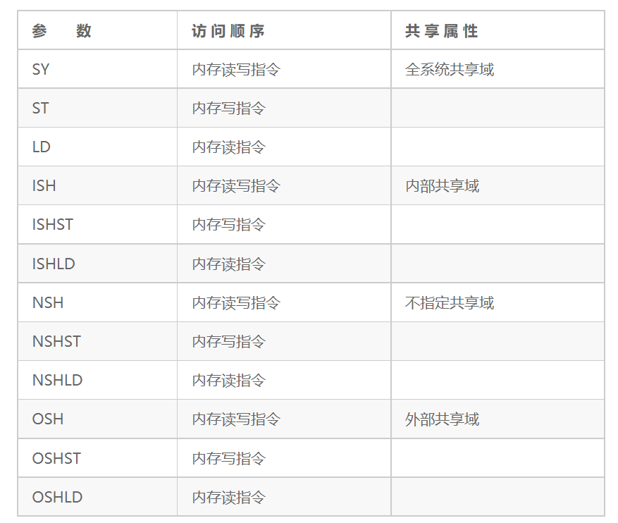

# 内存屏障指令分析

在大部分场景下，我们不用特意关注内存屏障的，特别是在单处理器系统里，虽然CPU内部支持乱序执行以及预测式的执行，但是总体来说，CPU会保证最终执行结果符合程序员的要求。在多核并发编程的场景下，程序员需要考虑是不是应该用内存屏障指令。下面是一些需要考虑使用内存屏障指令的典型场景。

- 在多个不同CPU内核之间共享数据，在弱一致性内存模型下，某个 CPU 乱序可能会产生竞争访问。
- 执行和外设相关的操作，例如DMA操作。启动DMA操作的流程通常是这样的：第一步，把数据写入DMA缓冲区里；第二步，设置DMA相关寄存器来启动DMA。如果这中间没有内存屏障指令，第二步的相关操作有可能在第一步前面执行，这样DMA就传输了错误的数据。
- 修改内存管理的策略，例如上下文切换、请求缺页以及修改页表等。
- 修改存储指令的内存区域，例如自修改代码的场景。

总之，我们使用内存屏障指令的目的是想让CPU按照程序代码逻辑来执行，而不是被CPU乱序执行和预测执行打乱了代码的执行次序。

## 内存屏障产生的原因

若程序在执行时的实际内存访问顺序和程序代码编写的访问顺序不一致，会导致**内存乱序访问**。内存访问的出现是为了提高程序执行时的效率。内存乱序访问主要发生在如下两个阶段：

1. 编译时，编译器优化导致内存乱序访问。
2. 执行时，多个 CPU 间交互引起的内存乱序访问。

### 编译器优化

编译器会把符合人类思维逻辑的代码翻译成符合 CPU 运算规则的汇编指令，编译器了解底层 CPU 的思维，因此它会在翻译汇编指令时对其进行优化。如内存访问指令的重新排序可以提高指令级并行效率。然而，这些优化可能会与程序员原始的代码逻辑不符，导致一些错误发生。编译时的乱序可以通过 barrier() 函数来规避。

```c
#define barrier() __asm__ __volatile__ ("" ::: "memory")
```

`barrier()` 函数告诉编译器，不要为了性能优化而将这些代码重排。

### 处理器优化

由于现代处理器普遍采用超标量架构、乱序发射以及乱序执行等技术来提高指令级并行效率，因此指令的执行序列在处理器流水线中可能被打乱，与程序代码编写时序列不一致。另外现代处理器采用多级存储结构，如何保证处理器对存储子系统访问的正确性也是一大挑战。

arm 处理器主要使用 `dmb dsb 和 isb` 来解决关键位置处理器乱序的问题。

### 常用指令

```
#define nop()   __asm__ volatile("nop" ::: "memory")
#define dmb()   __asm__ volatile("dmb sy" ::: "memory")
#define dsb()   __asm__ volatile("dsb sy" ::: "memory")
#define isb()   __asm__ volatile("isb" ::: "memory")
```

上面的 `__asm__ __volatile__ ("" ::: "memory")` 指令已经起到了编译器屏障的作用，因此使用上述 `dmb() dsb() isb()` 函数时，不仅执行了 CPU 屏障，而且隐式地提供了编译器屏障。

## ARM 弱一致性内存模型

ARM 采用弱一致性内存模型。在一个多处理器系统中，满足如下 3 个条件的内存访问称为弱一致性的内存访问。

- 所有处理器对全局同步变量的访问是顺序一致的
- 在之前的全局数据（global data）访问完成之前，任何处理器不能访问全局同步变量
- 在全局同步变量释放之前，任何处理器不能访问全局数据

弱一致性内存模型要求同步访问（访问全局同步变量）是顺序一致的，在一个同步访问可以执行之前，先前的所有数据访问必须完成。在一个正常的数据访问可以执行之前，所有之前的同步访问必须完成。这就相当于把一致性问题留给了程序员来解决。在 ARM 处理器中使用内存屏障指令的方式来实现同步访问。内存屏障指令的基本原则如下：

- 所有在内存屏障指令之前的数据访问必须在内存屏障指令之前完成
- 所有在内存屏障指令后面的数据访问必须等待内存屏障指令执行完
- 多条内存屏障指令是按顺序执行的

###  ARMv8 内存屏障指令

ARMv8 架构实现了弱一致性内存模型，内存访问的次序有可能和程序预期的次序不一样。A64 和 A32 指令集提供了内存屏障指令，ARM64 处理器把内存屏障指令细分为数据存储屏障指令、数据同步屏障指令以及指令同步屏障指令。如下表所示：

| 指令 | 描述                                                         |
| ---- | ------------------------------------------------------------ |
| DMB  | 数据存储屏障（Data Memory Barrier, DMB），用于确保在执行新的存储器访问前，所有的存储器访问都已经完成。仅当所有在它前面的存储器访问操作都执行完毕后，才提交（commit）在它后面的访问指令。DMB指令保证的是DMB指令之前的所有内存访问指令和DMB指令之后的所有内存访问指令的执行顺序。也就是说，DMB指令之后的内存访问指令不会被处理器重排到DMB指令的前面。DMB指令不会保证内存访问指令在内存屏障指令之前完成，它仅仅保证内存屏障指令前后的内存访问的执行顺序。DMB指令仅仅影响内存访问指令、数据高速缓存指令以及高速缓存管理指令等，并不会影响其他指令（例如算术运算指令等）的顺序。 |
| DSB  | 数据同步屏障（Data Synchronization Barrier, DSB），用于确保在下一个指令执行前，所有的存储器访问都已经完成。比DMB指令要严格一些，仅当所有在它前面的内存访问指令都执行完毕后，才会执行在它后面的指令，即任何指令都要等待DSB指令前面的内存访问指令完成。位于此指令前的所有缓存（如分支预测和TLB维护）操作需要全部完成。 |
| ISB  | 指令同步屏障（Instruction Synchronization Barrier，ISB），用于清空流水线，确保在执行新的指令前，之前所有的指令都已经完成。确保所有在ISB指令之后的指令都从指令高速缓存或内存中重新预取。它刷新流水线（flush pipeline）和预取缓冲区后才会从指令高速缓存或者内存中预取ISB指令之后的指令。ISB指令通常用来保证上下文切换（如ASID更改、TLB维护操作等）的效果。 |

#### 指令参数

DMB和DSB指令后面可以带参数，用于指定共享属性域以及具体的访问顺序。

共享属性域是内存屏障指令的作用域。ARMv8体系结构里定义了4种域。

- 全系统共享（full system sharable）域，指的是全系统的范围
- 外部共享（outer sharable）域
- 内部共享（inner sharable）域
- 不指定共享（non-sharable）域

除指定范围之外，我们还可以进一步细化内存屏障指令的访问方向，例如，细分为读内存屏障、写内存屏障以及读写内存屏障。

第一种是读内存屏障（Load-Load/Store）指令，在参数里的后缀为LD。在内存屏障指令之前的所有加载指令必须完成，但是不需要保证存储指令执行完。在内存屏障指令后面的加载和存储指令必须等到内存屏障指令执行完。

第二种是写内存屏障（Store-Store）指令，在参数里的后缀为ST。写内存屏障指令仅仅影响存储操作，对加载操作则没有约束。

第三种为读写内存屏障指令。在内存屏障指令之前的所有读写指令必须在内存屏障指令之前执行完。

第一种和第二种指令相当于把功能弱化成单一功能的内存屏障指令，而第三种指令就是全功能的内存屏障指令。

内存屏障指令的参数如下表所示：



### 内存屏障指令示例

#### 示例一

假设有两个 CPU 内核 A 和 B，同时访问 Addr1 和 Addr2。

```asm
CORE A:
    STR R0, [Addr1]
    LDR R1, [Addr2]
    
CORE B:
    STR R2, [Addr2]
    LDR R3, [Addr1]
```

在上面的代码片段中，没有任何同步措施，因此会受到处理器乱序执行的影响，导致最终执行的结果不确定，也就是说这四条指令的执行顺序是不确定的。对于 Core A 的寄存器 R1、Core B 的寄存器 R3，可能得到如下四种不同的结果：

- 处理器 A 与处理器 B 都得到旧值
- 处理器 A 得到旧值，处理器 B 得到新值
- 处理器 A 的到新值，处理器 B 得到旧值
- 处理器 A 与处理器  B 都得到新值

#### 示例二

假设处理器 A 把数据写入 MSG 地址，处理器 B 需要判断 flag 的位置后才读取新数据。

```asm
Core A:
    STR R0, [msg]       @ 写新的数据到 msg 地址
    STR R1, [flag]      @ 写新的数据到 flag 地址

Core B:
    Poll_loop:
        LDR R1, [flag]
        CMP R1, #0      @ 判断 flag 是否置位
        BEQ Poll_loop
        LDR R0, [msg]   @ 读取新数据
```

在上面的代码片段中，CORE B 可能读不到最新的数据， Core B 可能由于乱序执行的原因先读取 msg 然后才读取 flag。在弱一致性模型中，处理器不知道 msg 与 flag 之间存在数据依赖关系，所以程序员必须使用内存屏障指令来显示的告诉处理器这两个变量有数据依赖关系。CORE A 需要在两个存储指令之间插入 DMB 指令来保证两个存储指令的执行顺序。CORE B 需要在 `LDR R0, [msg]` 之前插入 DMB 指令来保证直到 flag 被置位以后才读取 msg，修改后的代码如下：

```asm
Core A:
    STR R0, [msg]       @ 写新的数据到 msg 地址
    DMB
    STR R1, [flag]      @ 写新的数据到 flag 地址

Core B:
    Poll_loop:
        LDR R1, [flag]
        CMP R1, #0      @ 判断 flag 是否置位
        BEQ Poll_loop
        DMB
        LDR R0, [msg]   @ 读取新数据
```

#### 示例三

在一个设备驱动中，写一个命令到外设寄存器中，然后等待状态的变化。使用 DSB 指令可以确保写入外设寄存器命令一定是在读取状态寄存器操作之前完成。

```asm
STR R0, [Addr]          @ 写入命令到外设寄存器
DSB
Poll_loop:
    LDR R1, [flag]      @ 等待状态寄存器的变化
    CMP R1, #0
    BEQ Poll_loop
```

## 总结

在ARM体系架构中，内存屏障是一种用来确保程序在多核或多线程环境下按照预期顺序执行的机制。ARM定义了三种内存屏障指令，分别是`DMB`(数据内存屏障)、`DSB`(数据同步屏障)和`ISB`(指令同步屏障)。

`DMB`指令用于确保内存访问的顺序性。在多核处理器中，不同核的缓存可能会引起数据一致性的问题，`DMB`指令在多核之间添加屏障，确保指令的执行顺序与内存访问的顺序一致，避免数据的读写乱序。

`DSB`指令用于确保指令的完成和数据的同步。它保证在`DSB`指令之前的所有指令都已经完成执行，然后再执行`DSB`指令之后的指令。这样可以避免指令的乱序执行和数据的读写乱序，确保执行的顺序性。

`ISB`指令用于确保指令的同步。它会刷新所有的指令缓存和流水线，使指令序列的执行从`ISB`指令之后重新开始。这样可以保证在`ISB`指令之前的所有指令都已经执行完毕，并且清除了所有执行过程中的缓存，使得指令的执行结果与预期一致。

综上所述，ARM的内存屏障机制通过`DMB`/`DSB`/`ISB`指令确保程序在多核或多线程环境下的正确顺序执行。这些指令提供了内存和指令的同步和顺序性保证，保证了程序的正确性和可靠性。

## 参考文档

- [ARM基础：内存屏障指令之DMB、DSB和ISB详解](https://blog.csdn.net/tilblackout/article/details/131949061)
- [ARM进阶：内存屏障(DMB/DSB/ISB)的20个使用例子详解](https://blog.csdn.net/tilblackout/article/details/132030663)

