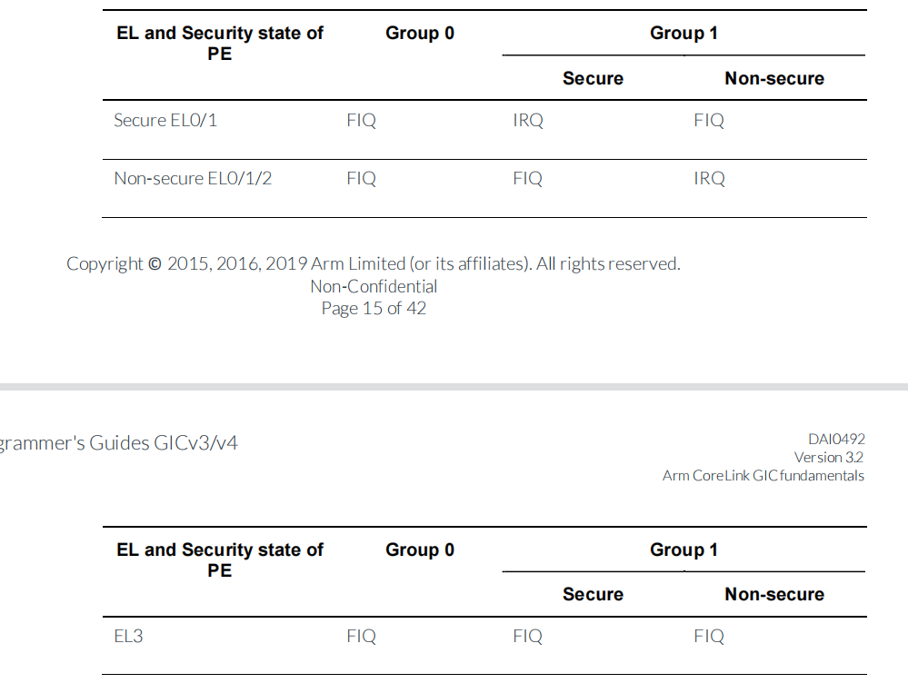

# ARM GICv3 配置说明

## 全局配置

每个中断必须被指定到一个组和安全类型。

| 中断类型           | 使用示例                                               |
| ------------------ | ------------------------------------------------------ |
| Secure Group 0     | Interrupts for EL3 (Secure Firmware)                   |
| Secure Group 1     | Interrupts for Secure EL1 (Trusted OS)                 |
| Non-secure Group 1 | Interrupts for the Non-secure state (OS or Hypervisor) |

Group0 的中断总是被作为 FIQs 被响应，Group 1 中断会被当做 IRQ 或者 FIQ 来响应，取决于当前的安全状态以及当前 PE（ Processing Element ）的异常级别，如下表所示：

简单来说，如果当前处于非安全状态，发生了安全状态的中断，则系统中以 FIQ 响应后进入 EL3，由 EL3 切换到安全世界，然后再次触发 IRQ 路由到安全世界响应的异常等级去响应。这里问题的重点是，当中断发生在和当前 CPU 所属不同安全世界时，需要先以 FIQ 切换到 EL3，通过 EL3 中的 ATF 切换世界，然后将中断路由到特定的异常级别中。