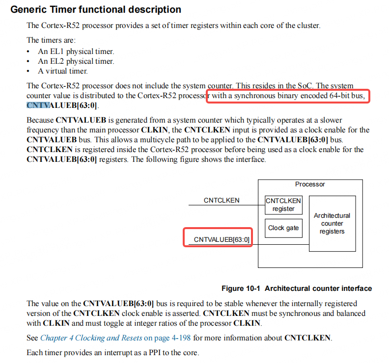
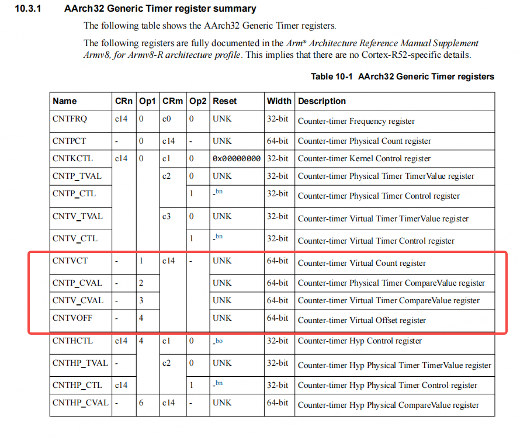

# R52 System Counter

## 系统时钟源

R52 内部没有系统定时器，因此需要 SoC 侧提供 System Counter Value，同时在一个域中，如果有一个 System Counter IP，则这个 IP 可以同时将该 Counter Value 通过 64-bit bus 通知给多个 core，R52 的 System 源如下图所示：



## 读取系统定时器

可以通过系统寄存器来读取系统定时器，寄存器列表如下：



通过如下代码访问 Generic Timer 寄存器组：

```c
static inline __attribute__((always_inline)) uint64_t read_cntvct(void)
{
    return ({
        uint64_t val;
        __asm__ volatile(
            "mrrc p15, "
            "1"
            ", %Q0, %R0, c"
            "14"
            : "=r"(val)::"memory");
        val;
    });
}
```

```c
static inline __attribute__((always_inline)) void write_cntvct(uint64_t val)
{
    ({
        __asm__ volatile(
            "mcrr p15, "
            "1"
            ", %Q0, %R0, c"
            "14" ::"r"(val)
            : "memory");
    });
}
```

## 注意事项

在 RTOS 子系统复位后，由于 System Counter 是由外部提供，因此如果继续读取 arch timer 的 CNTV 作为时间基准，会发现时间基准不是从 0 开始，而是接续复位前的时间。
