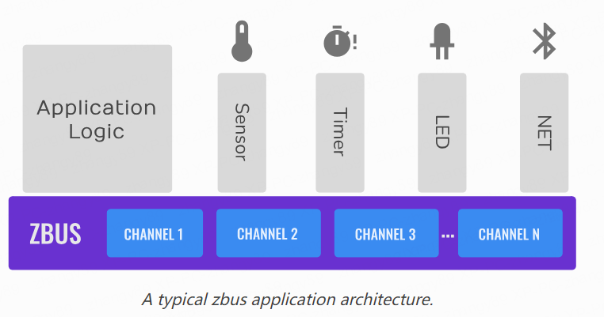
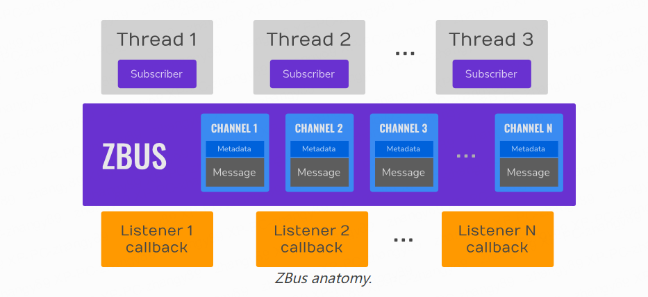

# Zbus 实现分析

The *Zephyr bus - zbus* is a lightweight and flexible software bus enabling a simple way for threads to talk to one another in a many-to-many way.

## 基础概念

线程可以通过 `zbus` 向一个或者多个观察者发送消息。这使得多对多的通信成为可能。 Zbus 实现消息传递和发布、订阅范式，使得线程可以通过共享内存同步和异步通信。

通过 `zbus` 的通信是基于通道的，线程或者 cb 通过通道来交换消息。另外，线程还可以发布和观察通道。当一个线程在一个通道上发布一个消息，这个消息可以被所有在该发布通道的观察者获取。基于观察者的类型，观察者可以直接获取消息、获取消息的拷贝或者只收到发布通道的引用。

The figure below shows an example of a typical application using zbus in which the application logic (hardware independent) talks to other threads via software bus. **Note that the threads are decoupled from each other because they only use zbus channels and do not need to know each other to talk.**

使用 Zbus 进行通信时，线程间是解耦的，因为他们只使用 zbus 通道，而不需要知道通信的其他线程。

The bus comprises:

- Set of channels that consists of the control metadata information, and the message itself;
- *Virtual Distributed Event Dispatcher* (VDED), the bus logic responsible for sending notifications/messages to the observers. The VDED logic runs inside the publishing action in the same thread context, giving the bus an idea of a distributed execution. When a thread publishes to a channel, it also propagates the notifications to the observers;
- Threads (subscribers and message subscribers) and callbacks (listeners) publishing, reading, and receiving notifications from the bus.

The bus makes the publish, read, claim, finish, notify, and subscribe actions available over channels. Publishing, reading, claiming, and finishing are available in all RTOS thread contexts. However, **it cannot run inside Interrupt Service Routines (ISR) **because it uses mutexes to control channel access, and **mutexes cannot work appropriately inside ISRs.** The publish and read operations are simple and fast; **the procedure is a mutex locking followed by a memory copy to and from a shared memory region and then a mutex unlocking**. Another essential aspect of zbus is the observers. 

### 观察者类型

There are three types of observers:

- Listeners, a callback that the event dispatcher executes every time an observed channel is published or notified;
- Subscriber, a thread-based observer that relies internally on **a message queue where the event dispatcher puts a changed channel’s reference every time an observed channel is published or notified**. Note this kind of observer does not receive the message itself. It should read the message from the channel after receiving the notification;
- Message subscribers, a thread-based observer that relies internally on a FIFO where the event dispatcher puts a copy of the message every time an observed channel is published or notified.

每一个通道可以配置一个或者多个 observers，这些 observers 可以是 listener、subscriber 或者 message subscriber：

- listeners 类型定义时需要指定 callback

- subscriber 类型定义时需要指定 queue 的 size，因为在 pub 消息的时候是发送预定义的 `msgq` 到 channel，利用 `msgq` 来完成数据发送，本质上是发送目标数据的指针，不需要数据拷贝

- Message subscribers 类型基于 FIFO 数据结构利用 `net_buf` 数据结构来实现数据传输，这里执行了一次数据拷贝

### 观察者类型分析

在 Zephyr RTOS 中，FIFO 和 Message Queue (`msgq`) 都是用于在任务之间传输数据的机制，但它们之间存在一些关键区别：

1. **数据结构**：FIFO 是一个先进先出的数据结构，它允许任务按照数据到达的顺序接收数据。而 Message Queue 则允许任务按照优先级接收数据，这意味着高优先级的消息可以跳过队列中的低优先级消息。

2. **数据类型**：FIFO 可以存储任何类型的数据，包括简单的数据类型和复杂的数据结构。而 Message Queue 通常用于传输固定大小的数据块，这些数据块可以包含任何类型的数据。

3. **内存管理**：在 FIFO 中，数据项通常在发送时动态分配，并在接收时释放。这可能会导致内存碎片。而在 Message Queue 中，所有的消息都存储在预先分配的内存池中，这可以避免内存碎片。

4. **同步和异步通信**：FIFO 和 Message Queue 都支持同步和异步通信。在同步通信中，发送任务会阻塞，直到接收任务取走数据。在异步通信中，发送任务在放入数据后立即返回。

总的来说，选择 FIFO 还是 Message Queue 取决于你的具体需求。如果你需要按照数据到达的顺序处理数据，那么 FIFO 可能是一个好选择。如果你需要处理固定大小的数据块，并且希望能够根据优先级接收数据，那么 Message Queue 可能更适合你。
