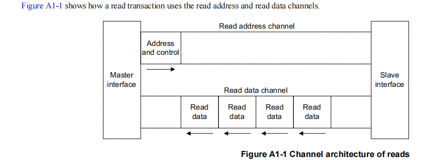
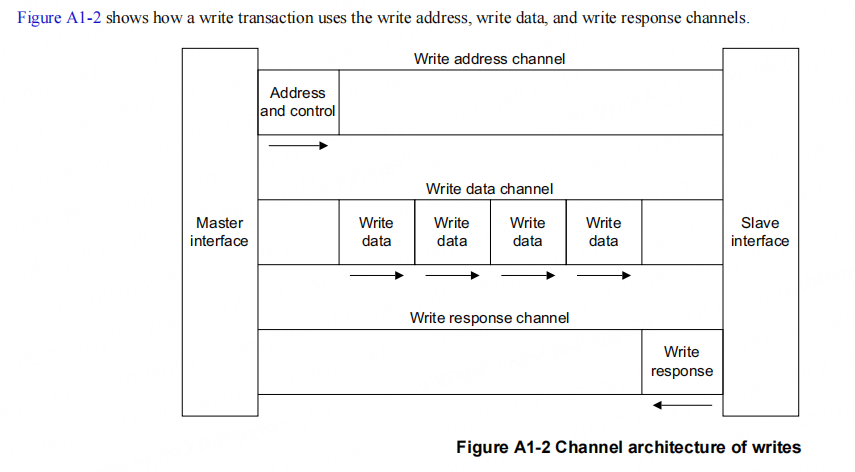

# AXI Basic

当代 SOC 越来越复杂，内部封装了多种 IP，这些 IP 通过系统总线相互连接，AXI 总线便是常用的总线之一。

## AXI 架构

AXI 协议是一种基于 burst 的协议，定义了一系列独立的传输通道：

- read address
- read data
- write address
- write data
- write response

地址通道运输控制信息，描述了将要被传输数据的种类。数据在 master 和 slave 之间被传输，通过下列通道之一：

- 写数据通道从 master 传输数据到 slave，在一次写传输中 slave 使用 write resonse channel 来通知传输完成
- 一个读数据通道用于传输数据从 slave 到 master

AXI 协议：

- 允许地址信息在实际的数据之前下发
- 支持 multiple outstanding transactions
- 支持 out-of-order 完成传输

### read transaction

### write transaction

